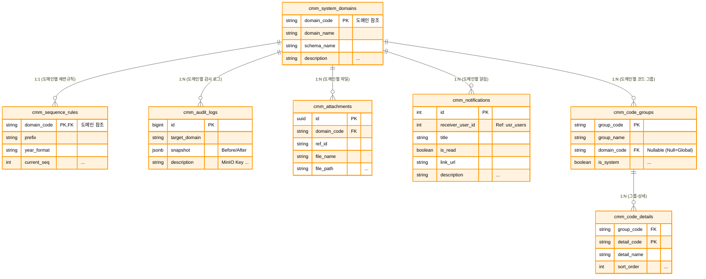
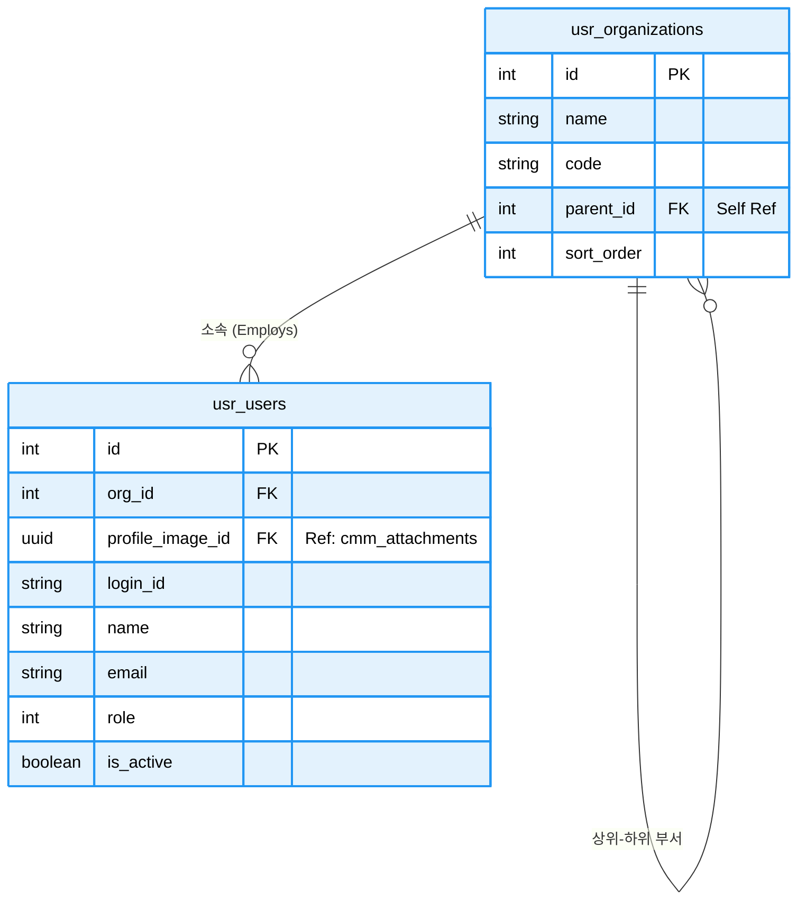
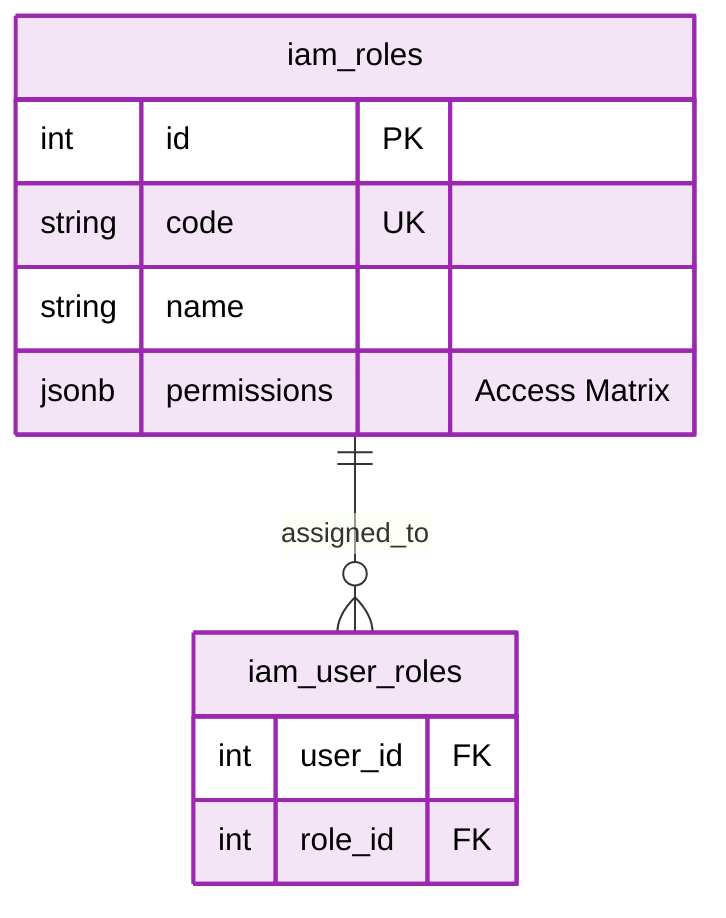
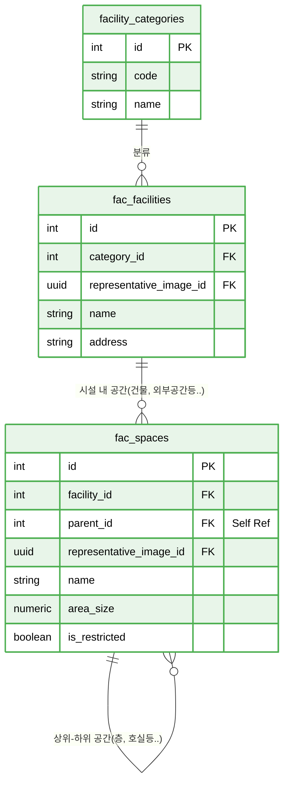
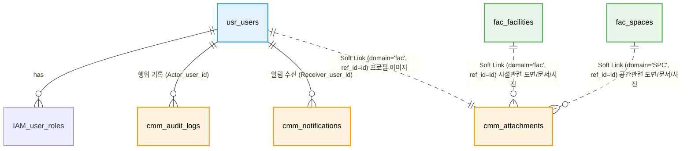

# 📘 SFMS Phase 1: 통합 데이터베이스 설계서 (Final Version)

* **프로젝트명:** SFMS (Sewage facility Management System)
* **작성일:** 2026-02-16
* **버전:** 2.0
* **단계:** Phase 1 (Foundation, Security, facility Base)
* **기술 스택:**
* **Database:** PostgreSQL 16+
* **Extensions:** `pgroonga` (한글/JSON 검색), `pgcrypto` (UUID)
* **File Storage:** MinIO (S3 Compatible) - DB는 메타데이터만 저장
* **변경이력**:

> 1. cmm, usr, fac 스키마 확정.
> 2. **JSONB 데이터 구조 표준 명세 추가.**

* **스키마 구조:**

> 1. **`cmm` (Common):** 공통 기준정보, 파일 레지스트리(MinIO), 감사 로그, 알림
> 2. **`ian` (Identity & Access Management):** 사용자 인증, 권한 관리
> 3. **`usr` (User):** 사용자, 조직(Organization), 권한(RBAC)
> 4. **`fac` (facility):** 시설 및 공간 계층 구조 (Tree)

---

## 1. 🏗️ 설계 원칙 및 규칙 (Conventions)

### 1.1 데이터 타입 및 식별자 전략

* **Primary Key (PK):**
  * 일반 업무 데이터: `BigSerial` (Auto-increment BigInteger) 사용. (성능 및 레거시 매핑 용이)
  * 파일/첨부 데이터: `UUID` (v4) 사용. (보안 및 분산 저장소 키 충돌 방지)

* **Timezone:**
  * 모든 일시(`DateTime`)는 `TIMESTAMPTZ` (Timezone 포함) 타입을 사용하며, DB에는 **UTC**로 저장하고 애플리케이션에서 로컬 시간(KST)으로 변환합니다.

* **JSONB 활용 (Semi-structured Data):**
  * Snake Case: JSON Key는 반드시 **스네이크 케이스(user_name)**를 사용합니다.
  * Flat Structure: 가능한 중첩(Nested) 구조를 피하고 1단계 Depth를 권장합니다.
  * Search: PGroonga 인덱스를 통해 JSON 내부의 모든 Key와 Value를 검색 가능하게 합니다.
  * 레거시 시스템의 비정형 데이터, 설비 제원, 변경 로그(`snapshot`)는 `JSONB` 컬럼에 저장하여 스키마 변경 없이 유연성을 확보합니다.

### 1.2 검색 및 인덱싱 전략

* **Full Text Search:** `PGroonga` 확장 기능을 사용하여 한글의 **중간 일치 검색**(`LIKE '%검색어%'`) 속도를 획기적으로 개선합니다.
* **JSON Search:** `Audit Log`의 변경 내역이나 `facility`의 메타데이터 검색 시 `GIN` 인덱스(PGroonga)를 사용하여 고속 검색을 지원합니다.

---

## 2. 🗺️ ERD (Entity Relationship Diagram)

네, 전체를 하나의 ERD에 담으면 관계선이 꼬이고 테이블이 작아져서 가독성이 크게 떨어집니다.

**도메인(스키마) 단위로 쪼개서 관리하는 것이 정석입니다.** 요청하신 대로 **cmm(공통), usr(사용자/조직), fac(시설)** 3가지 영역으로 나누어 시각화해 드립니다.

각 다이어그램은 해당 도메인 내부의 관계에 집중하고, 타 도메인과의 연결은 '참조(Reference)' 형태로 표현하여 깔끔하게 정리했습니다.

---

### 2.1. CMM (공통 모듈)

시스템 전반에서 사용하는 코드, 파일, 로그, 알림 등을 관리하는 영역입니다. 다른 모든 모듈의 기반이 됩니다.



---

### 2.2. USR (사용자 & 조직 모듈)

조직 구조와 사용자 계정을 관리합니다. `usr_organizations`의 자기 참조(Self-Reference) 관계가 핵심입니다.



---

### 2.3. IAM (사용자 인증, 권한 관리)

역할(Role) 기반의 세밀한 권한 제어를 통해 메뉴 접근 및 데이터 조작 권한을 관리합니다.



---

### 2.4. FAC (시설 모듈)

공간과 시설물을 관리합니다. `fac_spaces` 역시 계층 구조(층-호실 등)를 가지므로 자기 참조 관계가 중요합니다.



---

### 2.5. 도메인 간 인터페이스

개별 상세 ERD만으로는 **모듈 간의 연결**을 파악하기 어려울 때가 있습니다. 이럴 때는 테이블 내부 컬럼을 다 보여주는 대신, **테이블 이름만으로 구성된 '개념 모델(Conceptual Model)'**을 하나 그려두는 것이 좋습니다.



---

## 3. 🗄️ 상세 스키마 명세서 (Schema Specifications)

### 3.1 🟧 cmm: 공통 및 기준정보 (Common)

| Table Name | PK | Description | 주요 컬럼 및 JSONB 구조 |
| --- | --- | --- | --- |
| **system_domains** | `domain_code` | 시스템 모듈 정의 | `schema_name`(스키마), `is_active` |
| **code_groups** | `group_code` | 공통 코드 그룹 | `is_system`(삭제불가 여부) |
| **code_details** | `(group, detail)` | 공통 코드 상세 | `props` (JSONB): `{"color": "#F00", "unit": "kg"}` |
| **attachments** | `id` (UUID) | **MinIO 파일 메타데이터** | `file_path`(MinIO Key), `ref_id`(참조ID), `legacy_id` |
| **audit_logs** | `id` (BigInt) | **데이터 감사 로그** | `snapshot` (JSONB): `{"before": {...}, "after": {...}}` |
| **notifications** | `id` | 사용자 알림 | `receiver_user_id`, `is_read`, `link_url` |
| **sequence_rules** | `domain_code` | 문서 번호 채번 규칙 | `prefix`(접두어), `current_seq`(현재번호) |

### 3.2 🟦 usr: 사용자 및 조직 (User & Org)

| Table Name | PK | Description | 주요 컬럼 및 JSONB 구조 |
| --- | --- | --- | --- |
| **organizations** | `id` | **조직 (Department)** | `parent_id`(상위조직), `legacy_source`('GUMC'/'MES') |
| **users** | `id` | **사용자 (User)** | `login_id`, `role`(1/10/100), `profile_image_id`(UUID),_`metadata` (JSONB): 레거시 메모, UI 설정 등 |

### 3.3 🟪 IAM: 사용자 인증 및 권한 관리 (Identity & Access Management)

| Table Name | PK | Description | 주요 컬럼 및 JSONB 구조 |
| --- | --- | --- | --- |
| **roles** | `id` | 역할 정의 (RBAC) | code('ADMIN', 'OP'), name('운영자'), is_system, <br/> permissions (JSONB): {""fac_mgmt"": [""read"", ""write""]} |
| **user_roles** | `(user_id, role_id)` | 사용자-역할 매핑 | user_id (FK: usr.users), role_id (FK: iam.roles) |

### 3.4 🟩 fac: 시설 및 공간 (facility)

| Table Name | PK | Description | 주요 컬럼 및 JSONB 구조 |
| --- | --- | --- | --- |
| **facility_categories** | `id` | 시설 대분류 | `code`('STP', 'PS'), `name`('하수처리장', '펌프장') |
| **facilities** | `id` | **최상위 시설 (Site)** | `category_id`, `code`(유니크),<br/> `metadata`: `{"manager": "김소장", "tel": "031-..."}` |
| **spaces** | `id` | **공간 트리 (Tree)** | `parent_id`(계층), `space_type_id`(공정/실/지점),<br/>`metadata` (JSONB): **설비 제원, 용량, 레거시 속성** |
| **space_types** | `id` | 공간 유형 코드 | `code`('PROC', 'ROOM', 'POINT') |

---

## 4. 🗄️ 상세 스키마 정의 (Schema Definition)

### 4.1 cmm 도메인 (Common & File & Log)

**목적:** 시스템 전반의 공통 데이터, 파일 메타데이터(MinIO), 보안 감사 로그 관리.

#### 4.1.1 Table Specification

| Table Name | Description | PK Type | Remarks |
| --- | --- | --- | --- |
| `system_domains` | 시스템 모듈(도메인) 등록 | `Varchar` | fac, usr, cmm 등 |
| `code_groups` | 공통 코드 그룹 | `Varchar` | |
| `code_details` | 공통 코드 상세 | `Composite` | **JSONB Props** 적용 |
| `attachments` | **MinIO 파일 메타데이터** | `UUID` | 물리적 파일은 MinIO 저장 |
| `audit_logs` | 데이터 변경 감사 로그 | `BigInt` | **JSONB Snapshot** 필수 |
| `sequence_rules` | 문서 번호 자동 채번 규칙 | `Varchar` | |
| `notifications` | 사용자 알림 | `BigInt` | |

#### 4.1.2 DDL Script (SQL)

```sql
-----------------------------------------------------------
-- 🟨 cmm 도메인 (공통 관리) - 최종 확정본
-----------------------------------------------------------
CREATE SCHEMA IF NOT EXISTS cmm;
COMMENT ON SCHEMA cmm IS '공통 관리 도메인 (기준정보, 파일, 로그)';

-- [확장 기능] 검색 성능 향상(pgroonga) 및 UUID 생성을 위한 확장 모듈 활성화
CREATE EXTENSION IF NOT EXISTS pgroonga;
CREATE EXTENSION IF NOT EXISTS "uuid-ossp";

-----------------------------------------------------------
-- 0. [Function] 자동 시간 갱신 트리거 함수
-----------------------------------------------------------
CREATE OR REPLACE FUNCTION cmm.trg_set_updated_at()
RETURNS TRIGGER AS $$
BEGIN
    -- 레코드 수정(Update) 시 updated_at 컬럼을 현재 시간으로 자동 설정
    NEW.updated_at = CURRENT_TIMESTAMP;
    RETURN NEW;
END;
$$ LANGUAGE plpgsql;

COMMENT ON FUNCTION cmm.trg_set_updated_at IS '레코드 수정 시 updated_at 필드를 자동으로 갱신하는 트리거 함수';


-----------------------------------------------------------
-- 1. [Table] 시스템 도메인 (system_domains)
-----------------------------------------------------------
CREATE TABLE cmm.system_domains (
    id                  BIGSERIAL PRIMARY KEY,

    domain_code         VARCHAR(3) NOT NULL UNIQUE,     -- 비즈니스 식별 코드 (예: FAC, USR, CMM)
    domain_name         VARCHAR(50) NOT NULL,           -- 도메인 명칭 (예: 시설관리, 사용자관리)
    schema_name         VARCHAR(50) NOT NULL UNIQUE,    -- 물리적 DB 스키마명 (중복 불가)
    description         TEXT,                           -- 도메인 설명
    sort_order          INT DEFAULT 0,                  -- UI 표시 순서

    is_active           BOOLEAN DEFAULT true,           -- 사용 여부

    created_at          TIMESTAMPTZ DEFAULT CURRENT_TIMESTAMP,
    created_by          BIGINT REFERENCES usr.users(id),
    updated_at          TIMESTAMPTZ DEFAULT CURRENT_TIMESTAMP,
    updated_by          BIGINT REFERENCES usr.users(id),
    
    -- [제약조건] 도메인 코드는 반드시 대문자 3자 (정규식 체크)
    CONSTRAINT chk_domain_code_format CHECK (domain_code ~ '^[A-Z]{3}$')
);

-- [Trigger] 수정 시 updated_at 자동 갱신
CREATE TRIGGER trg_updated_at_system_domains 
BEFORE UPDATE ON cmm.system_domains 
FOR EACH ROW EXECUTE FUNCTION cmm.trg_set_updated_at();

-- [Comments] 모든 필드 상세 설명
COMMENT ON TABLE cmm.system_domains IS '시스템 내 업무 도메인(모듈) 정의 테이블';
COMMENT ON COLUMN cmm.system_domains.id IS '도메인 테이블 고유 ID (PK)';
COMMENT ON COLUMN cmm.system_domains.domain_code IS '도메인 식별 코드 (Unique, 대문자 3자, 예: FAC)';
COMMENT ON COLUMN cmm.system_domains.domain_name IS '도메인 명칭 (한글, 예: 시설관리)';
COMMENT ON COLUMN cmm.system_domains.schema_name IS '데이터베이스 스키마 명칭 (예: facility)';
COMMENT ON COLUMN cmm.system_domains.description IS '도메인에 대한 상세 설명';
COMMENT ON COLUMN cmm.system_domains.sort_order IS 'UI 메뉴 등에서의 정렬 순서';
COMMENT ON COLUMN cmm.system_domains.is_active IS '도메인 사용 여부 (False 시 비활성화)';
COMMENT ON COLUMN cmm.system_domains.created_at IS '데이터 생성 일시';
COMMENT ON COLUMN cmm.system_domains.created_by IS '데이터 생성자 ID';
COMMENT ON COLUMN cmm.system_domains.updated_at IS '데이터 최종 수정 일시';
COMMENT ON COLUMN cmm.system_domains.updated_by IS '데이터 최종 수정자 ID';


-----------------------------------------------------------
-- 2. [Table] 공통 코드 그룹 (code_groups)
-----------------------------------------------------------
CREATE TABLE cmm.code_groups (
    id                  BIGSERIAL PRIMARY KEY,

    group_code          VARCHAR(30) NOT NULL UNIQUE,    -- 그룹 식별 코드 (예: USER_TYPE)
    domain_code         VARCHAR(3) REFERENCES cmm.system_domains(domain_code) ON UPDATE CASCADE,
    group_name          VARCHAR(100) NOT NULL,          -- 그룹 명칭 (예: 사용자 유형)
    description         TEXT,                           -- 그룹 설명

    is_system           BOOLEAN DEFAULT false,          -- 시스템 기본 코드 여부 (삭제 불가)
    is_active           BOOLEAN DEFAULT true,           -- 사용 여부

    created_at          TIMESTAMPTZ DEFAULT CURRENT_TIMESTAMP,
    created_by          BIGINT REFERENCES usr.users(id),
    updated_at          TIMESTAMPTZ DEFAULT CURRENT_TIMESTAMP,
    updated_by          BIGINT REFERENCES usr.users(id),

    -- [제약조건] 그룹 코드는 영대문자, 숫자, 언더바만 허용
    CONSTRAINT chk_group_code_format CHECK (group_code ~ '^[A-Z0-9_]+$')
);

-- [Index] 도메인별 코드 그룹 조회를 위한 인덱스
CREATE INDEX idx_code_groups_domain ON cmm.code_groups (domain_code);

-- [Trigger] 수정 시 updated_at 자동 갱신
CREATE TRIGGER trg_updated_at_code_groups 
BEFORE UPDATE ON cmm.code_groups 
FOR EACH ROW EXECUTE FUNCTION cmm.trg_set_updated_at();

-- [Comments] 모든 필드 상세 설명
COMMENT ON TABLE cmm.code_groups IS '공통 코드 그룹 (헤더) 정의 테이블';
COMMENT ON COLUMN cmm.code_groups.id IS '코드 그룹 고유 ID (PK)';
COMMENT ON COLUMN cmm.code_groups.group_code IS '그룹 식별 코드 (Unique, 예: GENDER_TYPE)';
COMMENT ON COLUMN cmm.code_groups.domain_code IS '해당 코드를 관리하는 도메인 코드 (FK)';
COMMENT ON COLUMN cmm.code_groups.group_name IS '코드 그룹 명칭 (예: 성별)';
COMMENT ON COLUMN cmm.code_groups.description IS '코드 그룹에 대한 설명';
COMMENT ON COLUMN cmm.code_groups.is_system IS '시스템 필수 코드 여부 (True인 경우 UI에서 삭제 불가)';
COMMENT ON COLUMN cmm.code_groups.is_active IS '코드 그룹 사용 여부';
COMMENT ON COLUMN cmm.code_groups.created_at IS '생성 일시';
COMMENT ON COLUMN cmm.code_groups.created_by IS '생성자 ID';
COMMENT ON COLUMN cmm.code_groups.updated_at IS '수정 일시';
COMMENT ON COLUMN cmm.code_groups.updated_by IS '수정자 ID';


-----------------------------------------------------------
-- 3. [Table] 공통 코드 상세 (code_details)
-----------------------------------------------------------
CREATE TABLE cmm.code_details (
    id                  BIGSERIAL PRIMARY KEY,          -- 내부 관리용 대리키

    group_code          VARCHAR(30) NOT NULL REFERENCES cmm.code_groups(group_code) ON DELETE CASCADE,
    detail_code         VARCHAR(30) NOT NULL,           -- 상세 코드 값 (예: M, F)
    detail_name         VARCHAR(100) NOT NULL,          -- 상세 코드 명칭 (예: 남성, 여성)
    
    -- [확장성] 코드별 색상, 참조값 등 비정형 데이터를 저장
    props               JSONB DEFAULT '{}'::jsonb NOT NULL,
    sort_order          INT DEFAULT 0,                  -- 정렬 순서

    is_active           BOOLEAN DEFAULT true,           -- 사용 여부

    created_at          TIMESTAMPTZ DEFAULT CURRENT_TIMESTAMP,
    created_by          BIGINT REFERENCES usr.users(id),
    updated_at          TIMESTAMPTZ DEFAULT CURRENT_TIMESTAMP,
    updated_by          BIGINT REFERENCES usr.users(id),

    -- [제약조건] 동일 그룹 내 코드 중복 불가
    CONSTRAINT uq_code_details_group_detail UNIQUE (group_code, detail_code),
    CONSTRAINT chk_detail_code_format CHECK (detail_code ~ '^[A-Z0-9_]+$')
);

-- [Index] 특정 그룹의 코드 목록 조회를 위한 인덱스
CREATE INDEX idx_code_details_group ON cmm.code_details (group_code);

-- [Trigger] 수정 시 updated_at 자동 갱신
CREATE TRIGGER trg_updated_at_code_details 
BEFORE UPDATE ON cmm.code_details 
FOR EACH ROW EXECUTE FUNCTION cmm.trg_set_updated_at();

-- [Comments] 모든 필드 상세 설명
COMMENT ON TABLE cmm.code_details IS '공통 코드 상세 (아이템) 정의 테이블';
COMMENT ON COLUMN cmm.code_details.id IS '코드 상세 고유 ID (PK)';
COMMENT ON COLUMN cmm.code_details.group_code IS '소속된 코드 그룹 코드 (FK)';
COMMENT ON COLUMN cmm.code_details.detail_code IS '상세 코드 값 (실제 저장되는 값, 예: 01)';
COMMENT ON COLUMN cmm.code_details.detail_name IS '상세 코드 명칭 (화면에 표시되는 값, 예: 1분기)';
COMMENT ON COLUMN cmm.code_details.props IS '코드별 확장 속성 데이터 (JSONB, 예: {color: "red"})';
COMMENT ON COLUMN cmm.code_details.sort_order IS '코드 표시 순서';
COMMENT ON COLUMN cmm.code_details.is_active IS '코드 상세 사용 여부';
COMMENT ON COLUMN cmm.code_details.created_at IS '생성 일시';
COMMENT ON COLUMN cmm.code_details.created_by IS '생성자 ID';
COMMENT ON COLUMN cmm.code_details.updated_at IS '수정 일시';
COMMENT ON COLUMN cmm.code_details.updated_by IS '수정자 ID';


-----------------------------------------------------------
-- 4. [Table] 파일/첨부파일 (attachments)
-----------------------------------------------------------
CREATE TABLE cmm.attachments (
    id                  UUID PRIMARY KEY DEFAULT gen_random_uuid(),

    domain_code         VARCHAR(3) NOT NULL REFERENCES cmm.system_domains(domain_code),
    ref_id              VARCHAR(50) NOT NULL,           -- 참조하는 원본 데이터의 ID (String 처리)
    category_code       VARCHAR(20) NOT NULL,           -- 파일 구분 코드 (Lookup: ATTACH_CAT)

    file_name           VARCHAR(255) NOT NULL,          -- 사용자가 업로드한 원본 파일명
    file_path           VARCHAR(500) NOT NULL,          -- 스토리지(MinIO/S3) 저장 경로 (Key)
    file_size           BIGINT NOT NULL DEFAULT 0,      -- 파일 크기 (Bytes)
    content_type        VARCHAR(100),                   -- 파일 MIME Type
    
    props               JSONB NOT NULL DEFAULT '{}'::jsonb, -- 이미지 메타데이터 등 추가 정보

    legacy_id           INTEGER,                        -- 마이그레이션용 구 시스템 ID
    legacy_source       VARCHAR(50),                    -- 마이그레이션 출처
    is_deleted          BOOLEAN DEFAULT false,          -- 소프트 삭제 여부 (휴지통 기능 지원)
    
    created_at          TIMESTAMPTZ DEFAULT CURRENT_TIMESTAMP,
    created_by          BIGINT REFERENCES usr.users(id),
    updated_at          TIMESTAMPTZ DEFAULT CURRENT_TIMESTAMP,
    updated_by          BIGINT REFERENCES usr.users(id),

    -- [제약조건] 파일 크기는 음수일 수 없음
    CONSTRAINT chk_attachments_size CHECK (file_size >= 0)
);

-- [Index] 특정 데이터(ref_id)에 연결된 첨부파일 목록 조회
CREATE INDEX idx_attachments_ref ON cmm.attachments (domain_code, ref_id);
-- [Index] 파일 경로(Key) 중복 방지 (삭제되지 않은 파일 기준)
CREATE UNIQUE INDEX uq_attachments_active_path ON cmm.attachments (file_path) WHERE (is_deleted IS FALSE);

-- [Trigger] 수정 시 updated_at 자동 갱신
CREATE TRIGGER trg_updated_at_attachments 
BEFORE UPDATE ON cmm.attachments 
FOR EACH ROW EXECUTE FUNCTION cmm.trg_set_updated_at();

-- [Comments] 모든 필드 상세 설명
COMMENT ON TABLE cmm.attachments IS '통합 첨부파일 관리 테이블';
COMMENT ON COLUMN cmm.attachments.id IS '파일 고유 식별자 (UUID)';
COMMENT ON COLUMN cmm.attachments.domain_code IS '업무 도메인 코드 (FK)';
COMMENT ON COLUMN cmm.attachments.ref_id IS '첨부파일이 연결된 원본 데이터의 ID';
COMMENT ON COLUMN cmm.attachments.category_code IS '첨부파일 분류 코드 (예: PROFILE, DOC)';
COMMENT ON COLUMN cmm.attachments.file_name IS '업로드된 원본 파일명';
COMMENT ON COLUMN cmm.attachments.file_path IS '물리적 저장 경로 (Object Storage Key)';
COMMENT ON COLUMN cmm.attachments.file_size IS '파일 크기 (Byte 단위)';
COMMENT ON COLUMN cmm.attachments.content_type IS '파일의 MIME Type (예: image/jpeg)';
COMMENT ON COLUMN cmm.attachments.props IS '파일 추가 메타데이터 (JSONB)';
COMMENT ON COLUMN cmm.attachments.legacy_id IS '기존 시스템에서의 파일 ID (마이그레이션용)';
COMMENT ON COLUMN cmm.attachments.legacy_source IS '기존 시스템 출처 테이블명 (마이그레이션용)';
COMMENT ON COLUMN cmm.attachments.is_deleted IS '삭제 여부 (True: 삭제됨, 실제 파일은 배치로 정리)';
COMMENT ON COLUMN cmm.attachments.created_at IS '업로드 일시';
COMMENT ON COLUMN cmm.attachments.created_by IS '업로더 ID';
COMMENT ON COLUMN cmm.attachments.updated_at IS '메타데이터 수정 일시';
COMMENT ON COLUMN cmm.attachments.updated_by IS '메타데이터 수정자 ID';


-----------------------------------------------------------
-- 5. [Table] 시스템 감사 로그 (audit_logs)
-----------------------------------------------------------
CREATE TABLE cmm.audit_logs (
    id                  BIGSERIAL PRIMARY KEY,
    
    actor_user_id       BIGINT REFERENCES usr.users(id),    -- 행위자 ID (NULL 허용: 시스템 작업)
    
    action_type         VARCHAR(20) NOT NULL,               -- 행위 유형 (CREATE, UPDATE, LOGIN 등)
    
    target_domain       VARCHAR(3) NOT NULL REFERENCES cmm.system_domains(domain_code),
    target_table        VARCHAR(50) NOT NULL,               -- 대상 테이블명
    target_id           VARCHAR(50) NOT NULL,               -- 대상 데이터의 PK (String 변환)

    snapshot            JSONB NOT NULL DEFAULT '{}'::jsonb, -- 변경 전/후 데이터 스냅샷

    client_ip           VARCHAR(50),                        -- 요청자 IP 주소
    user_agent          TEXT,                               -- 요청자 브라우저/클라이언트 정보
    
    description         TEXT,                               -- 로그 상세 설명 (사람이 읽기 쉬운 형태)

    created_at          TIMESTAMPTZ DEFAULT CURRENT_TIMESTAMP
);

-- [Index] 특정 테이블/데이터의 이력 조회
CREATE INDEX idx_cmm_audit_target_lookup ON cmm.audit_logs (target_table, target_id);
-- [Index] 특정 사용자의 활동 이력 조회
CREATE INDEX idx_cmm_audit_actor ON cmm.audit_logs (actor_user_id);
-- [Extension Index] pgroonga를 활용한 로그 설명 전문 검색
CREATE INDEX idx_cmm_audit_desc_pg ON cmm.audit_logs USING pgroonga (description);
-- [Extension Index] pgroonga를 활용한 스냅샷(JSON) 내부 검색
CREATE INDEX idx_cmm_audit_snap_pg ON cmm.audit_logs USING pgroonga (snapshot);

-- [Comments] 모든 필드 상세 설명
COMMENT ON TABLE cmm.audit_logs IS '시스템 감사 로그 및 주요 행위 추적 테이블';
COMMENT ON COLUMN cmm.audit_logs.id IS '로그 고유 ID (PK)';
COMMENT ON COLUMN cmm.audit_logs.actor_user_id IS '행위를 수행한 사용자 ID (NULL이면 시스템)';
COMMENT ON COLUMN cmm.audit_logs.action_type IS '행위 유형 (C:생성, U:수정, D:삭제, L:로그인 등)';
COMMENT ON COLUMN cmm.audit_logs.target_domain IS '대상 데이터의 도메인 코드';
COMMENT ON COLUMN cmm.audit_logs.target_table IS '대상 데이터의 테이블명';
COMMENT ON COLUMN cmm.audit_logs.target_id IS '대상 데이터의 식별자(PK)';
COMMENT ON COLUMN cmm.audit_logs.snapshot IS '변경 데이터 스냅샷 (JSONB)';
COMMENT ON COLUMN cmm.audit_logs.client_ip IS '요청 클라이언트 IP 주소';
COMMENT ON COLUMN cmm.audit_logs.user_agent IS '요청 클라이언트 User-Agent 정보';
COMMENT ON COLUMN cmm.audit_logs.description IS '로그 내용 텍스트 설명';
COMMENT ON COLUMN cmm.audit_logs.created_at IS '로그 발생 일시';


-----------------------------------------------------------
-- 6. [Table] 알림 (notifications)
-----------------------------------------------------------
CREATE TABLE cmm.notifications (
    id                  BIGSERIAL PRIMARY KEY,
    domain_code         VARCHAR(3) REFERENCES cmm.system_domains(domain_code),

    sender_user_id      BIGINT REFERENCES usr.users(id),    -- 발신자 (NULL: 시스템 발신)
    receiver_user_id    BIGINT REFERENCES usr.users(id),    -- 수신자

    category            VARCHAR(20) NOT NULL,               -- 알림 분류 (ALERT, NOTICE, MSG)
    priority            VARCHAR(10) DEFAULT 'NORMAL',       -- 중요도 (URGENT, NORMAL, LOW)

    title               VARCHAR(200) NOT NULL,              -- 알림 제목
    content             TEXT,                               -- 알림 내용
    
    link_url            VARCHAR(500),                       -- 클릭 시 이동할 URL

    props               JSONB NOT NULL DEFAULT '{}'::jsonb, -- 추가 데이터 (파라미터 등)

    is_read             BOOLEAN DEFAULT false,              -- 읽음 여부
    read_at             TIMESTAMPTZ,                        -- 읽은 시간

    is_deleted          BOOLEAN DEFAULT false,              -- 수신자 삭제 여부
    
    created_at          TIMESTAMPTZ DEFAULT CURRENT_TIMESTAMP,
    updated_at          TIMESTAMPTZ DEFAULT CURRENT_TIMESTAMP,
    
    -- [제약조건] 읽은 시간은 생성 시간보다 빠를 수 없음
    CONSTRAINT chk_notifications_read_time CHECK (read_at IS NULL OR read_at >= created_at)
);

-- [Index] 사용자의 '읽지 않은' 알림 조회 성능 최적화 (부분 인덱스)
CREATE INDEX idx_notifications_receiver_unread 
ON cmm.notifications (receiver_user_id, is_read, created_at DESC) 
WHERE (is_deleted IS FALSE);

-- [Trigger] 수정 시 updated_at 자동 갱신
CREATE TRIGGER trg_updated_at_notifications 
BEFORE UPDATE ON cmm.notifications 
FOR EACH ROW EXECUTE FUNCTION cmm.trg_set_updated_at();

-- [Comments] 모든 필드 상세 설명
COMMENT ON TABLE cmm.notifications IS '사용자 알림 및 메시지 관리 테이블';
COMMENT ON COLUMN cmm.notifications.id IS '알림 고유 ID (PK)';
COMMENT ON COLUMN cmm.notifications.domain_code IS '관련 도메인 코드';
COMMENT ON COLUMN cmm.notifications.sender_user_id IS '보낸 사람 ID (NULL: 시스템)';
COMMENT ON COLUMN cmm.notifications.receiver_user_id IS '받는 사람 ID';
COMMENT ON COLUMN cmm.notifications.category IS '알림 카테고리 (예: 공지, 경고, 일반)';
COMMENT ON COLUMN cmm.notifications.priority IS '알림 중요도 (URGENT, NORMAL, LOW)';
COMMENT ON COLUMN cmm.notifications.title IS '알림 제목';
COMMENT ON COLUMN cmm.notifications.content IS '알림 본문 내용';
COMMENT ON COLUMN cmm.notifications.link_url IS '알림 클릭 시 이동할 링크 URL';
COMMENT ON COLUMN cmm.notifications.props IS '알림 관련 추가 속성 (JSONB)';
COMMENT ON COLUMN cmm.notifications.is_read IS '수신자 확인 여부 (True: 읽음)';
COMMENT ON COLUMN cmm.notifications.read_at IS '수신자가 확인한 일시';
COMMENT ON COLUMN cmm.notifications.is_deleted IS '수신자 삭제(숨김) 여부';
COMMENT ON COLUMN cmm.notifications.created_at IS '알림 생성 일시';
COMMENT ON COLUMN cmm.notifications.updated_at IS '알림 상태 수정 일시';


-----------------------------------------------------------
-- 7. [Table] 채번 규칙 (sequence_rules)
-----------------------------------------------------------
CREATE TABLE cmm.sequence_rules (
    id                  BIGSERIAL PRIMARY KEY,
    domain_code         VARCHAR(3) NOT NULL REFERENCES cmm.system_domains(domain_code),
  
    prefix              VARCHAR(10) NOT NULL,           -- 채번 접두어 (예: PO, INV)
    year_format         VARCHAR(4) DEFAULT 'YYYY',      -- 연도 포맷 (YYYY, YY, NONE)
    separator           CHAR(1) DEFAULT '-',            -- 구분자 (-, _, 공백 등)
    padding_length      INT DEFAULT 4,                  -- 순번 자리수 (4 -> 0001)

    current_year        VARCHAR(4) NOT NULL,            -- 현재 채번 기준 연도
    current_seq         BIGINT NOT NULL DEFAULT 0,      -- 현재 마지막 발급 번호
    reset_type          VARCHAR(10) DEFAULT 'YEARLY',   -- 번호 초기화 주기 (YEARLY, NONE)

    is_active           BOOLEAN DEFAULT true,           -- 규칙 사용 여부

    created_at          TIMESTAMPTZ DEFAULT CURRENT_TIMESTAMP,
    created_by          BIGINT REFERENCES usr.users(id),
    updated_at          TIMESTAMPTZ DEFAULT CURRENT_TIMESTAMP,
    updated_by          BIGINT REFERENCES usr.users(id),

    -- [제약조건] 동일 도메인 내 접두어 중복 불가
    CONSTRAINT uq_sequence_rules_domain_prefix UNIQUE (domain_code, prefix),
    -- [제약조건] 시퀀스는 음수 불가
    CONSTRAINT chk_sequence_current_seq CHECK (current_seq >= 0),
    -- [제약조건] 패딩 길이는 1~10 사이
    CONSTRAINT chk_sequence_padding CHECK (padding_length BETWEEN 1 AND 10)
);

-- [Trigger] 수정 시 updated_at 자동 갱신
CREATE TRIGGER trg_updated_at_sequence_rules 
BEFORE UPDATE ON cmm.sequence_rules 
FOR EACH ROW EXECUTE FUNCTION cmm.trg_set_updated_at();

-- [Comments] 모든 필드 상세 설명
COMMENT ON TABLE cmm.sequence_rules IS '문서 번호 자동 채번 규칙 정의 테이블';
COMMENT ON COLUMN cmm.sequence_rules.id IS '채번 규칙 고유 ID (PK)';
COMMENT ON COLUMN cmm.sequence_rules.domain_code IS '해당 규칙을 사용하는 도메인 코드';
COMMENT ON COLUMN cmm.sequence_rules.prefix IS '문서 번호 접두어 (예: ORD)';
COMMENT ON COLUMN cmm.sequence_rules.year_format IS '연도 표시 형식 (YYYY: 2024, YY: 24)';
COMMENT ON COLUMN cmm.sequence_rules.separator IS '접두어, 연도, 번호 사이의 구분자';
COMMENT ON COLUMN cmm.sequence_rules.padding_length IS '일련번호의 자릿수 (LPAD 처리)';
COMMENT ON COLUMN cmm.sequence_rules.current_year IS '현재 채번이 진행 중인 연도';
COMMENT ON COLUMN cmm.sequence_rules.current_seq IS '마지막으로 발급된 일련번호';
COMMENT ON COLUMN cmm.sequence_rules.reset_type IS '일련번호 초기화 방식 (YEARLY: 매년 1로 초기화)';
COMMENT ON COLUMN cmm.sequence_rules.is_active IS '규칙 사용 여부';
COMMENT ON COLUMN cmm.sequence_rules.created_at IS '규칙 생성 일시';
COMMENT ON COLUMN cmm.sequence_rules.created_by IS '규칙 생성자 ID';
COMMENT ON COLUMN cmm.sequence_rules.updated_at IS '규칙 수정 일시';
COMMENT ON COLUMN cmm.sequence_rules.updated_by IS '규칙 수정자 ID';


-----------------------------------------------------------
-- 8. [Function] 자동 채번 함수 (fn_get_next_sequence)
-- 기능: 도메인과 접두어를 입력받아 규칙에 맞는 다음 번호를 생성 (동시성 제어 포함)
-----------------------------------------------------------
CREATE OR REPLACE FUNCTION cmm.fn_get_next_sequence(
    p_domain_code VARCHAR, 
    p_prefix VARCHAR, 
    p_user_id BIGINT DEFAULT NULL
)
RETURNS VARCHAR AS $$
DECLARE
    v_rec RECORD;
    v_new_seq BIGINT;
    v_now_year VARCHAR(4);
    v_formatted_year VARCHAR(4);
    v_result VARCHAR(100);
BEGIN
    -- 1. 현재 연도 확인 (YYYY 문자열)
    v_now_year := TO_CHAR(CURRENT_TIMESTAMP, 'YYYY');

    -- 2. 채번 규칙 조회 및 잠금 (FOR UPDATE)
    -- [중요] 동시 요청 시 중복 채번을 방지하기 위해 해당 행을 Lock 함
    SELECT * INTO v_rec FROM cmm.sequence_rules 
    WHERE domain_code = p_domain_code AND prefix = p_prefix AND is_active = true FOR UPDATE;

    IF NOT FOUND THEN RAISE EXCEPTION 'No active sequence rule for %:%', p_domain_code, p_prefix; END IF;

    -- 3. 연도 변경 체크 및 번호 증가 로직
    IF v_rec.reset_type = 'YEARLY' AND v_rec.current_year <> v_now_year THEN 
        v_new_seq := 1; -- 연도가 바뀌었으면 1번부터 시작
    ELSE 
        v_new_seq := v_rec.current_seq + 1; -- 아니면 +1 증가
    END IF;

    -- 4. DB 정보 업데이트 (다음 채번을 위해 상태 저장)
    UPDATE cmm.sequence_rules 
    SET current_seq = v_new_seq, 
        current_year = v_now_year, 
        updated_by = p_user_id, 
        updated_at = CURRENT_TIMESTAMP 
    WHERE id = v_rec.id;

    -- 5. 출력 포맷 생성 (연도 포맷팅)
    v_formatted_year := CASE 
        WHEN v_rec.year_format = 'YYYY' THEN v_now_year 
        WHEN v_rec.year_format = 'YY' THEN RIGHT(v_now_year, 2)
        ELSE '' END;

    -- 6. 최종 문자열 조합 (접두어 + 구분자 + 연도 + 구분자 + 패딩된 번호)
    -- 예시: INV-2024-0005
    v_result := v_rec.prefix || CASE WHEN v_formatted_year <> '' THEN v_rec.separator || v_formatted_year ELSE '' END 
                || v_rec.separator || LPAD(v_new_seq::text, v_rec.padding_length, '0');

    RETURN v_result;
END;
$$ LANGUAGE plpgsql;

COMMENT ON FUNCTION cmm.fn_get_next_sequence IS '도메인 및 접두어 기반 자동 문서 번호 생성 함수 (Concurrency Safe)';


-----------------------------------------------------------
-- 9. [View] 코드 조회 뷰 (v_code_lookup)
-----------------------------------------------------------
CREATE OR REPLACE VIEW cmm.v_code_lookup AS
SELECT 
    g.domain_code,          -- 도메인 필터링용
    g.group_code,           -- 그룹 코드
    g.group_name,           -- 그룹 명칭
    d.id AS detail_id,      -- 상세 코드 ID
    d.detail_code AS value, -- Frontend Select Box 호환용 (value)
    d.detail_name AS label, -- Frontend Select Box 호환용 (label)
    d.props,                -- 확장 속성
    d.sort_order            -- 정렬 순서
FROM cmm.code_groups g 
JOIN cmm.code_details d ON g.group_code = d.group_code
WHERE g.is_active = true 
  AND d.is_active = true
ORDER BY g.group_code, d.sort_order;

-- [Comments] 뷰 및 컬럼 설명
COMMENT ON VIEW cmm.v_code_lookup IS '프론트엔드 Select 컴포넌트용 통합 코드 조회 뷰 (Value/Label 매핑)';
COMMENT ON COLUMN cmm.v_code_lookup.domain_code IS '도메인 구분 코드';
COMMENT ON COLUMN cmm.v_code_lookup.group_code IS '코드 그룹 식별자';
COMMENT ON COLUMN cmm.v_code_lookup.group_name IS '코드 그룹 명칭';
COMMENT ON COLUMN cmm.v_code_lookup.detail_id IS '코드 상세 ID';
COMMENT ON COLUMN cmm.v_code_lookup.value IS '코드 값 (Select Box value)';
COMMENT ON COLUMN cmm.v_code_lookup.label IS '코드 표시명 (Select Box label)';
COMMENT ON COLUMN cmm.v_code_lookup.props IS '코드 확장 속성 JSON';
COMMENT ON COLUMN cmm.v_code_lookup.sort_order IS '정렬 순서';
```

---

### 4.2 usr 도메인 (User & Organization)

**목적:** 기존 `Department`를 `Organization`으로 격상하고, 사용자의 계층적 관리 및 인증 처리.

#### 4.2.1 Table Specification

| Table Name | Description | PK Type | Remarks |
| --- | --- | --- | --- |
| `organizations` | 조직 (본부/팀/파트) | `Serial` | 계층형 구조 (Self-Ref) |
| `users` | 사용자 계정 | `Serial` | MinIO 프로필 이미지 참조 |

#### 4.2.2 DDL Script (SQL)

```sql
-----------------------------------------------------------
-- 🟦 usr 도메인 (사용자 및 조직)
-----------------------------------------------------------
CREATE SCHEMA IF NOT EXISTS usr;
COMMENT ON SCHEMA usr IS '사용자 및 조직 관리 도메인';

-- ========================================================
-- 1. [Table] 조직 (Organizations)
-- 설명: 부서, 팀 등 계층적 조직 구조를 관리하는 테이블
-- ========================================================
CREATE TABLE usr.organizations (
    id                  BIGSERIAL PRIMARY KEY,
    
    name                VARCHAR(100) NOT NULL,          -- 조직 명칭 (예: 개발팀, 인사팀)
    code                VARCHAR(50) NOT NULL UNIQUE,    -- 조직 식별 코드 (고유값)
    
    parent_id           BIGINT REFERENCES usr.organizations(id), -- [Self-Ref] 상위 조직 ID (NULL이면 최상위)
    
    sort_order          INT DEFAULT 0,                  -- 트리 구조 내 정렬 순서
    description         TEXT,                           -- 조직 상세 설명
    is_active           BOOLEAN DEFAULT true,           -- 사용 여부 (폐쇄된 부서는 False)
    
    -- [Migration] 레거시 시스템 데이터 이관용 필드
    legacy_id           INTEGER,                        -- 기존 시스템의 PK
    legacy_source       VARCHAR(20),                    -- 데이터 원천 (예: ERP, HR)
    
    -- [Audit] 감사 로그 (FK 제약조건은 데이터 적재 후 ALTER로 추가)
    created_at          TIMESTAMPTZ DEFAULT CURRENT_TIMESTAMP,
    created_by          BIGINT,                         -- 생성자 (users.id)
    updated_at          TIMESTAMPTZ DEFAULT CURRENT_TIMESTAMP,
    updated_by          BIGINT,                         -- 수정자 (users.id)

    -- [Constraint] 조직 코드는 대문자만 허용
    CONSTRAINT chk_organizations_code_upper CHECK (code = UPPER(code)),
    -- [Constraint] 자기 자신을 부모로 가질 수 없음 (무한 루프 방지)
    CONSTRAINT chk_organizations_parent_recursive CHECK (id <> parent_id)
);

-- [Index] 계층 구조 조회(Start with Connect by 유사 쿼리) 성능 최적화
CREATE INDEX idx_usr_org_parent ON usr.organizations (parent_id);

-- [Trigger] 수정 시 updated_at 자동 갱신
CREATE TRIGGER trg_updated_at_organizations 
BEFORE UPDATE ON usr.organizations 
FOR EACH ROW EXECUTE FUNCTION cmm.trg_set_updated_at();

-- [Comments] 테이블 및 전체 컬럼 주석
COMMENT ON TABLE usr.organizations IS '조직(부서) 계층 정보 관리 테이블';
COMMENT ON COLUMN usr.organizations.id IS '조직 고유 ID (PK)';
COMMENT ON COLUMN usr.organizations.name IS '조직 및 부서 명칭';
COMMENT ON COLUMN usr.organizations.code IS '조직 식별 코드 (Unique, 대문자 필수)';
COMMENT ON COLUMN usr.organizations.parent_id IS '상위 조직 ID (Self Reference, NULL: 최상위)';
COMMENT ON COLUMN usr.organizations.sort_order IS '동일 레벨 내 정렬 순서';
COMMENT ON COLUMN usr.organizations.description IS '조직의 역할 및 기능 설명';
COMMENT ON COLUMN usr.organizations.is_active IS '조직 활성화 여부 (False: 폐쇄/미사용)';
COMMENT ON COLUMN usr.organizations.legacy_id IS '[마이그레이션] 기존 시스템의 조직 ID';
COMMENT ON COLUMN usr.organizations.legacy_source IS '[마이그레이션] 데이터 원천 시스템명';
COMMENT ON COLUMN usr.organizations.created_at IS '데이터 생성 일시';
COMMENT ON COLUMN usr.organizations.created_by IS '데이터 생성자 ID (User FK)';
COMMENT ON COLUMN usr.organizations.updated_at IS '데이터 최종 수정 일시';
COMMENT ON COLUMN usr.organizations.updated_by IS '데이터 최종 수정자 ID (User FK)';


-- ========================================================
-- 2. [Table] 사용자 (Users)
-- 설명: 시스템 접속 계정 및 사원 정보 관리
-- ========================================================
CREATE TABLE usr.users (
    id                  BIGSERIAL PRIMARY KEY,
    
    org_id              BIGINT REFERENCES usr.organizations(id) ON UPDATE CASCADE ON DELETE SET NULL, -- 소속 부서
    profile_image_id    UUID REFERENCES cmm.attachments(id) ON UPDATE CASCADE ON DELETE SET NULL,     -- 프로필 사진
    
    login_id            VARCHAR(50) NOT NULL UNIQUE,    -- 시스템 로그인 ID
    password_hash       VARCHAR(255) NOT NULL,          -- 비밀번호 (BCrypt/Argon2 해시)
    
    emp_code            VARCHAR(16) NOT NULL UNIQUE,    -- 사원 번호 (인사 시스템 연동 키)
    name                VARCHAR(100) NOT NULL,          -- 사용자 실명
    email               VARCHAR(100) NOT NULL UNIQUE,   -- 이메일 (계정 찾기 및 알림용)
    phone               VARCHAR(50),                    -- 연락처
    
    is_active           BOOLEAN DEFAULT TRUE,           -- 계정 활성화 여부 (퇴사자 처리 등)
    last_login_at       TIMESTAMPTZ,                    -- 마지막 로그인 시간
    
    -- [Migration] 레거시 데이터 매핑
    legacy_id           INTEGER,
    legacy_source       VARCHAR(20),
    
    -- [Extension] 사용자별 설정, UI 테마 등 비정형 데이터
    metadata            JSONB NOT NULL DEFAULT '{}'::jsonb,

    -- [Audit] 감사 로그 (FK는 하단 ALTER문에서 추가)
    created_at          TIMESTAMPTZ DEFAULT CURRENT_TIMESTAMP,
    created_by          BIGINT,
    updated_at          TIMESTAMPTZ DEFAULT CURRENT_TIMESTAMP,
    updated_by          BIGINT,

    -- [Constraint] 로그인 ID는 소문자로 저장
    CONSTRAINT chk_users_login_id_lower CHECK (login_id = LOWER(login_id)),
    -- [Constraint] 이메일은 소문자로 저장
    CONSTRAINT chk_users_email_lower CHECK (email = LOWER(email)),
    -- [Constraint] 이메일 형식이 맞는지 정규식 검사
    CONSTRAINT chk_users_email_format CHECK (email ~* '^[A-Za-z0-9._%+-]+@[A-Za-z0-9.-]+\.[A-Za-z]{2,}$'),
    -- [Constraint] 사번은 빈 값일 수 없음
    CONSTRAINT chk_users_emp_code_not_empty CHECK (LENGTH(TRIM(emp_code)) > 0)
);

-- [Index] 부서별 사용자 조회 성능 최적화
CREATE INDEX idx_usr_users_org_id ON usr.users (org_id);
-- [Index] 사용자 이름 검색 (pgroonga 확장 기능을 사용한 전체 텍스트 검색)
CREATE INDEX idx_usr_name_pg ON usr.users USING pgroonga (name);
-- [Index] 로그인 시 ID 조회 속도 향상
CREATE INDEX idx_usr_login_id ON usr.users (login_id);
-- [Index] 메타데이터(JSONB) 내부 키 검색 최적화
CREATE INDEX idx_usr_users_metadata_gin ON usr.users USING GIN (metadata);

-- [Trigger] 수정 시 updated_at 자동 갱신
CREATE TRIGGER trg_updated_at_users 
BEFORE UPDATE ON usr.users 
FOR EACH ROW EXECUTE FUNCTION cmm.trg_set_updated_at();

-- [Comments] 테이블 및 전체 컬럼 주석
COMMENT ON TABLE usr.users IS '시스템 사용자(임직원) 계정 정보 테이블';
COMMENT ON COLUMN usr.users.id IS '사용자 고유 ID (PK)';
COMMENT ON COLUMN usr.users.org_id IS '소속 조직 ID (FK)';
COMMENT ON COLUMN usr.users.profile_image_id IS '프로필 이미지 파일 ID (UUID FK)';
COMMENT ON COLUMN usr.users.login_id IS '로그인 계정 ID (Unique, 소문자)';
COMMENT ON COLUMN usr.users.password_hash IS '단방향 암호화된 비밀번호';
COMMENT ON COLUMN usr.users.emp_code IS '사원 번호 (인사 시스템 매핑용)';
COMMENT ON COLUMN usr.users.name IS '사용자 성명';
COMMENT ON COLUMN usr.users.email IS '이메일 주소 (Unique, 소문자)';
COMMENT ON COLUMN usr.users.phone IS '전화번호 또는 휴대전화번호';
COMMENT ON COLUMN usr.users.is_active IS '계정 사용 가능 여부 (False: 잠김/퇴사)';
COMMENT ON COLUMN usr.users.last_login_at IS '최근 로그인 성공 일시';
COMMENT ON COLUMN usr.users.legacy_id IS '[마이그레이션] 기존 시스템 사용자 ID';
COMMENT ON COLUMN usr.users.legacy_source IS '[마이그레이션] 데이터 원천';
COMMENT ON COLUMN usr.users.metadata IS '사용자 설정 및 확장 속성 (JSONB)';
COMMENT ON COLUMN usr.users.created_at IS '계정 생성 일시';
COMMENT ON COLUMN usr.users.created_by IS '계정 생성자 ID (관리자)';
COMMENT ON COLUMN usr.users.updated_at IS '계정 정보 수정 일시';
COMMENT ON COLUMN usr.users.updated_by IS '계정 정보 수정자 ID';


-- ========================================================
-- 3. 시스템 초기 데이터 (Bootstrapping)
-- 설명: created_by, updated_by가 users 테이블을 참조해야 하는데,
--       최초 생성 시에는 user가 없으므로 ID=0인 가상 시스템 계정을 먼저 생성함.
-- ========================================================

-- (1) 시스템 최상위 조직 생성 (ID: 0)
-- 생성자(created_by)를 0으로 지정하여 임시 삽입
INSERT INTO usr.organizations (
    id, name, code, sort_order, description, is_active, 
    created_at, created_by, updated_at, updated_by
) VALUES (
    0, '시스템 관리', 'SYSTEM', -1, '시스템 자동 생성 및 관리를 위한 가상 최상위 조직', true,
    CURRENT_TIMESTAMP, 0, CURRENT_TIMESTAMP, 0
);

-- (2) 시스템 슈퍼 유저 생성 (ID: 0)
-- 조직(0)을 참조하며, 자기 자신(0)이 생성한 것으로 처리
INSERT INTO usr.users (
    id, org_id, login_id, password_hash, emp_code, name, 
    email, is_active, metadata, created_at, created_by, updated_at, updated_by
) VALUES (
    0, 0, 'system', '$6$SYSTEM_ACCOUNT_NO_LOGIN$', '0000', '시스템',
    'system@sfms.local', true, '{"role": "internal_system"}',
    CURRENT_TIMESTAMP, 0, CURRENT_TIMESTAMP, 0
);

-- (3) 시퀀스 값 조정
-- ID 0번을 수동으로 넣었으므로, 다음 INSERT는 1부터 시작하도록 시퀀스 초기화
SELECT setval('usr.organizations_id_seq', 1, false);
SELECT setval('usr.users_id_seq', 1, false);


-- ========================================================
-- 4. 외래키(FK) 제약조건 추가 (Circular Reference 해결)
-- 설명: users 테이블 데이터가 생성되었으므로 이제 감사 로그 필드에 FK를 걸 수 있음
-- ========================================================

-- 조직 테이블의 감사 필드 FK 연결
ALTER TABLE usr.organizations 
    ADD CONSTRAINT fk_org_created_by FOREIGN KEY (created_by) REFERENCES usr.users (id),
    ADD CONSTRAINT fk_org_updated_by FOREIGN KEY (updated_by) REFERENCES usr.users (id);

-- 사용자 테이블의 감사 필드 FK 연결
ALTER TABLE usr.users 
    ADD CONSTRAINT fk_usr_created_by FOREIGN KEY (created_by) REFERENCES usr.users (id),
    ADD CONSTRAINT fk_usr_updated_by FOREIGN KEY (updated_by) REFERENCES usr.users (id);
```

---

### 4.3 IAM 도메인 (Identity & Access)

**목적:** 역할(Role) 기반 접근 제어(RBAC)를 통해 메뉴 접근 및 데이터 조작 권한을 세밀하게 관리.

#### 4.3.1 Table Specification

| Table Name | Description | PK Type | Remarks |
| --- | --- | --- | --- |
| `roles` | 역할 정의 (RBAC) | `BigSerial` | 역할별 권한 매트릭스(`permissions`) JSONB 포함 |
| `user_roles` | 사용자-역할 매핑 | `Composite` | 사용자별 다중 역할 부여를 위한 교차 테이블 |

#### 4.3.2 DDL Script (SQL)

```sql
CREATE SCHEMA IF NOT EXISTS iam;
COMMENT ON SCHEMA iam IS '인증 및 권한 관리 도메인';
-----------------------------------------------------------
-- 🟪 ism 도메인 (인증 및 권한 관리)
-----------------------------------------------------------
CREATE SCHEMA IF NOT EXISTS iam;
COMMENT ON SCHEMA iam IS '인증 및 권한 관리 도메인';

-- ========================================================
-- 1. 역할 정의 (Roles)
-- ========================================================
CREATE TABLE iam.roles (
    id                  BIGSERIAL PRIMARY KEY,
    name                VARCHAR(100) NOT NULL,          -- 역할의 표시 명칭 (UI 노출용)
    code                VARCHAR(50) NOT NULL UNIQUE,    -- 시스템 내부 식별용 코드 (고유값)
    
    -- [핵심] 메뉴 및 액션별 권한 매트릭스
    -- 구조 예시: {"menu_id": ["read", "write"], "user_mng": ["*"]}
    -- GIN 인덱스를 통해 JSON 내부 키/값 검색 성능 최적화
    permissions         JSONB NOT NULL DEFAULT '{}'::jsonb,
    
    description         TEXT,                           -- 역할에 대한 상세 설명
    is_system           BOOLEAN DEFAULT false,          -- true일 경우 삭제/수정 제한 (시스템 필수 역할)
    
    created_at          TIMESTAMPTZ DEFAULT CURRENT_TIMESTAMP,
    created_by          BIGINT REFERENCES usr.users(id),
    updated_at          TIMESTAMPTZ DEFAULT CURRENT_TIMESTAMP,
    updated_by          BIGINT REFERENCES usr.users(id),

    -- [무결성 제약] 역할 코드는 항상 대문자로 저장
    CONSTRAINT chk_roles_code_upper CHECK (code = UPPER(code)),
    -- [데이터 검증] permissions 컬럼은 반드시 JSON 객체 타입이어야 함 (배열 등 불가)
    CONSTRAINT chk_roles_permissions_obj CHECK (jsonb_typeof(permissions) = 'object')
);

-- [Trigger] 업데이트 시 updated_at 자동 갱신
CREATE TRIGGER trg_updated_at_roles 
BEFORE UPDATE ON iam.roles 
FOR EACH ROW EXECUTE FUNCTION cmm.trg_set_updated_at();

-- [Index] 권한 JSON 데이터의 고속 검색을 위한 GIN 인덱스
CREATE INDEX idx_iam_roles_permissions_gin ON iam.roles USING GIN (permissions);

-- [Comment] 테이블 및 컬럼 설명 등록 (DB 메타데이터)
COMMENT ON TABLE iam.roles IS '시스템 내 역할(Role) 및 권한(Permission) 정의 테이블';
COMMENT ON COLUMN iam.roles.id IS '역할 고유 ID (PK)';
COMMENT ON COLUMN iam.roles.name IS '역할 명칭 (예: 시스템 관리자, 일반 사용자)';
COMMENT ON COLUMN iam.roles.code IS '역할 식별 코드 (Unique, 대문자 필수, 예: ADMIN)';
COMMENT ON COLUMN iam.roles.permissions IS '권한 설정 JSONB (Key: 메뉴/리소스, Value: 행위 배열)';
COMMENT ON COLUMN iam.roles.description IS '역할에 대한 상세 설명';
COMMENT ON COLUMN iam.roles.is_system IS '시스템 기본 역할 여부 (True인 경우 삭제 불가)';
COMMENT ON COLUMN iam.roles.created_at IS '생성 일시';
COMMENT ON COLUMN iam.roles.created_by IS '생성자 ID';
COMMENT ON COLUMN iam.roles.updated_at IS '수정 일시';
COMMENT ON COLUMN iam.roles.updated_by IS '수정자 ID';


-- ========================================================
-- 2. 사용자-역할 매핑 (User-Roles)
-- ========================================================
CREATE TABLE iam.user_roles (
    user_id             BIGINT NOT NULL REFERENCES usr.users(id) ON DELETE CASCADE,
    role_id             BIGINT NOT NULL REFERENCES iam.roles(id) ON DELETE CASCADE,
    
    assigned_at         TIMESTAMPTZ DEFAULT CURRENT_TIMESTAMP,
    assigned_by         BIGINT REFERENCES usr.users(id) ON DELETE SET NULL,  -- 권한 부여 수행자

    -- 한 사용자가 동일 역할을 중복 보유할 수 없음
    PRIMARY KEY (user_id, role_id)
);

-- [Index] 특정 역할(Role)을 가진 사용자 목록 조회를 위한 인덱스
-- (PK가 user_id 선행이므로, role_id 선행 인덱스 별도 생성)
CREATE INDEX idx_iam_user_roles_role_id ON iam.user_roles (role_id);

-- [Comment] 테이블 및 컬럼 설명 등록 (DB 메타데이터)
COMMENT ON TABLE iam.user_roles IS '사용자와 역할 간의 N:M 매핑 테이블';
COMMENT ON COLUMN iam.user_roles.user_id IS '대상 사용자 ID (FK)';
COMMENT ON COLUMN iam.user_roles.role_id IS '부여된 역할 ID (FK)';
COMMENT ON COLUMN iam.user_roles.assigned_at IS '역할 부여 일시';
COMMENT ON COLUMN iam.user_roles.assigned_by IS '역할을 부여한 관리자 ID';


-- ========================================================
-- 3. 초기 필수 데이터 (Seed Data)
-- ========================================================
INSERT INTO iam.roles (name, code, permissions, is_system) VALUES 
('슈퍼 관리자', 'SUPER_ADMIN', '{"all": ["*"]}', true),
('일반 사용자', 'USER', '{"dashboard": ["read"]}', true);
```

---

### 4.4 fac 도메인 (facility & Space)

**목적:** 레거시의 파편화된 위치 정보(`site`, `lines`, `smp`, `location`)를 **시설(facility) - 공간(Space)** 트리 구조로 통합.

#### 4.4.1 Table Specification

| Table Name | Description | PK Type | Remarks |
| --- | --- | --- | --- |
| `facility_categories` | 시설 카테고리 | `Serial` | 하수처리장, 펌프장 등 |
| `space_types` | 공간 유형 | `Serial` | 공정, 건물, 층, 구역 |
| `space_functions` | 공간 기능 | `Serial` | 전기실, 기계실 등 |
| `facilities` | **최상위 시설** | `Serial` | 사업소 단위 (Site) |
| `spaces` | **공간 트리** | `Serial` | 공정 > 층 > 실 > 지점 |

#### 4.4.2 DDL Script (SQL)

```sql
-----------------------------------------------------------
-- 🟩 fac 도메인 (시설 및 공간 관리) - 최종 확정본
-----------------------------------------------------------
CREATE SCHEMA IF NOT EXISTS fac;
COMMENT ON SCHEMA fac IS '시설물 및 공간(Site/Location) 관리 도메인';

-- ========================================================
-- 1. 기초 코드 테이블 (Categories, Types, Functions)
-- ========================================================

-- (1) 시설 카테고리 (facility_categories)
CREATE TABLE fac.facility_categories (
    id                  BIGSERIAL PRIMARY KEY,
    code                VARCHAR(50) NOT NULL UNIQUE,    -- 코드 (예: WTP, PS)
    name                VARCHAR(100) NOT NULL,          -- 명칭 (예: 하수처리장, 펌프장)
    description         TEXT,                           -- 설명
    is_active           BOOLEAN DEFAULT true,           -- 사용 여부

    created_at          TIMESTAMPTZ DEFAULT CURRENT_TIMESTAMP,
    created_by          BIGINT REFERENCES usr.users(id),
    updated_at          TIMESTAMPTZ DEFAULT CURRENT_TIMESTAMP,
    updated_by          BIGINT REFERENCES usr.users(id),

    -- [Constraint] 코드는 대문자 필수
    CONSTRAINT chk_facility_categories_code_upper CHECK (code = UPPER(code))
);

-- [Trigger] 수정 일시 자동 갱신
CREATE TRIGGER trg_updated_at_facility_categories
BEFORE UPDATE ON fac.facility_categories
FOR EACH ROW EXECUTE FUNCTION cmm.trg_set_updated_at();

-- [Comments]
COMMENT ON TABLE fac.facility_categories IS '시설물 유형 분류 (예: 처리장, 펌프장, 관로 등)';
COMMENT ON COLUMN fac.facility_categories.id IS '카테고리 ID (PK)';
COMMENT ON COLUMN fac.facility_categories.code IS '카테고리 식별 코드 (Unique, 대문자)';
COMMENT ON COLUMN fac.facility_categories.name IS '카테고리 명칭';
COMMENT ON COLUMN fac.facility_categories.description IS '카테고리 상세 설명';
COMMENT ON COLUMN fac.facility_categories.is_active IS '사용 여부';
COMMENT ON COLUMN fac.facility_categories.created_at IS '생성 일시';
COMMENT ON COLUMN fac.facility_categories.created_by IS '생성자 ID';
COMMENT ON COLUMN fac.facility_categories.updated_at IS '수정 일시';
COMMENT ON COLUMN fac.facility_categories.updated_by IS '수정자 ID';


-- (2) 공간 유형 (space_types)
CREATE TABLE fac.space_types (
    id                  BIGSERIAL PRIMARY KEY,
    code                VARCHAR(50) NOT NULL UNIQUE,    -- 코드 (예: BLDG, FLOOR, ROOM)
    name                VARCHAR(100) NOT NULL,          -- 명칭 (예: 건물, 층, 호실)
    is_active           BOOLEAN DEFAULT true,

    created_at          TIMESTAMPTZ DEFAULT CURRENT_TIMESTAMP,
    created_by          BIGINT REFERENCES usr.users(id),
    updated_at          TIMESTAMPTZ DEFAULT CURRENT_TIMESTAMP,
    updated_by          BIGINT REFERENCES usr.users(id),

    CONSTRAINT chk_space_types_code_upper CHECK (code = UPPER(code))
);

-- [Trigger]
CREATE TRIGGER trg_updated_at_space_types
BEFORE UPDATE ON fac.space_types
FOR EACH ROW EXECUTE FUNCTION cmm.trg_set_updated_at();

-- [Comments]
COMMENT ON TABLE fac.space_types IS '공간의 물리적 유형 정의 (건물, 층, 구역 등)';
COMMENT ON COLUMN fac.space_types.id IS '공간 유형 ID (PK)';
COMMENT ON COLUMN fac.space_types.code IS '유형 식별 코드 (Unique, 대문자)';
COMMENT ON COLUMN fac.space_types.name IS '유형 명칭';
COMMENT ON COLUMN fac.space_types.is_active IS '사용 여부';
COMMENT ON COLUMN fac.space_types.created_at IS '생성 일시';
COMMENT ON COLUMN fac.space_types.created_by IS '생성자 ID';
COMMENT ON COLUMN fac.space_types.updated_at IS '수정 일시';
COMMENT ON COLUMN fac.space_types.updated_by IS '수정자 ID';


-- (3) 공간 기능/용도 (space_functions)
CREATE TABLE fac.space_functions (
    id                  BIGSERIAL PRIMARY KEY,
    code                VARCHAR(50) NOT NULL UNIQUE,    -- 코드 (예: ELEC_ROOM, OFFICE)
    name                VARCHAR(100) NOT NULL,          -- 명칭 (예: 전기실, 사무실)
    is_active           BOOLEAN DEFAULT true,

    created_at          TIMESTAMPTZ DEFAULT CURRENT_TIMESTAMP,
    created_by          BIGINT REFERENCES usr.users(id),
    updated_at          TIMESTAMPTZ DEFAULT CURRENT_TIMESTAMP,
    updated_by          BIGINT REFERENCES usr.users(id),

    CONSTRAINT chk_space_functions_code_upper CHECK (code = UPPER(code))
);

-- [Trigger]
CREATE TRIGGER trg_updated_at_space_functions
BEFORE UPDATE ON fac.space_functions
FOR EACH ROW EXECUTE FUNCTION cmm.trg_set_updated_at();

-- [Comments]
COMMENT ON TABLE fac.space_functions IS '공간의 기능적 용도 정의 (전기실, 제어실, 화장실 등)';
COMMENT ON COLUMN fac.space_functions.id IS '공간 기능 ID (PK)';
COMMENT ON COLUMN fac.space_functions.code IS '기능 식별 코드 (Unique, 대문자)';
COMMENT ON COLUMN fac.space_functions.name IS '기능 명칭';
COMMENT ON COLUMN fac.space_functions.is_active IS '사용 여부';
COMMENT ON COLUMN fac.space_functions.created_at IS '생성 일시';
COMMENT ON COLUMN fac.space_functions.created_by IS '생성자 ID';
COMMENT ON COLUMN fac.space_functions.updated_at IS '수정 일시';
COMMENT ON COLUMN fac.space_functions.updated_by IS '수정자 ID';


-- ========================================================
-- 2. 최상위 시설 (facilities)
-- 설명: 사업소, 처리장 등 최상위 물리적 단위
-- ========================================================
CREATE TABLE fac.facilities (
    id                  BIGSERIAL PRIMARY KEY,
    category_id         BIGINT REFERENCES fac.facility_categories(id), -- 시설 유형(FK)

    -- [대표 사진] Attachments 테이블 참조 (FK)
    representative_image_id UUID REFERENCES cmm.attachments(id) ON DELETE SET NULL,

    code                VARCHAR(50) NOT NULL UNIQUE,    -- 시설 코드 (Legacy: site_code)
    name                VARCHAR(100) NOT NULL,          -- 시설 명칭 (Legacy: site_name)
    address             VARCHAR(255),                   -- 주소
    is_active           BOOLEAN DEFAULT true,           -- 운영 여부
    sort_order          INT DEFAULT 0,                  -- 정렬 순서
    
    -- [Migration] 레거시 데이터 및 비정형 속성
    metadata            JSONB NOT NULL DEFAULT '{}'::jsonb, -- 전화번호, 팩스 등 추가 정보
    legacy_id           INTEGER,                        -- 구 시스템 ID (tblsite.site_id)
    
    created_at          TIMESTAMPTZ DEFAULT CURRENT_TIMESTAMP,
    created_by          BIGINT REFERENCES usr.users(id),
    updated_at          TIMESTAMPTZ DEFAULT CURRENT_TIMESTAMP,
    updated_by          BIGINT REFERENCES usr.users(id),

    CONSTRAINT chk_facility_code_upper CHECK (code = UPPER(code))
);

-- [Trigger]
CREATE TRIGGER trg_updated_at_facilities
BEFORE UPDATE ON fac.facilities
FOR EACH ROW EXECUTE FUNCTION cmm.trg_set_updated_at();

-- [Index]
CREATE INDEX idx_fac_name_pg ON fac.facilities USING pgroonga (name);       -- 이름 전문 검색
CREATE INDEX idx_fac_meta_gin ON fac.facilities USING GIN (metadata);       -- 메타데이터 검색

-- [Comments]
COMMENT ON TABLE fac.facilities IS '최상위 시설물(사업소/처리장) 정보 테이블';
COMMENT ON COLUMN fac.facilities.id IS '시설물 고유 ID (PK)';
COMMENT ON COLUMN fac.facilities.category_id IS '시설물 카테고리 ID (FK)';
COMMENT ON COLUMN fac.facilities.representative_image_id IS '시설물 대표 이미지 ID (FK)';
COMMENT ON COLUMN fac.facilities.code IS '시설물 관리 코드 (Unique, 대문자)';
COMMENT ON COLUMN fac.facilities.name IS '시설물 명칭';
COMMENT ON COLUMN fac.facilities.address IS '시설물 주소';
COMMENT ON COLUMN fac.facilities.is_active IS '운영(활성) 여부';
COMMENT ON COLUMN fac.facilities.sort_order IS '표시 정렬 순서';
COMMENT ON COLUMN fac.facilities.metadata IS '시설물 추가 속성 JSON (연락처, 좌표 등)';
COMMENT ON COLUMN fac.facilities.legacy_id IS '[마이그레이션] 기존 시스템 시설 ID';
COMMENT ON COLUMN fac.facilities.created_at IS '생성 일시';
COMMENT ON COLUMN fac.facilities.created_by IS '생성자 ID';
COMMENT ON COLUMN fac.facilities.updated_at IS '수정 일시';
COMMENT ON COLUMN fac.facilities.updated_by IS '수정자 ID';


-- ========================================================
-- 3. 공간 계층 (Spaces)
-- 설명: 시설물 내의 트리 구조 공간 (건물 -> 층 -> 구역/설비군)
-- ========================================================
CREATE TABLE fac.spaces (
    id                  BIGSERIAL PRIMARY KEY,
    
    facility_id         BIGINT NOT NULL REFERENCES fac.facilities(id) ON DELETE CASCADE, -- 소속 시설
    parent_id           BIGINT REFERENCES fac.spaces(id) ON DELETE CASCADE,              -- 상위 공간 (Self-Ref)
    
    -- [대표 사진]
    representative_image_id UUID REFERENCES cmm.attachments(id) ON DELETE SET NULL,

    space_type_id       BIGINT REFERENCES fac.space_types(id),          -- 물리적 유형 (건물, 층)
    space_function_id   BIGINT REFERENCES fac.space_functions(id),      -- 기능적 용도 (전기실, 사무실)
    
    code                VARCHAR(50) NOT NULL,           -- 공간 코드 (시설 내 유일)
    name                VARCHAR(100) NOT NULL,          -- 공간 명칭
    area_size           NUMERIC(10, 2),                 -- 면적 (m2)
    is_active           BOOLEAN DEFAULT true,           -- 사용 여부
    sort_order          INT DEFAULT 0,                  -- 정렬 순서
    is_restricted       BOOLEAN DEFAULT false,          -- 출입 제한 구역 여부

    -- [Migration] 레거시 통합의 핵심 필드
    metadata            JSONB NOT NULL DEFAULT '{}'::jsonb, -- 기타 속성
    legacy_id           INTEGER,                        -- 구 시스템 ID
    legacy_source_tbl   VARCHAR(50),                    -- 데이터 원천 테이블 (tbllines, tblsmp 등)

    created_at          TIMESTAMPTZ DEFAULT CURRENT_TIMESTAMP,
    created_by          BIGINT REFERENCES usr.users(id),
    updated_at          TIMESTAMPTZ DEFAULT CURRENT_TIMESTAMP,
    updated_by          BIGINT REFERENCES usr.users(id),

    -- [Constraint] 시설 내에서 코드는 유일해야 함 (복합 Unique)
    CONSTRAINT uq_fac_spaces_code UNIQUE (facility_id, code),
    -- [Constraint] 코드는 대문자
    CONSTRAINT chk_spaces_code_upper CHECK (code = UPPER(code)),
    -- [Constraint] 자기 자신을 부모로 가질 수 없음
    CONSTRAINT chk_spaces_parent_recursive CHECK (id <> parent_id)
);

-- [Trigger]
CREATE TRIGGER trg_updated_at_spaces
BEFORE UPDATE ON fac.spaces
FOR EACH ROW EXECUTE FUNCTION cmm.trg_set_updated_at();

-- [Index]
CREATE INDEX idx_fac_spaces_name_pg ON fac.spaces USING pgroonga (name);                -- 이름 전문 검색
CREATE INDEX idx_fac_spaces_meta_pg ON fac.spaces USING pgroonga (metadata);            -- 메타데이터 전문 검색
CREATE INDEX idx_fac_spaces_meta_gin ON fac.spaces USING GIN (metadata);                -- 메타데이터 JSON 검색
CREATE INDEX idx_fac_spaces_hierarchy ON fac.spaces (facility_id, parent_id);           -- 계층 조회 최적화

-- [Comments]
COMMENT ON TABLE fac.spaces IS '시설물 내부 공간 계층(Tree) 관리 테이블';
COMMENT ON COLUMN fac.spaces.id IS '공간 고유 ID (PK)';
COMMENT ON COLUMN fac.spaces.facility_id IS '소속 시설물 ID (FK)';
COMMENT ON COLUMN fac.spaces.parent_id IS '상위 공간 ID (Self Reference, NULL: 최상위 공간)';
COMMENT ON COLUMN fac.spaces.representative_image_id IS '공간 대표 이미지 ID (FK)';
COMMENT ON COLUMN fac.spaces.space_type_id IS '공간 물리적 유형 ID (건물, 층 등)';
COMMENT ON COLUMN fac.spaces.space_function_id IS '공간 기능적 용도 ID (전기실, 펌프실 등)';
COMMENT ON COLUMN fac.spaces.code IS '공간 식별 코드 (시설 내 Unique, 대문자)';
COMMENT ON COLUMN fac.spaces.name IS '공간 명칭';
COMMENT ON COLUMN fac.spaces.area_size IS '면적 (단위: m2)';
COMMENT ON COLUMN fac.spaces.is_active IS '사용 여부';
COMMENT ON COLUMN fac.spaces.sort_order IS '정렬 순서';
COMMENT ON COLUMN fac.spaces.is_restricted IS '출입 제한/보안 구역 여부';
COMMENT ON COLUMN fac.spaces.metadata IS '공간 추가 속성 JSON';
COMMENT ON COLUMN fac.spaces.legacy_id IS '[마이그레이션] 기존 시스템 ID';
COMMENT ON COLUMN fac.spaces.legacy_source_tbl IS '[마이그레이션] 데이터 원천 테이블명';
COMMENT ON COLUMN fac.spaces.created_at IS '생성 일시';
COMMENT ON COLUMN fac.spaces.created_by IS '생성자 ID';
COMMENT ON COLUMN fac.spaces.updated_at IS '수정 일시';
COMMENT ON COLUMN fac.spaces.updated_by IS '수정자 ID';

```

---

## 5. ⚠️ DB 생성 전략 (Database Create Strategy)

1. usr 스키마와 users 테이블이 먼저 생성되어야 합니다.

2. 그다음에 cmm.audit_logs 테이블을 생성해야 REFERENCES usr.users(id) 구문에서 "테이블을 찾을 수 없다"는 에러가 나지 않습니다.

---

## 6. 🚀 레거시 마이그레이션 전략 (Migration Strategy)

기존 시스템(`GUMC`, `MES`, `LIMS`)의 데이터를 신규 스키마로 이관하기 위한 매핑 가이드입니다.

### 6.1 조직 및 사용자 (usr)

* **Organization:** `users.tbldepartments`(GUMC) 테이블을 `usr.organizations`로 1차 이관 후, `mes.pklstDepartments` 데이터를 병합합니다. (`legacy_source`로 구분)
* **User:** `mes.tblUsers`를 메인으로 `usr.users`에 이관합니다. `image` 컬럼(BLOB)이 있는 경우 MinIO에 업로드 후 `cmm.attachments`에 메타데이터를 생성하고 `usr.users.profile_image_id`를 연결합니다.

### 6.2 시설 및 공간 (fac) - 통합 계층화

파편화된 레거시 테이블을 `facility > Space` 트리로 재구성합니다.

| Legacy Table | Legacy Column | New Table | New Column | Space Type |
| --- | --- | --- | --- | --- |
| `lims.tblsite` | `site_name` | `fac.facilities` | `name` | (Root) |
| `wqm.tbllines` | `name` | `fac.spaces` | `name` | `PROC` (공정) |
| `mes.tblLocation` | `chrLocationName` | `fac.spaces` | `name` | `ROOM` (실/위치) |
| `lims.tblsmp` | `smp_loc_name` | `fac.spaces` | `name` | `POINT` (지점) |

### 6.3 파일 및 이미지 (cmm)

* DB에 저장된 `bytea`(BLOB) 데이터는 추출하여 MinIO의 `/legacy/{table_name}/{id}/` 경로에 저장합니다.
* 저장 후 `cmm.attachments` 테이블에 파일 경로와 `legacy_id`를 기록하여 데이터 무결성을 유지합니다.

### 6.4 마이그레이션 매핑 요약 (Migration Map)

| 구분 | 레거시 테이블 (Old) | 신규 테이블 (New) | 비고 |
| --- | --- | --- | --- |
| **조직** | `tbldepartments` (GUMC) | `usr.organizations` | `legacy_source`='GUMC' |
| **사용자** | `tblUsers` (MES) | `usr.users` | `legacy_source`='MES' |
| **시설** | `tblsite` (LIMS) | `fac.facilities` | `metadata`에 관리정보 저장 |
| **공정** | `tbllines` (WQM) | `fac.spaces` | `space_type`='PROC'🚩[^1] |
| **위치** | `tblLocation` (MES) | `fac.spaces` | `space_type`='ROOM' |
| **이미지** | `tblimages` (Blob) | `MinIO` + `cmm.attachments` | DB에서 파일 추출 후 업로드 |

[^1]:  상태: 🚩 검토, ⏳ 진행, ✅ 완료
순위: 🔴 고, 🟡 중, 🟢 저
