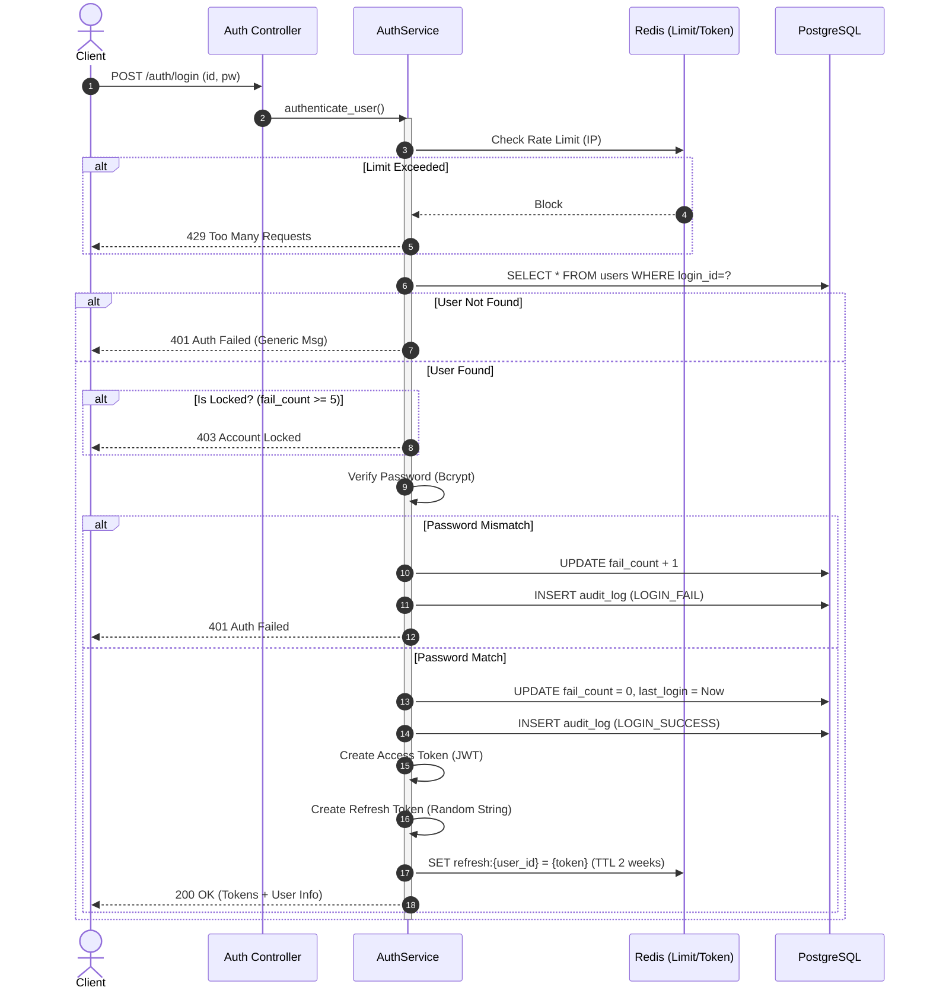
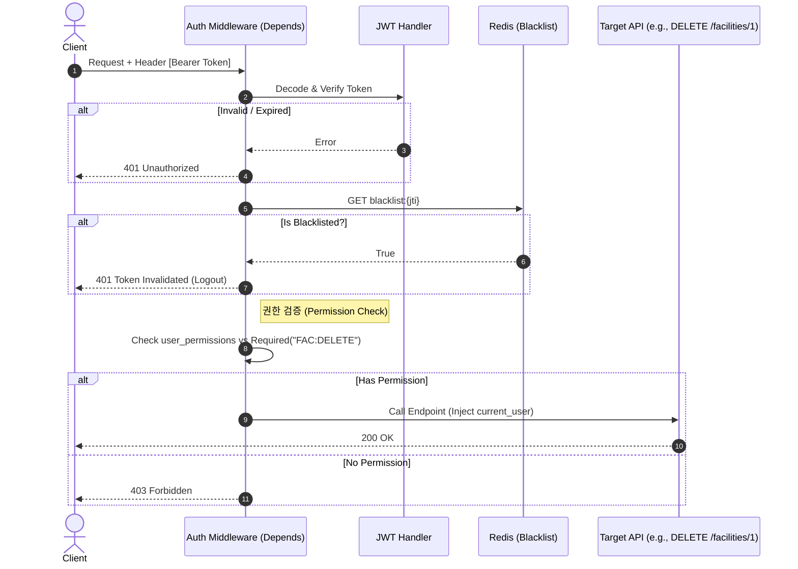
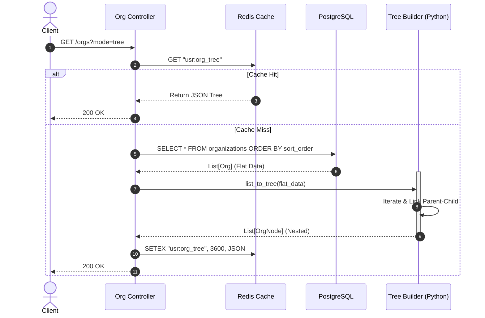
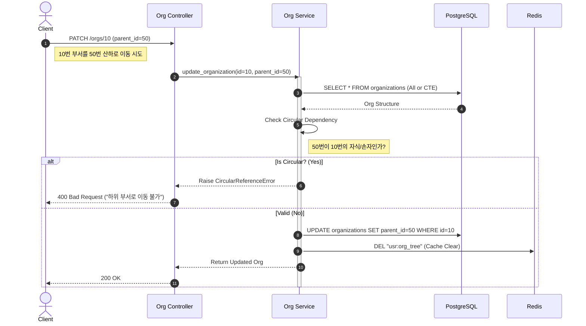

# 📐 SFMS Phase 1 - 핵심 로직 시퀀스 다이어그램 (02. IAM & 03. USR)

* **문서 버전:** v1.0
* **작성일:** 2026-02-17
* **관련 모듈:** `IAM(Auth, Roles)`, `USR(Users, Orgs)`

---

## 1. 🔐 IAM: 로그인 및 토큰 발급 (Login & Token Issue)

단순한 ID/PW 확인을 넘어, **계정 잠금(Brute Force 방어)**, **감사 로그**, **Refresh Token 저장**까지 포함된 보안 흐름입니다.

### 1.1 핵심 로직 설명

1. **Rate Limiting:** IP 기반의 로그인 시도 횟수를 Redis로 제한합니다.
2. **Account Lock:** 연속 5회 실패 시 계정을 잠급니다 (`is_locked` 또는 `fail_count` 체크).
3. **Audit Log:** 로그인 성공/실패 여부를 반드시 기록합니다 (보안 감사 필수 요건).
4. **Token Pair:** Access Token(Stateless)과 Refresh Token(Stateful in Redis)을 동시 발급합니다.

### 1.2 Sequence Diagram



---

## 2. 🛡️ IAM: 권한 인가 가드 (Authorization Guard)

모든 API 요청 시 수행되는 **미들웨어(Dependency)** 레벨의 로직입니다.

### 2.1 핵심 로직 설명

1. **JWT Verification:** 서명(Signature)과 만료(Exp)를 확인합니다.
2. **Blacklist Check:** 로그아웃된 토큰인지 Redis에서 확인합니다.
3. **Permission Check:** 해당 API가 요구하는 권한(예: `FAC:UPDATE`)을 유저가 보유했는지 확인합니다.
* *최적화:* 매번 DB에서 권한을 조회하면 느리므로, 로그인 시 발급된 **Token의 Payload(Claims)** 또는 **Redis 캐시**를 활용합니다.


### 2.2 Sequence Diagram



---

## 3. 🌳 USR: 조직도 트리 조회 (Organization Tree Assembly)

DB의 Flat 데이터(Adjacency List)를 프론트엔드용 **계층형 트리(Nested JSON)**로 변환하는 로직입니다.

### 3.1 핵심 로직 설명

1. **Fetch All:** DB에서는 `WHERE is_active=true` 조건으로 전체 목록을 한 번에 가져옵니다 (N+1 문제 방지).
2. **In-Memory Build:** Python의 Dictionary Reference를 활용하여 O(N) 복잡도로 트리를 조립합니다.
3. **Cache:** 조직도는 변경 빈도가 낮고 조회 빈도가 높으므로 **Redis 캐싱**이 필수입니다.

### 3.2 Sequence Diagram



---

## 4. 🔄 USR: 조직 이동 및 순환 참조 방지 (Circular Check)

부서 이동 시 **자신의 하위 부서 밑으로 들어가는 모순(Cycle)**을 방지하는 로직입니다.

### 4.1 핵심 로직 설명

1. **Validation:** 자기 자신을 부모로 설정하는지 확인.
2. **Descendant Check:** 이동하려는 `target_parent_id`가 나의 자손(Descendant)인지 확인해야 합니다.
* DB의 `RECURSIVE CTE` 쿼리나, 메모리에 로드된 트리에서 탐색을 수행합니다.


3. **Cache Eviction:** 구조가 변경되면 Redis의 `usr:org_tree` 키를 삭제합니다.

### 4.2 Sequence Diagram



---

## 5. 👨‍💻 개발자 구현 가이드 (Implementation Tips)

### 1. IAM (인증)

* **비밀번호 해싱:** `passlib.context.CryptContext(schemes=["bcrypt"])` 사용을 권장합니다.
* **JWT 라이브러리:** `PyJWT` 또는 `python-jose`를 사용하며, 알고리즘은 `HS256`이 가장 무난합니다.

### 2. USR (조직)

* **트리 조립 유틸리티 (Python 예시):**
```python
def list_to_tree(nodes):
    tree = []
    node_map = {node['id']: node for node in nodes}
    for node in nodes:
        node['children'] = []  # 초기화
    for node in nodes:
        parent_id = node.get('parent_id')
        if parent_id and parent_id in node_map:
            node_map[parent_id]['children'].append(node)
        else:
            tree.append(node) # 최상위 노드
    return tree

```


* **순환 참조 방지:** DB 쿼리보다는 **메모리 상에서 전체 트리를 로드한 후 검사**하는 것이 구현 난이도가 낮고 성능상(데이터가 1만 건 이하라면) 큰 문제가 없습니다.
