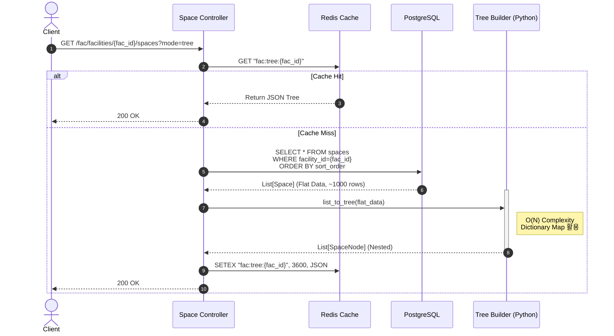
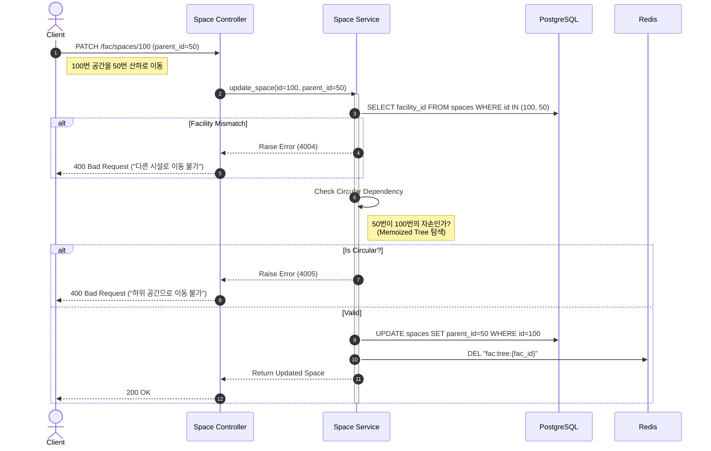
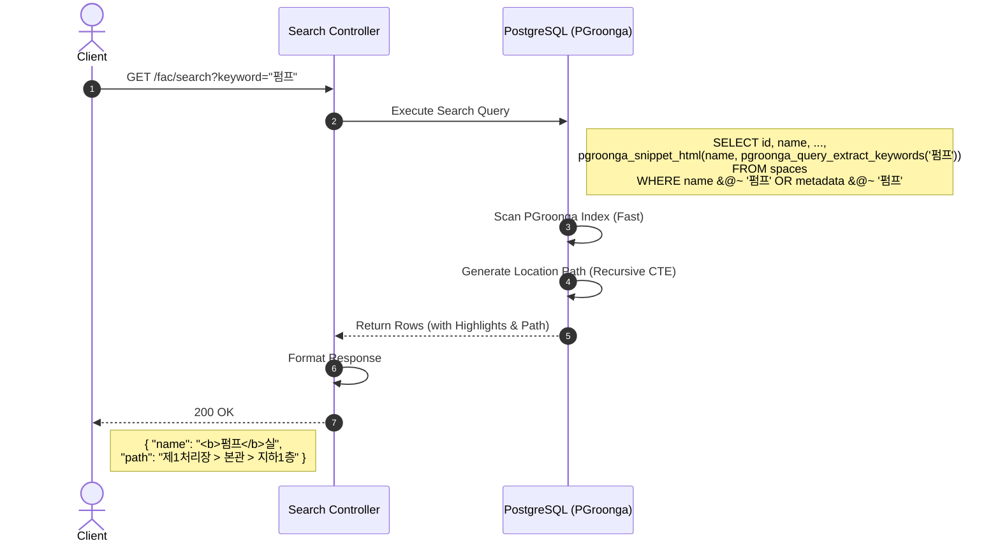
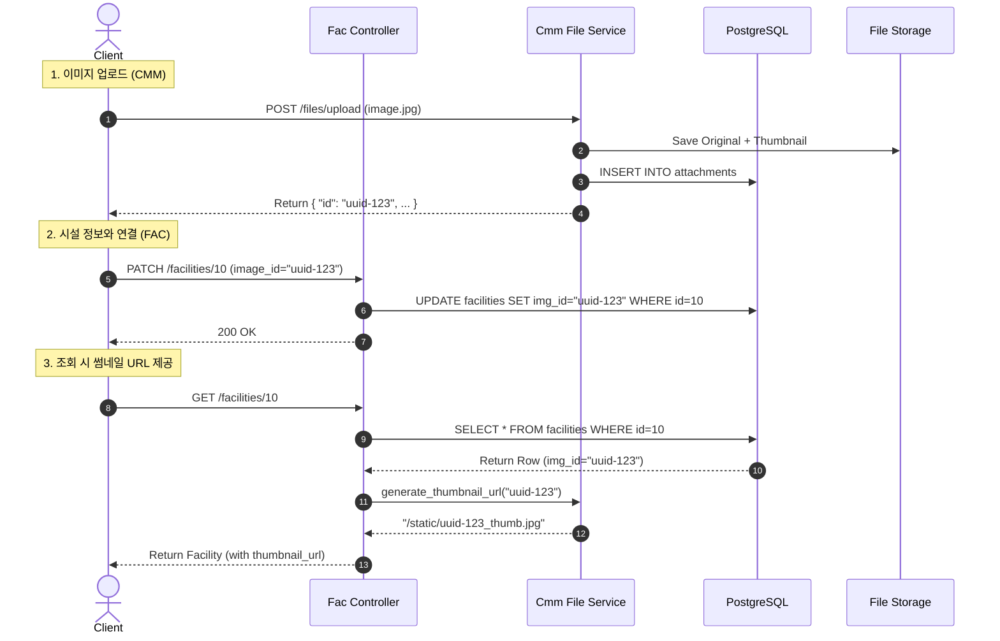

# 📐 SFMS Phase 1 - 핵심 로직 시퀀스 다이어그램 (04. FAC)

* **문서 버전:** v1.0
* **작성일:** 2026-02-17
* **관련 모듈:** `FAC(Facility, Space)`, `CMM(Image)`, `Search(PGroonga)`

---

## 1. 🏢 공간 트리 조회 및 조립 (Space Tree Assembly)

특정 시설물(예: 제1하수처리장)에 속한 수천 개의 공간(건물/층/실)을 계층 구조로 조회하는 로직입니다.

### 1.1 핵심 로직 설명

1. **Scoped Fetch:** 전체 공간을 조회하지 않고, 반드시 `facility_id`로 범위를 한정하여 조회합니다.
2. **In-Memory Assembly:** DB 부하를 줄이기 위해 `Recursive Query` 대신 **Flat Data**를 한 번에 조회 후 애플리케이션 메모리에서 조립합니다.
3. **Caching:** 시설별 트리 구조는 변경 빈도가 낮으므로 **Redis**에 캐싱합니다.

### 1.2 Sequence Diagram



---

## 2. 🔄 공간 이동 및 무결성 검증 (Move & Validation)

공간의 부모를 변경할 때 발생할 수 있는 **논리적 오류(순환 참조, 타 시설로의 이동)**를 방지합니다.

### 2.1 핵심 로직 설명

1. **Facility Scope Check:** 부모 공간(`parent_id`)이 자식 공간(`id`)과 **동일한 시설(`facility_id`)**에 속해 있는지 확인합니다.
2. **Circular Reference Check:** 이동하려는 부모가 **나의 자손(Descendant)**인지 검사합니다.
3. **Cache Eviction:** 이동 성공 시 해당 시설의 Redis 트리 캐시를 삭제합니다.

### 2.2 Sequence Diagram



---

## 3. 🔍 PGroonga 기반 통합 검색 (Full-Text Search)

**한글, 영어, JSONB 메타데이터**를 동시에 고속 검색하는 로직입니다.

### 3.1 핵심 로직 설명

1. **PGroonga Operator:** `&@~` 연산자를 사용하여 다중 컬럼(`name`, `code`, `metadata`)에 대한 인덱스 스캔을 수행합니다.
2. **Path Generation:** 검색된 공간이 어디에 있는지 알 수 있도록 `CTE(Common Table Expression)`를 사용해 **위치 경로(Path)**를 생성합니다.
3. **Highlight:** 검색어가 포함된 부분을 강조(`<b>text</b>`) 처리합니다.

### 3.2 Sequence Diagram



---

## 4. 🖼️ 대표 이미지 등록 및 썸네일 연결 (Image Linking)

`CMM` 모듈에 업로드된 이미지를 `FAC` 데이터와 연결하고, 조회 시 **썸네일 URL**을 제공하는 흐름입니다.

### 4.1 핵심 로직 설명

1. **Upload First:** `CMM` 모듈을 통해 파일을 먼저 업로드하고 `UUID`를 받습니다.
2. **Link Update:** 시설/공간 테이블의 `representative_image_id` 컬럼만 업데이트합니다.
3. **Read Logic:** 조회 시 `id`만 있는 경우, `CMM`의 URL 생성 로직을 호출해 `_thumb` 경로를 조합해 반환합니다.

### 4.2 Sequence Diagram



---

## 5. 👨‍💻 개발자 구현 가이드 (Implementation Tips)

### 1. PGroonga 쿼리 예시 (SQLAlchemy)

```python
# app/modules/fac/repository.py

async def search_spaces(session, keyword: str):
    # PGroonga 연산자 &@~ (Like 검색과 유사하지만 인덱스 사용)
    stmt = select(Space).where(
        or_(
            text("name &@~ :kw"),
            text("metadata &@~ :kw")
        )
    ).params(kw=keyword)
    
    # 하이라이팅 기능 (옵션)
    # pgroonga_snippet_html 함수 사용 가능
    
    return await session.execute(stmt)

```

### 2. 트리 조립 유틸리티 (Python)

```python
# app/core/utils/tree.py

def build_space_tree(spaces: List[SpaceRead]) -> List[SpaceRead]:
    """
    Flat List를 받아서 Children이 포함된 Nested List로 변환
    O(N) 복잡도 유지
    """
    node_map = {node.id: node for node in spaces}
    roots = []
    
    for node in spaces:
        node.children = [] # 초기화
        
    for node in spaces:
        if node.parent_id and node.parent_id in node_map:
            parent = node_map[node.parent_id]
            parent.children.append(node)
        else:
            roots.append(node)
            
    return roots

```