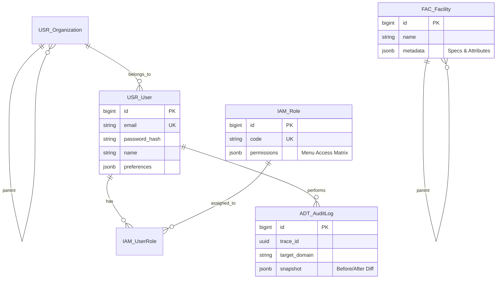
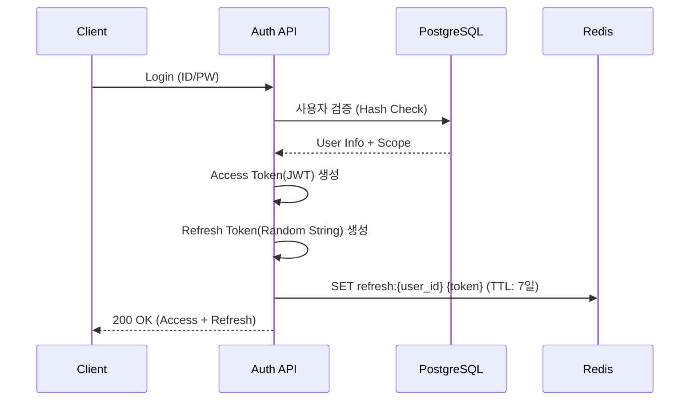
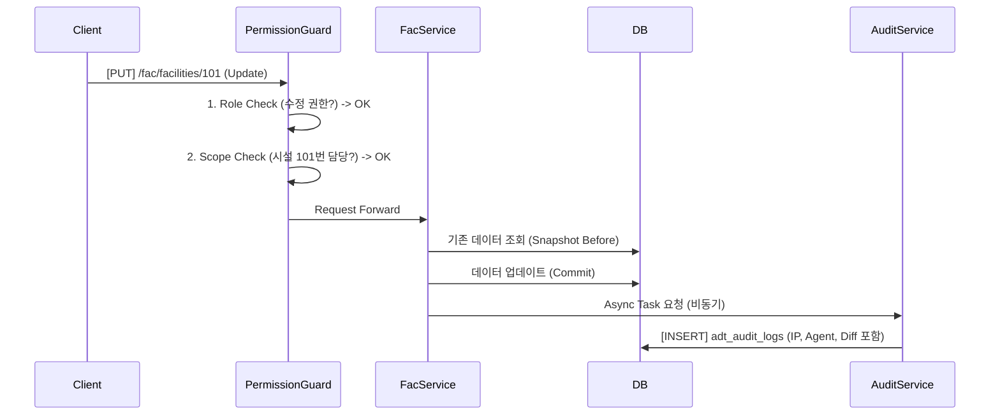

# 📘 SFMS Phase 1: 통합 설계서 (Foundation & Security)

* **프로젝트명:** SFMS (Sewage Facility Management System)
* **작성일:** 2026-02-18
* **작성자:** Chief Architect (오빠야~)
* **단계:** Phase 1 (기반 구축 및 보안)
* **기술 스택:**
* **Backend:** Python 3.12+, FastAPI, SQLAlchemy (Async), Pydantic v2
* **Database:** PostgreSQL 16 + **PGroonga** (한글/JSONB 검색 최적화)
* **Frontend:** React, TypeScript, Ant Design Pro
* **Infra:** Docker Compose

---

## 1. 🏗️ 프로젝트 구조 (Project Structure)

**Domain-Driven Design (DDD)**의 경량화 버전을 채택하여 모듈 간 응집도를 높입니다.

```text
sfms-backend/
├── app/
│   ├── core/               # 전역 설정, 보안, DB, 로깅, 미들웨어
│   │   ├── config.py       # 환경변수 관리
│   │   ├── database.py     # SQLAlchemy 세션 및 Base
│   │   ├── security.py     # JWT 핸들러, 암호화
│   │   ├── exceptions.py   # 커스텀 예외 처리
│   │   └── middleware/     # ADT 로깅 미들웨어 등
│   ├── modules/            # 도메인별 모듈 (Modular Monolith)
│   │   ├── adt/            # [감사] Audit Log
│   │   ├── iam/            # [보안] Auth, Role, Permission
│   │   ├── usr/            # [조직] User, Organization
│   │   └── fac/            # [시설] Facility Management
│   └── main.py             # FastAPI 진입점
├── docs/                   # 설계 문서
├── tests/                  # Pytest
├── docker-compose.yml      # PGroonga, Redis 실행
└── requirements.txt

```

---

## 2. 🗄️ 데이터베이스 스키마 (ERD & Schema)

### 2.1 공통 설계 원칙

* Soft Delete: 모든 주요 엔티티(User, Facility 등)는 is_deleted (Boolean) 또는 deleted_at (Timestamp) 컬럼을 보유하여 물리적 삭제를 방지한다.

* Naming: Table(snake_case), Column(snake_case), PK(id BigInt).

### 2.2 ERD 예시



### 2.2 상세 스키마 정의 (PostgreSQL + PGroonga)

#### 2.2.1. ADT_AuditLog (감사 로그)

시스템의 모든 변경 사항을 추적하는 블랙박스입니다.

**제약 사항:**
1. **Log Level:** 사용자의 행위만 기록한다.
2. **Scope:** LOGIN, LOGOUT, CREATE, UPDATE, DELETE 행위만 기록.(설정, 기준정보, 사용자 행위만 기록)
3. **Partitioning:** 월 단위(Month) 파티셔닝을 적용하여 1년 지난 로그는 아카이빙한다.

* **Index Strategy:** `snapshot` 컬럼에 PGroonga 인덱스를 적용하여 JSON 내부 검색 가속.

| Field | Type | Nullable | Description |
| --- | --- | --- | --- |
| `id` | `BigInteger` | NO | PK (Auto Increment) |
| `trace_id` | `UUID` | NO | 요청 추적 ID (Middleware 생성) |
| `actor_id` | `BigInteger` | YES | 수행자 ID (User ID) |
| `ip_address` | `Inet` | YES | 요청자 IP (보안 감사 필수 항목 추가) |
| `user_agent` | `Text` | YES | 요청 브라우저/기기 정보 (추가) |
| `target_domain` | `Varchar(50)` | NO | 예: `FAC`, `USR` |
| `target_id` | `Varchar(100)` | NO | 대상 레코드 PK |
| `action` | `Varchar(20)` | NO | `CREATE`, `UPDATE`, `DELETE`, `LOGIN` |
| `snapshot` | `JSONB` | YES | 변경 전/후 데이터 (PGroonga Index) |
| `created_at` | `DateTime` | NO | 생성 일시 (Default: Now) |

**`snapshot` JSON 구조 예시:**

```json
{
  "before": { "status": "STOP", "temp": 45 },
  "after": { "status": "RUN", "temp": 60 },
  "changes": ["status", "temp"],
  "reason": "정기 가동"
}

```

#### 2.2.2. IAM_Role (역할 및 권한)

* **Key Concept:** 메뉴별 권한을 JSONB로 관리하여 스키마 변경 없이 권한 체계를 수정 가능하게 함.
* RBAC(Role-Based)와 **데이터 접근 범위(Scope)**를 분리하여 설계한다.
* **IAM_Role (permissions):** "할 수 있는 행위" (What)
* **USR_User (access_scope):** "접근 가능한 데이터" (Where)

| Table | Field | Type | Description |
| --- | --- | --- | --- |
| IAM_Role | permissions | JSONB | * 메뉴/기능별 권한 매트릭스 <br>예: {"fac": ["read", "write"], "sys": ["read"]} |
| USR_User | access_scope | JSONB | * 데이터 접근 범위<br>예: {"facility_ids": [101, 102], "dept_code": "MAIN"} |

**`permissions` JSON 구조 예시:**

```json
{
  "fac_mgmt": ["read", "create", "update", "delete"],
  "user_mgmt": ["read"],
  "report": ["read", "export"]
}

```

### 2.2.3. CMM_File (파일 메타데이터)

NewMinIO 객체와 DB 간의 정합성을 보장하기 위한 메타데이터 테이블.

| Field | Type | Description |
| --- | --- | --- |
| id | UUID | PK (MinIO Object Name과 동일하게 사용 권장) |
| original_name | Varchar | 업로드 원본 파일명 |
| file_size | BigInt | 파일 크기 (Byte) |
| mime_type | Varchar | MIME Type |
| bucket_name | Varchar | MinIO Bucket 이름 |
| ref_domain | Varchar | 연결된 도메인 (예: FAC) |
| ref_id | BigInt | 연결된 레코드 ID |

---

## 3. 📡 API 명세서 (Interface Specification)

### 3.1 공통 응답 포맷 (Envelope Pattern)

프론트엔드 타입 추론을 위해 아래 제네릭 모델을 준수한다.

* **backend**

```python

# Pseudo Code
class APIResponse[T](BaseModel):
    success: bool
    code: int
    message: str
    data: T | None  # 실제 데이터 타입이 여기에 들어감
    meta: dict | None
```

### 3.2 성공 응답 포멧 예제

* **frontend 예제**

```json
{
  "success": true,           // 성공 여부
  "code": 200,               // HTTP Status or Custom Code
  "message": "Ok",           // 사람이 읽을 수 있는 메시지
  "data": { ... },           // 실제 페이로드 (List or Object)
  "meta": {                  // (Optional) 페이지네이션 등 메타 정보
    "total": 120,
    "page": 1,
    "size": 20
  }
}

```

### 3.2 에러 응답 포맷 예제

```json
{
  "success": false,
  "code": 4001,              // Custom Error Code
  "message": "이미 존재하는 사용자 이메일입니다.",
  "data": null
}

```

### 3.3 Endpoint 규칙

* **Prefix:** `/api/v1`
* **URL:** `kebab-case` (소문자 및 하이픈)
* **Resource:** 복수형 명사 사용

| Method | URL | Description |
| --- | --- | --- |
| `POST` | `/auth/login` | 로그인 (Access Token 발급, Refresh Token Redis 저장) |
| `POST` | `/auth/refresh` | 토큰 갱신 (Redis 내 Refresh Token 유효성 검증) |
| `POST` | `/auth/logout` | 로그아웃 (Access Token Redis Blacklist 등록) |
| `GET` | `/adt/logs` | 감시 로그 조회 (PGroonga JSON 검색 활용) |
| `GET` | `/users` | 사용자 목록 조회 |
| `POST` | `/users` | 사용자 생성 |
| `GET` | `/users/{id}` | 사용자 상세 조회 |
| `PATCH` | `/users/{id}` | 사용자 정보 일부 수정 |
| `GET` | `/fac/facilities` | 시설 트리 조회 |

---

## 4. 🔄 핵심 로직 시퀀스 (Sequence Diagram)

### 4.1 로그인 및 세션관리(Radis 활용)



### 4.2 데이터 변경 및 감사 로깅 (Audit + Scope Check)



---

## 5. 🔐 권한 매트릭스 (Permission Matrix)

각 역할(Role)별로 수행 가능한 행위를 정의합니다.

| 도메인 | 기능(Menu) | Admin | Operator | Viewer | 비고 |
| --- | --- | --- | --- | --- | --- |
| **USR** | 사용자 관리 | ✅ All | ❌ | ❌ | |
| **IAM** | 권한 설정 | ✅ All | ❌ | ❌ | |
| **FAC** | 시설 트리 조회 | ✅ Read | ✅ Read | ✅ Read | |
| **FAC** | 시설 속성 편집 | ✅ All | ✅ Update | ❌ | |
| **ADT** | 감사 로그 조회 | ✅ Read | ❌ | ❌ | 보안 민감 |
| **RPT** | 보고서 출력 | ✅ Export | ✅ Export | ✅ Read | |

---

## 6. ✅ Phase 1 구현 체크리스트 (Backlog)

### 1주차: 환경 설정 및 공통 모듈

* [ ] Docker Compose: PGroonga, Redis, MinIO 컨테이너 구성 및 연동 확인.
* [ ] FastAPI Setup: Generic[T] 기반 응답 모델 및 예외 처리 핸들러 구현.
* [ ] Database: SQLAlchemy Async Engine 설정, Alembic 환경 구성.

### 2주차: 보안(IAM) 및 감사(ADT)

* [ ] Redis 연동: JWT Refresh Token 저장소 및 Blacklist 기능 구현.
* [ ] ADT 모델: Partitioning이 적용된 Audit Log 테이블 생성.
* [ ] Middleware: Request Context에서 IP/User-Agent 추출 및 로깅 로직 구현.

### 3주차: 사용자(USR) 및 공통(CMM)

* [ ] Scope Logic: 사용자별 access_scope JSON 처리 로직 구현.
* [ ] File Mgmt: MinIO 업로드 유틸리티 및 CMM_File 메타데이터 저장 로직.

---
