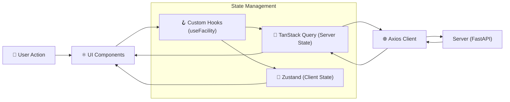

# 📘 SFMS Phase 1 doc02 - 프론트엔드 아키텍처 및 UI 표준

* **프로젝트명:** SFMS (Smart Facility Management System)
* **작성일:** 2026-02-18
* **작성자:** Chief Architect (Min-su)
* **버전:** v1.0 (Draft)
* **단계:** Phase 1 (Foundation & UI Standards)

---

## 1. 🏗️ 아키텍처 개요 (Architecture Overview)

**"복잡한 데이터를 한눈에, 하지만 수정은 안전하게"**
데이터 중심의 엔터프라이즈 애플리케이션을 위해 **Vite + React + Ant Design Pro**를 기반으로 하며, 상태 관리를 **서버 상태(Data)**와 **UI 상태(View)**로 엄격히 분리합니다.

### 1.1 기술 스택 (Tech Stack)

* **Core:** React 18, TypeScript 5.x, Vite 5.x
* **UI Framework:** **Ant Design v5**, **ProComponents** (ProTable, ProForm, ProLayout)
* **State Management:**
* **Server State:** **TanStack Query v5** (Caching, Auto-fetching)
* **Client State:** **Zustand** (Global UI State: Modal, Theme, Auth)

* **Styling:** **Tailwind CSS 4** (Layout/Spacing) + **AntD Token** (Component Style)
* **Icons:** `lucide-react` (기본), AntD Icons (보조)
* **Network:** Axios (Interceptors)
* **Package Manager:** `pnpm` (Strict mode)

### 1.2 데이터 흐름도 (Data Flow)



---

## 2. 📂 디렉토리 구조 (Directory Structure)

백엔드의 **DDD(Domain-Driven Design)** 구조를 프론트엔드 `features` 폴더에 동일하게 적용하여 도메인 응집도를 높입니다.

```text
src/
├── app/                    # 앱 전역 설정 (Provider, Router, Entry)
│   ├── App.tsx
│   ├── main.tsx
│   └── router.tsx          # React Router 설정
│
├── shared/                 # [공통] 도메인 무관 재사용 요소
│   ├── api/                # Axios 인스턴스 (Interceptor)
│   ├── components/         # 공통 UI (Button, ModalWrapper)
│   ├── hooks/              # 공통 Hook (useDebounce, useAuth)
│   ├── stores/             # 전역 UI Store (useThemeStore)
│   └── utils/              # 유틸리티 (dateFormatter, validator)
│
├── features/               # [도메인] 비즈니스 로직 (백엔드 모듈과 1:1 매핑)
│   ├── cmm/                # [공통 관리] 코드, 파일, 알림
│   ├── iam/                # [인증/권한] 로그인, 역할 관리
│   ├── usr/                # [사용자/조직] 조직도, 사원 관리
│   └── fac/                # [시설 관리] 설비, 공간 트리
│       ├── api/            # 해당 도메인 API 호출 함수
│       ├── components/     # 도메인 전용 컴포넌트 (FacilityTree.tsx)
│       ├── hooks/          # React Query Hooks (useFacilityList)
│       ├── types/          # TypeScript 인터페이스 (Zod 스키마)
│       └── pages/          # 라우팅 페이지 (FacilityPage.tsx)
│
└── styles/                 # 전역 스타일 (Tailwind, AntD Theme)
    └── theme.ts            # High Density 토큰 설정

```

---

## 3. 🎨 UI/UX 표준 (UI Standards)

**"Data Density High"** 가치를 실현하기 위해 Ant Design의 기본 여백을 줄이고 정보 밀도를 높입니다.

### 3.1 Ant Design Config (High Density)

`ConfigProvider`를 통해 전역적으로 컴포넌트 사이즈를 축소합니다.

* **Global Size:** `small` (기본값)
* **Font Size:** `13px` (데이터 가독성 최적화)
* **Border Radius:** `4px` (단단하고 전문적인 느낌)

```typescript
// src/styles/theme.ts
import { ThemeConfig } from 'antd';

export const sfmsTheme: ThemeConfig = {
  token: {
    fontSize: 13,
    colorPrimary: '#1677ff', // SFMS Blue
    borderRadius: 4,
    fontFamily: "'Pretendard', -apple-system, BlinkMacSystemFont, system-ui, sans-serif",
  },
  components: {
    Table: {
      cellPaddingBlock: 8, // 행 높이 축소
      cellPaddingInline: 8,
      headerBg: '#f0f2f5', // 헤더 구분감 강화
    },
    Button: {
      paddingInline: 12,
      controlHeightSM: 28, // 소형 버튼 높이
    },
    Form: {
      itemMarginBottom: 12, // 폼 간격 축소
    },
    Card: {
        paddingLG: 16, // 카드 내부 패딩 축소
    }
  },
};

```

### 3.2 레이아웃 표준 (ProLayout)

* **Navigation:** 좌측 사이드바 (Collapsible)
* **Header:** 우측 상단 유저 정보, 알림 벨, 테마 토글
* **Breadcrumb:** 현재 위치 명확히 표시 (예: 시설 관리 > 펌프장 > A동)
* **PageContainer:** 모든 페이지는 `ProLayout`의 `PageContainer` 내부에 렌더링하여 통일된 헤더/타이틀 제공.

---

## 4. 🔄 상태 관리 전략 (State Strategy)

**"섞어 쓰지 않는다."** 이것이 철칙입니다.

| 구분 | 도구 | 사용 규칙 | 예시 |
| --- | --- | --- | --- |
| **Server State** | **TanStack Query** | API 데이터 조회, 캐싱, 동기화 | 사용자 목록, 시설 트리, 공통 코드 |
| **Client State** | **Zustand** | UI 제어, 클라이언트 전역 설정 | 다크모드 여부, 사이드바 열림, 모달 상태 |
| **Local State** | **useState** | 컴포넌트 내부의 일시적 상태 | 폼 입력값, 탭 선택, 드롭다운 열림 |
| **Form State** | **AntD Form / RHF** | 복잡한 입력 폼 관리 | 사용자 등록 폼, 검색 필터 |

### 4.1 Query Key 관리 규칙 (Factory Pattern)

쿼리 키가 분산되면 캐시 무효화(Invalidation)가 어렵습니다. `queryKeys` 객체로 중앙 관리합니다.

```typescript
// src/features/fac/queries.ts
export const facKeys = {
  all: ['fac'] as const,
  lists: () => [...facKeys.all, 'list'] as const,
  list: (filters: string) => [...facKeys.lists(), { filters }] as const,
  details: () => [...facKeys.all, 'detail'] as const,
  detail: (id: number) => [...facKeys.details(), id] as const,
  tree: (rootId: number) => [...facKeys.all, 'tree', rootId] as const,
};

// 사용: useQuery({ queryKey: facKeys.detail(1), ... })

```

---

## 5. 🧩 컴포넌트 패턴 (Component Patterns)

### 5.1 ProTable 활용 (CRUD 표준)

엔터프라이즈 데이터 조회 화면은 **90% 이상 `ProTable`**을 사용하여 개발 생산성을 극대화합니다.

* **Search:** 상단 검색 영역 자동 생성 (Schema 기반).
* **Pagination:** 서버 사이드 페이지네이션 기본 적용.
* **ToolBar:** '신규 등록', '엑셀 다운로드' 등 공통 액션 배치.

```tsx
// 예시: 사용자 목록 (features/usr/pages/UserListPage.tsx)
<ProTable<User>
  columns={columns}
  request={async (params, sort) => {
    // API 호출 및 포맷팅 자동화
    return getUserList({ ...params, ...sort });
  }}
  rowKey="id"
  search={{ labelWidth: 'auto' }}
  size="small" // High Density 적용
  pagination={{ pageSize: 20 }}
/>

```

### 5.2 Modal vs Drawer (Overlay UI)

* **Drawer (우측 패널):** 상세 정보 조회, 긴 입력 폼, 데이터 비교 시 사용. (사용자가 컨텍스트를 유지해야 할 때)
* **Modal (중앙 팝업):** 간단한 확인, 알림, 삭제 경고, 짧은 입력 폼.

---

## 6. 🛡️ 보안 및 에러 처리 (Security & Error)

### 6.1 인증 가드 (AuthGuard)

`react-router`의 `Outlet`을 감싸는 형태로 구현합니다.

* 토큰 존재 여부 확인 -> 없으면 로그인 페이지 리다이렉트.
* 토큰 만료 시 -> Refresh Token 시도 -> 실패 시 강제 로그아웃.
* 권한(Role) 체크 -> 권한 부족 시 403 페이지 표시.

### 6.2 에러 핸들링 (Global Boundary)

* **API Error:** Axios Interceptor에서 401, 403, 500 등 공통 에러를 감지하여 `AntD Message` 또는 `Notification`으로 사용자에게 알림.
* **Runtime Error:** `React Error Boundary`를 사용하여 화면 전체가 깨지는 것을 방지하고 "오류가 발생했습니다" UI 표시.

---

## 7. ✅ 프론트엔드 체크리스트 (Kick-off)

1. [ ] **프로젝트 초기화:** `npm create vite@latest sfms-frontend -- --template react-ts`
2. [ ] **라이브러리 설치:** `antd`, `@ant-design/pro-components`, `@tanstack/react-query`, `axios`, `zustand`, `lucide-react`, `tailwindcss`
3. [ ] **테마 설정:** `theme.ts` 작성 및 `ConfigProvider` 적용.
4. [ ] **라우터 구성:** `react-router-dom` 설치 및 `AuthGuard` 구현.
5. [ ] **API 클라이언트:** Axios 인스턴스 설정 (BaseURL, Timeout, Interceptor).

---
