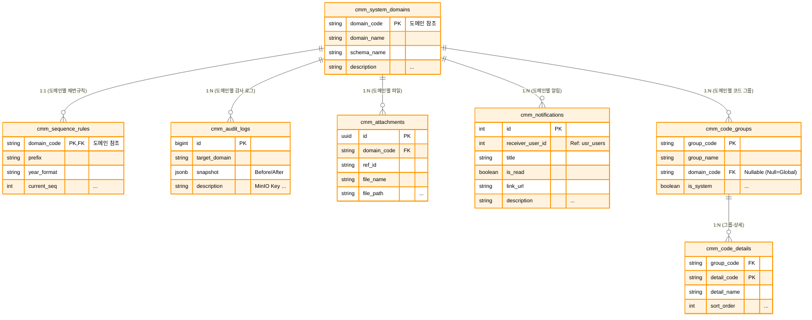

# 📘 SFMS Phase 1 DATABASE 설계서 - 공통 관리 (CMM) (Revised v1.3)

* **문서 버전:** v1.3 (Production Ready)
* **작성일:** 2026-02-17
* **기준 규격:** `SFMS Standard v1.2`

---

## 1. 🗺️ ERD (Entity Relationship Diagram)

시스템 전반에서 사용하는 코드, 파일, 로그, 알림 등을 관리하는 영역입니다. 다른 모든 모듈의 기반이 됩니다.



---

## 2. 🗄️ 상세 스키마 명세서 (Schema Specifications)

| Table Name | PK | Description | 주요 컬럼 및 JSONB 구조 |
| --- | --- | --- | --- |
| **system_domains** | `domain_code` | 시스템 모듈 정의 | `schema_name`(스키마), `is_active` |
| **code_groups** | `group_code` | 공통 코드 그룹 | `is_system`(삭제불가 여부) |
| **code_details** | `(group, detail)` | 공통 코드 상세 | `props` (JSONB): `{"color": "#F00", "unit": "kg"}` |
| **attachments** | `id` (UUID) | **MinIO 파일 메타데이터** | `file_path`(MinIO Key), `ref_id`(참조ID), `legacy_id` |
| **audit_logs** | `id` (BigInt) | **데이터 감사 로그** | `snapshot` (JSONB): `{"before": {...}, "after": {...}}` |
| **notifications** | `id` | 사용자 알림 | `receiver_user_id`, `is_read`, `link_url` |
| **sequence_rules** | `domain_code` | 문서 번호 채번 규칙 | `prefix`(접두어), `current_seq`(현재번호) |

## 3. 🗄️ 상세 스키마 정의 (Schema Definition - Common & File & Log)

**목적:** 시스템 전반의 공통 데이터, 파일 메타데이터(MinIO), 보안 감사 로그 관리.

### 3.1 Table Specification

| Table Name | Description | PK Type | Remarks |
| --- | --- | --- | --- |
| `system_domains` | 시스템 모듈(도메인) 등록 | `Varchar` | fac, usr, cmm 등 |
| `code_groups` | 공통 코드 그룹 | `Varchar` | |
| `code_details` | 공통 코드 상세 | `Composite` | **JSONB Props** 적용 |
| `attachments` | **MinIO 파일 메타데이터** | `UUID` | 물리적 파일은 MinIO 저장 |
| `audit_logs` | 데이터 변경 감사 로그 | `BigInt` | **JSONB Snapshot** 필수 |
| `sequence_rules` | 문서 번호 자동 채번 규칙 | `Varchar` | |
| `notifications` | 사용자 알림 | `BigInt` | |

### 3.2 DDL Script (SQL)

```sql
-----------------------------------------------------------
-- 🟨 cmm 도메인 (공통 관리) - 최종 확정본
-----------------------------------------------------------
CREATE SCHEMA IF NOT EXISTS cmm;
COMMENT ON SCHEMA cmm IS '공통 관리 도메인 (기준정보, 파일, 로그)';

-- [확장 기능] 검색 성능 향상(pgroonga) 및 UUID 생성을 위한 확장 모듈 활성화
CREATE EXTENSION IF NOT EXISTS pgroonga;
CREATE EXTENSION IF NOT EXISTS "uuid-ossp";

-----------------------------------------------------------
-- 0. [Function] 자동 시간 갱신 트리거 함수
-----------------------------------------------------------
CREATE OR REPLACE FUNCTION cmm.trg_set_updated_at()
RETURNS TRIGGER AS $$
BEGIN
    -- 레코드 수정(Update) 시 updated_at 컬럼을 현재 시간으로 자동 설정
    NEW.updated_at = CURRENT_TIMESTAMP;
    RETURN NEW;
END;
$$ LANGUAGE plpgsql;

COMMENT ON FUNCTION cmm.trg_set_updated_at IS '레코드 수정 시 updated_at 필드를 자동으로 갱신하는 트리거 함수';


-----------------------------------------------------------
-- 1. [Table] 시스템 도메인 (system_domains)
-----------------------------------------------------------
CREATE TABLE cmm.system_domains (
    id                  BIGSERIAL PRIMARY KEY,

    domain_code         VARCHAR(3) NOT NULL UNIQUE,     -- 비즈니스 식별 코드 (예: FAC, USR, CMM)
    domain_name         VARCHAR(50) NOT NULL,           -- 도메인 명칭 (예: 시설관리, 사용자관리)
    schema_name         VARCHAR(50) NOT NULL UNIQUE,    -- 물리적 DB 스키마명 (중복 불가)
    description         TEXT,                           -- 도메인 설명
    sort_order          INT DEFAULT 0,                  -- UI 표시 순서

    is_active           BOOLEAN DEFAULT true,           -- 사용 여부

    created_at          TIMESTAMPTZ DEFAULT CURRENT_TIMESTAMP,
    created_by          BIGINT REFERENCES usr.users(id),
    updated_at          TIMESTAMPTZ DEFAULT CURRENT_TIMESTAMP,
    updated_by          BIGINT REFERENCES usr.users(id),
    
    -- [제약조건] 도메인 코드는 반드시 대문자 3자 (정규식 체크)
    CONSTRAINT chk_domain_code_format CHECK (domain_code ~ '^[A-Z]{3}$')
);

-- [Trigger] 수정 시 updated_at 자동 갱신
CREATE TRIGGER trg_updated_at_system_domains 
BEFORE UPDATE ON cmm.system_domains 
FOR EACH ROW EXECUTE FUNCTION cmm.trg_set_updated_at();

-- [Comments] 모든 필드 상세 설명
COMMENT ON TABLE cmm.system_domains IS '시스템 내 업무 도메인(모듈) 정의 테이블';
COMMENT ON COLUMN cmm.system_domains.id IS '도메인 테이블 고유 ID (PK)';
COMMENT ON COLUMN cmm.system_domains.domain_code IS '도메인 식별 코드 (Unique, 대문자 3자, 예: FAC)';
COMMENT ON COLUMN cmm.system_domains.domain_name IS '도메인 명칭 (한글, 예: 시설관리)';
COMMENT ON COLUMN cmm.system_domains.schema_name IS '데이터베이스 스키마 명칭 (예: facility)';
COMMENT ON COLUMN cmm.system_domains.description IS '도메인에 대한 상세 설명';
COMMENT ON COLUMN cmm.system_domains.sort_order IS 'UI 메뉴 등에서의 정렬 순서';
COMMENT ON COLUMN cmm.system_domains.is_active IS '도메인 사용 여부 (False 시 비활성화)';
COMMENT ON COLUMN cmm.system_domains.created_at IS '데이터 생성 일시';
COMMENT ON COLUMN cmm.system_domains.created_by IS '데이터 생성자 ID';
COMMENT ON COLUMN cmm.system_domains.updated_at IS '데이터 최종 수정 일시';
COMMENT ON COLUMN cmm.system_domains.updated_by IS '데이터 최종 수정자 ID';


-----------------------------------------------------------
-- 2. [Table] 공통 코드 그룹 (code_groups)
-----------------------------------------------------------
CREATE TABLE cmm.code_groups (
    id                  BIGSERIAL PRIMARY KEY,

    group_code          VARCHAR(30) NOT NULL UNIQUE,    -- 그룹 식별 코드 (예: USER_TYPE)
    domain_code         VARCHAR(3) REFERENCES cmm.system_domains(domain_code) ON UPDATE CASCADE,
    group_name          VARCHAR(100) NOT NULL,          -- 그룹 명칭 (예: 사용자 유형)
    description         TEXT,                           -- 그룹 설명

    is_system           BOOLEAN DEFAULT false,          -- 시스템 기본 코드 여부 (삭제 불가)
    is_active           BOOLEAN DEFAULT true,           -- 사용 여부

    created_at          TIMESTAMPTZ DEFAULT CURRENT_TIMESTAMP,
    created_by          BIGINT REFERENCES usr.users(id),
    updated_at          TIMESTAMPTZ DEFAULT CURRENT_TIMESTAMP,
    updated_by          BIGINT REFERENCES usr.users(id),

    -- [제약조건] 그룹 코드는 영대문자, 숫자, 언더바만 허용
    CONSTRAINT chk_group_code_format CHECK (group_code ~ '^[A-Z0-9_]+$')
);

-- [Index] 도메인별 코드 그룹 조회를 위한 인덱스
CREATE INDEX idx_code_groups_domain ON cmm.code_groups (domain_code);

-- [Trigger] 수정 시 updated_at 자동 갱신
CREATE TRIGGER trg_updated_at_code_groups 
BEFORE UPDATE ON cmm.code_groups 
FOR EACH ROW EXECUTE FUNCTION cmm.trg_set_updated_at();

-- [Comments] 모든 필드 상세 설명
COMMENT ON TABLE cmm.code_groups IS '공통 코드 그룹 (헤더) 정의 테이블';
COMMENT ON COLUMN cmm.code_groups.id IS '코드 그룹 고유 ID (PK)';
COMMENT ON COLUMN cmm.code_groups.group_code IS '그룹 식별 코드 (Unique, 예: GENDER_TYPE)';
COMMENT ON COLUMN cmm.code_groups.domain_code IS '해당 코드를 관리하는 도메인 코드 (FK)';
COMMENT ON COLUMN cmm.code_groups.group_name IS '코드 그룹 명칭 (예: 성별)';
COMMENT ON COLUMN cmm.code_groups.description IS '코드 그룹에 대한 설명';
COMMENT ON COLUMN cmm.code_groups.is_system IS '시스템 필수 코드 여부 (True인 경우 UI에서 삭제 불가)';
COMMENT ON COLUMN cmm.code_groups.is_active IS '코드 그룹 사용 여부';
COMMENT ON COLUMN cmm.code_groups.created_at IS '생성 일시';
COMMENT ON COLUMN cmm.code_groups.created_by IS '생성자 ID';
COMMENT ON COLUMN cmm.code_groups.updated_at IS '수정 일시';
COMMENT ON COLUMN cmm.code_groups.updated_by IS '수정자 ID';


-----------------------------------------------------------
-- 3. [Table] 공통 코드 상세 (code_details)
-----------------------------------------------------------
CREATE TABLE cmm.code_details (
    id                  BIGSERIAL PRIMARY KEY,          -- 내부 관리용 대리키

    group_code          VARCHAR(30) NOT NULL REFERENCES cmm.code_groups(group_code) ON DELETE CASCADE,
    detail_code         VARCHAR(30) NOT NULL,           -- 상세 코드 값 (예: M, F)
    detail_name         VARCHAR(100) NOT NULL,          -- 상세 코드 명칭 (예: 남성, 여성)
    
    -- [확장성] 코드별 색상, 참조값 등 비정형 데이터를 저장
    props               JSONB DEFAULT '{}'::jsonb NOT NULL,
    sort_order          INT DEFAULT 0,                  -- 정렬 순서

    is_active           BOOLEAN DEFAULT true,           -- 사용 여부

    created_at          TIMESTAMPTZ DEFAULT CURRENT_TIMESTAMP,
    created_by          BIGINT REFERENCES usr.users(id),
    updated_at          TIMESTAMPTZ DEFAULT CURRENT_TIMESTAMP,
    updated_by          BIGINT REFERENCES usr.users(id),

    -- [제약조건] 동일 그룹 내 코드 중복 불가
    CONSTRAINT uq_code_details_group_detail UNIQUE (group_code, detail_code),
    CONSTRAINT chk_detail_code_format CHECK (detail_code ~ '^[A-Z0-9_]+$')
);

-- [Index] 특정 그룹의 코드 목록 조회를 위한 인덱스
CREATE INDEX idx_code_details_group ON cmm.code_details (group_code);

-- [Trigger] 수정 시 updated_at 자동 갱신
CREATE TRIGGER trg_updated_at_code_details 
BEFORE UPDATE ON cmm.code_details 
FOR EACH ROW EXECUTE FUNCTION cmm.trg_set_updated_at();

-- [Comments] 모든 필드 상세 설명
COMMENT ON TABLE cmm.code_details IS '공통 코드 상세 (아이템) 정의 테이블';
COMMENT ON COLUMN cmm.code_details.id IS '코드 상세 고유 ID (PK)';
COMMENT ON COLUMN cmm.code_details.group_code IS '소속된 코드 그룹 코드 (FK)';
COMMENT ON COLUMN cmm.code_details.detail_code IS '상세 코드 값 (실제 저장되는 값, 예: 01)';
COMMENT ON COLUMN cmm.code_details.detail_name IS '상세 코드 명칭 (화면에 표시되는 값, 예: 1분기)';
COMMENT ON COLUMN cmm.code_details.props IS '코드별 확장 속성 데이터 (JSONB, 예: {color: "red"})';
COMMENT ON COLUMN cmm.code_details.sort_order IS '코드 표시 순서';
COMMENT ON COLUMN cmm.code_details.is_active IS '코드 상세 사용 여부';
COMMENT ON COLUMN cmm.code_details.created_at IS '생성 일시';
COMMENT ON COLUMN cmm.code_details.created_by IS '생성자 ID';
COMMENT ON COLUMN cmm.code_details.updated_at IS '수정 일시';
COMMENT ON COLUMN cmm.code_details.updated_by IS '수정자 ID';


-----------------------------------------------------------
-- 4. [Table] 파일/첨부파일 (attachments)
-----------------------------------------------------------
CREATE TABLE cmm.attachments (
    id                  UUID PRIMARY KEY DEFAULT gen_random_uuid(),

    domain_code         VARCHAR(3) NOT NULL REFERENCES cmm.system_domains(domain_code),
    resource_type       VARCHAR(50) NOT NULL, -- 구분자 (예: facilities, spaces) << 추가
    ref_id              BIGINT NOT NULL,           -- 참조하는 원본 데이터의 ID (BIGINT)
    category_code       VARCHAR(20) NOT NULL,           -- 파일 구분 코드 (Lookup: ATTACH_CAT)

    file_name           VARCHAR(255) NOT NULL,          -- 사용자가 업로드한 원본 파일명
    file_path           VARCHAR(500) NOT NULL,          -- 스토리지(MinIO/S3) 저장 경로 (Key)
    file_size           BIGINT NOT NULL DEFAULT 0,      -- 파일 크기 (Bytes)
    content_type        VARCHAR(100),                   -- 파일 MIME Type
    
    props               JSONB NOT NULL DEFAULT '{}'::jsonb, -- 이미지 메타데이터 등 추가 정보

    legacy_id           INTEGER,                        -- 마이그레이션용 구 시스템 ID
    legacy_source       VARCHAR(50),                    -- 마이그레이션 출처
    is_deleted          BOOLEAN DEFAULT false,          -- 소프트 삭제 여부 (휴지통 기능 지원)
    
    created_at          TIMESTAMPTZ DEFAULT CURRENT_TIMESTAMP,
    created_by          BIGINT REFERENCES usr.users(id),
    updated_at          TIMESTAMPTZ DEFAULT CURRENT_TIMESTAMP,
    updated_by          BIGINT REFERENCES usr.users(id),

    -- [제약조건] 파일 크기는 음수일 수 없음
    CONSTRAINT chk_attachments_size CHECK (file_size >= 0)
);

-- [Index] 특정 데이터(ref_id)에 연결된 첨부파일 목록 조회
CREATE INDEX idx_attachments_ref ON cmm.attachments (domain_code, resource_type, ref_id);
-- [Index] 파일 경로(Key) 중복 방지 (삭제되지 않은 파일 기준)
CREATE UNIQUE INDEX uq_attachments_active_path ON cmm.attachments (file_path) WHERE (is_deleted IS FALSE);

-- [Trigger] 수정 시 updated_at 자동 갱신
CREATE TRIGGER trg_updated_at_attachments 
BEFORE UPDATE ON cmm.attachments 
FOR EACH ROW EXECUTE FUNCTION cmm.trg_set_updated_at();

-- [Comments] 모든 필드 상세 설명
COMMENT ON TABLE cmm.attachments IS '통합 첨부파일 관리 테이블';
COMMENT ON COLUMN cmm.attachments.id IS '파일 고유 식별자 (UUID)';
COMMENT ON COLUMN cmm.attachments.domain_code IS '업무 도메인 코드 (FK)';
COMMENT ON COLUMN cmm.attachments.ref_id IS '첨부파일이 연결된 원본 데이터의 ID';
COMMENT ON COLUMN cmm.attachments.category_code IS '첨부파일 분류 코드 (예: PROFILE, DOC)';
COMMENT ON COLUMN cmm.attachments.file_name IS '업로드된 원본 파일명';
COMMENT ON COLUMN cmm.attachments.file_path IS '물리적 저장 경로 (Object Storage Key)';
COMMENT ON COLUMN cmm.attachments.file_size IS '파일 크기 (Byte 단위)';
COMMENT ON COLUMN cmm.attachments.content_type IS '파일의 MIME Type (예: image/jpeg)';
COMMENT ON COLUMN cmm.attachments.props IS '파일 추가 메타데이터 (JSONB)';
COMMENT ON COLUMN cmm.attachments.legacy_id IS '기존 시스템에서의 파일 ID (마이그레이션용)';
COMMENT ON COLUMN cmm.attachments.legacy_source IS '기존 시스템 출처 테이블명 (마이그레이션용)';
COMMENT ON COLUMN cmm.attachments.is_deleted IS '삭제 여부 (True: 삭제됨, 실제 파일은 배치로 정리)';
COMMENT ON COLUMN cmm.attachments.created_at IS '업로드 일시';
COMMENT ON COLUMN cmm.attachments.created_by IS '업로더 ID';
COMMENT ON COLUMN cmm.attachments.updated_at IS '메타데이터 수정 일시';
COMMENT ON COLUMN cmm.attachments.updated_by IS '메타데이터 수정자 ID';


-----------------------------------------------------------
-- 5. [Table] 시스템 감사 로그 (audit_logs)
-----------------------------------------------------------
CREATE TABLE cmm.audit_logs (
    id                  BIGSERIAL PRIMARY KEY,
    
    actor_user_id       BIGINT REFERENCES usr.users(id),    -- 행위자 ID (NULL 허용: 시스템 작업)
    
    action_type         VARCHAR(20) NOT NULL,               -- 행위 유형 (CREATE, UPDATE, LOGIN 등)
    
    target_domain       VARCHAR(3) NOT NULL REFERENCES cmm.system_domains(domain_code),
    target_table        VARCHAR(50) NOT NULL,               -- 대상 테이블명
    target_id           VARCHAR(50) NOT NULL,               -- 대상 데이터의 PK (String 변환)

    snapshot            JSONB NOT NULL DEFAULT '{}'::jsonb, -- 변경 전/후 데이터 스냅샷

    client_ip           VARCHAR(50),                        -- 요청자 IP 주소
    user_agent          TEXT,                               -- 요청자 브라우저/클라이언트 정보
    
    description         TEXT,                               -- 로그 상세 설명 (사람이 읽기 쉬운 형태)

    created_at          TIMESTAMPTZ DEFAULT CURRENT_TIMESTAMP
);

-- [Index] 특정 테이블/데이터의 이력 조회
CREATE INDEX idx_cmm_audit_target_lookup ON cmm.audit_logs (target_table, target_id);
-- [Index] 특정 사용자의 활동 이력 조회
CREATE INDEX idx_cmm_audit_actor ON cmm.audit_logs (actor_user_id);
-- [Extension Index] pgroonga를 활용한 로그 설명 전문 검색
CREATE INDEX idx_cmm_audit_desc_pg ON cmm.audit_logs USING pgroonga (description);
-- [Extension Index] pgroonga를 활용한 스냅샷(JSON) 내부 검색
CREATE INDEX idx_cmm_audit_snap_pg ON cmm.audit_logs USING pgroonga (snapshot);

-- [Comments] 모든 필드 상세 설명
COMMENT ON TABLE cmm.audit_logs IS '시스템 감사 로그 및 주요 행위 추적 테이블';
COMMENT ON COLUMN cmm.audit_logs.id IS '로그 고유 ID (PK)';
COMMENT ON COLUMN cmm.audit_logs.actor_user_id IS '행위를 수행한 사용자 ID (NULL이면 시스템)';
COMMENT ON COLUMN cmm.audit_logs.action_type IS '행위 유형 (C:생성, U:수정, D:삭제, L:로그인 등)';
COMMENT ON COLUMN cmm.audit_logs.target_domain IS '대상 데이터의 도메인 코드';
COMMENT ON COLUMN cmm.audit_logs.target_table IS '대상 데이터의 테이블명';
COMMENT ON COLUMN cmm.audit_logs.target_id IS '대상 데이터의 식별자(PK)';
COMMENT ON COLUMN cmm.audit_logs.snapshot IS '변경 데이터 스냅샷 (JSONB)';
COMMENT ON COLUMN cmm.audit_logs.client_ip IS '요청 클라이언트 IP 주소';
COMMENT ON COLUMN cmm.audit_logs.user_agent IS '요청 클라이언트 User-Agent 정보';
COMMENT ON COLUMN cmm.audit_logs.description IS '로그 내용 텍스트 설명';
COMMENT ON COLUMN cmm.audit_logs.created_at IS '로그 발생 일시';


-----------------------------------------------------------
-- 6. [Table] 알림 (notifications)
-----------------------------------------------------------
CREATE TABLE cmm.notifications (
    id                  BIGSERIAL PRIMARY KEY,
    domain_code         VARCHAR(3) REFERENCES cmm.system_domains(domain_code),

    sender_user_id      BIGINT REFERENCES usr.users(id),    -- 발신자 (NULL: 시스템 발신)
    receiver_user_id    BIGINT REFERENCES usr.users(id),    -- 수신자

    category            VARCHAR(20) NOT NULL,               -- 알림 분류 (ALERT, NOTICE, MSG)
    priority            VARCHAR(10) DEFAULT 'NORMAL',       -- 중요도 (URGENT, NORMAL, LOW)

    title               VARCHAR(200) NOT NULL,              -- 알림 제목
    content             TEXT,                               -- 알림 내용
    
    link_url            VARCHAR(500),                       -- 클릭 시 이동할 URL

    props               JSONB NOT NULL DEFAULT '{}'::jsonb, -- 추가 데이터 (파라미터 등)

    is_read             BOOLEAN DEFAULT false,              -- 읽음 여부
    read_at             TIMESTAMPTZ,                        -- 읽은 시간

    is_deleted          BOOLEAN DEFAULT false,              -- 수신자 삭제 여부
    
    created_at          TIMESTAMPTZ DEFAULT CURRENT_TIMESTAMP,
    updated_at          TIMESTAMPTZ DEFAULT CURRENT_TIMESTAMP,
    
    -- [제약조건] 읽은 시간은 생성 시간보다 빠를 수 없음
    CONSTRAINT chk_notifications_read_time CHECK (read_at IS NULL OR read_at >= created_at)
);

-- [Index] 사용자의 '읽지 않은' 알림 조회 성능 최적화 (부분 인덱스)
CREATE INDEX idx_notifications_receiver_unread 
ON cmm.notifications (receiver_user_id, is_read, created_at DESC) 
WHERE (is_deleted IS FALSE);

-- [Trigger] 수정 시 updated_at 자동 갱신
CREATE TRIGGER trg_updated_at_notifications 
BEFORE UPDATE ON cmm.notifications 
FOR EACH ROW EXECUTE FUNCTION cmm.trg_set_updated_at();

-- [Comments] 모든 필드 상세 설명
COMMENT ON TABLE cmm.notifications IS '사용자 알림 및 메시지 관리 테이블';
COMMENT ON COLUMN cmm.notifications.id IS '알림 고유 ID (PK)';
COMMENT ON COLUMN cmm.notifications.domain_code IS '관련 도메인 코드';
COMMENT ON COLUMN cmm.notifications.sender_user_id IS '보낸 사람 ID (NULL: 시스템)';
COMMENT ON COLUMN cmm.notifications.receiver_user_id IS '받는 사람 ID';
COMMENT ON COLUMN cmm.notifications.category IS '알림 카테고리 (예: 공지, 경고, 일반)';
COMMENT ON COLUMN cmm.notifications.priority IS '알림 중요도 (URGENT, NORMAL, LOW)';
COMMENT ON COLUMN cmm.notifications.title IS '알림 제목';
COMMENT ON COLUMN cmm.notifications.content IS '알림 본문 내용';
COMMENT ON COLUMN cmm.notifications.link_url IS '알림 클릭 시 이동할 링크 URL';
COMMENT ON COLUMN cmm.notifications.props IS '알림 관련 추가 속성 (JSONB)';
COMMENT ON COLUMN cmm.notifications.is_read IS '수신자 확인 여부 (True: 읽음)';
COMMENT ON COLUMN cmm.notifications.read_at IS '수신자가 확인한 일시';
COMMENT ON COLUMN cmm.notifications.is_deleted IS '수신자 삭제(숨김) 여부';
COMMENT ON COLUMN cmm.notifications.created_at IS '알림 생성 일시';
COMMENT ON COLUMN cmm.notifications.updated_at IS '알림 상태 수정 일시';


-----------------------------------------------------------
-- 7. [Table] 채번 규칙 (sequence_rules)
-----------------------------------------------------------
CREATE TABLE cmm.sequence_rules (
    id                  BIGSERIAL PRIMARY KEY,
    domain_code         VARCHAR(3) NOT NULL REFERENCES cmm.system_domains(domain_code),
  
    prefix              VARCHAR(10) NOT NULL,           -- 채번 접두어 (예: PO, INV)
    year_format         VARCHAR(4) DEFAULT 'YYYY',      -- 연도 포맷 (YYYY, YY, NONE)
    separator           CHAR(1) DEFAULT '-',            -- 구분자 (-, _, 공백 등)
    padding_length      INT DEFAULT 4,                  -- 순번 자리수 (4 -> 0001)

    current_year        VARCHAR(4) NOT NULL,            -- 현재 채번 기준 연도
    current_seq         BIGINT NOT NULL DEFAULT 0,      -- 현재 마지막 발급 번호
    reset_type          VARCHAR(10) DEFAULT 'YEARLY',   -- 번호 초기화 주기 (YEARLY, NONE)

    is_active           BOOLEAN DEFAULT true,           -- 규칙 사용 여부

    created_at          TIMESTAMPTZ DEFAULT CURRENT_TIMESTAMP,
    created_by          BIGINT REFERENCES usr.users(id),
    updated_at          TIMESTAMPTZ DEFAULT CURRENT_TIMESTAMP,
    updated_by          BIGINT REFERENCES usr.users(id),

    -- [제약조건] 동일 도메인 내 접두어 중복 불가
    CONSTRAINT uq_sequence_rules_domain_prefix UNIQUE (domain_code, prefix),
    -- [제약조건] 시퀀스는 음수 불가
    CONSTRAINT chk_sequence_current_seq CHECK (current_seq >= 0),
    -- [제약조건] 패딩 길이는 1~10 사이
    CONSTRAINT chk_sequence_padding CHECK (padding_length BETWEEN 1 AND 10)
);

-- [Trigger] 수정 시 updated_at 자동 갱신
CREATE TRIGGER trg_updated_at_sequence_rules 
BEFORE UPDATE ON cmm.sequence_rules 
FOR EACH ROW EXECUTE FUNCTION cmm.trg_set_updated_at();

-- [Comments] 모든 필드 상세 설명
COMMENT ON TABLE cmm.sequence_rules IS '문서 번호 자동 채번 규칙 정의 테이블';
COMMENT ON COLUMN cmm.sequence_rules.id IS '채번 규칙 고유 ID (PK)';
COMMENT ON COLUMN cmm.sequence_rules.domain_code IS '해당 규칙을 사용하는 도메인 코드';
COMMENT ON COLUMN cmm.sequence_rules.prefix IS '문서 번호 접두어 (예: ORD)';
COMMENT ON COLUMN cmm.sequence_rules.year_format IS '연도 표시 형식 (YYYY: 2024, YY: 24)';
COMMENT ON COLUMN cmm.sequence_rules.separator IS '접두어, 연도, 번호 사이의 구분자';
COMMENT ON COLUMN cmm.sequence_rules.padding_length IS '일련번호의 자릿수 (LPAD 처리)';
COMMENT ON COLUMN cmm.sequence_rules.current_year IS '현재 채번이 진행 중인 연도';
COMMENT ON COLUMN cmm.sequence_rules.current_seq IS '마지막으로 발급된 일련번호';
COMMENT ON COLUMN cmm.sequence_rules.reset_type IS '일련번호 초기화 방식 (YEARLY: 매년 1로 초기화)';
COMMENT ON COLUMN cmm.sequence_rules.is_active IS '규칙 사용 여부';
COMMENT ON COLUMN cmm.sequence_rules.created_at IS '규칙 생성 일시';
COMMENT ON COLUMN cmm.sequence_rules.created_by IS '규칙 생성자 ID';
COMMENT ON COLUMN cmm.sequence_rules.updated_at IS '규칙 수정 일시';
COMMENT ON COLUMN cmm.sequence_rules.updated_by IS '규칙 수정자 ID';


-----------------------------------------------------------
-- 8. [Function] 자동 채번 함수 (fn_get_next_sequence)
-- 기능: 도메인과 접두어를 입력받아 규칙에 맞는 다음 번호를 생성 (동시성 제어 포함)
-----------------------------------------------------------
CREATE OR REPLACE FUNCTION cmm.fn_get_next_sequence(
    p_domain_code VARCHAR, 
    p_prefix VARCHAR, 
    p_user_id BIGINT DEFAULT NULL
)
RETURNS VARCHAR AS $$
DECLARE
    v_rec RECORD;
    v_new_seq BIGINT;
    v_now_year VARCHAR(4);
    v_formatted_year VARCHAR(4);
    v_result VARCHAR(100);
BEGIN
    -- 1. 현재 연도 확인 (YYYY 문자열)
    v_now_year := TO_CHAR(CURRENT_TIMESTAMP, 'YYYY');

    -- 2. 채번 규칙 조회 및 잠금 (FOR UPDATE)
    -- [중요] 동시 요청 시 중복 채번을 방지하기 위해 해당 행을 Lock 함
    SELECT * INTO v_rec FROM cmm.sequence_rules 
    WHERE domain_code = p_domain_code AND prefix = p_prefix AND is_active = true FOR UPDATE;

    IF NOT FOUND THEN RAISE EXCEPTION 'No active sequence rule for %:%', p_domain_code, p_prefix; END IF;

    -- 3. 연도 변경 체크 및 번호 증가 로직
    IF v_rec.reset_type = 'YEARLY' AND v_rec.current_year <> v_now_year THEN 
        v_new_seq := 1; -- 연도가 바뀌었으면 1번부터 시작
    ELSE 
        v_new_seq := v_rec.current_seq + 1; -- 아니면 +1 증가
    END IF;

    -- 4. DB 정보 업데이트 (다음 채번을 위해 상태 저장)
    UPDATE cmm.sequence_rules 
    SET current_seq = v_new_seq, 
        current_year = v_now_year, 
        updated_by = p_user_id, 
        updated_at = CURRENT_TIMESTAMP 
    WHERE id = v_rec.id;

    -- 5. 출력 포맷 생성 (연도 포맷팅)
    v_formatted_year := CASE 
        WHEN v_rec.year_format = 'YYYY' THEN v_now_year 
        WHEN v_rec.year_format = 'YY' THEN RIGHT(v_now_year, 2)
        ELSE '' END;

    -- 6. 최종 문자열 조합 (접두어 + 구분자 + 연도 + 구분자 + 패딩된 번호)
    -- 예시: INV-2024-0005
    v_result := v_rec.prefix || CASE WHEN v_formatted_year <> '' THEN v_rec.separator || v_formatted_year ELSE '' END 
                || v_rec.separator || LPAD(v_new_seq::text, v_rec.padding_length, '0');

    RETURN v_result;
END;
$$ LANGUAGE plpgsql;

COMMENT ON FUNCTION cmm.fn_get_next_sequence IS '도메인 및 접두어 기반 자동 문서 번호 생성 함수 (Concurrency Safe)';


-----------------------------------------------------------
-- 9. [View] 코드 조회 뷰 (v_code_lookup)
-----------------------------------------------------------
CREATE OR REPLACE VIEW cmm.v_code_lookup AS
SELECT 
    g.domain_code,          -- 도메인 필터링용
    g.group_code,           -- 그룹 코드
    g.group_name,           -- 그룹 명칭
    d.id AS detail_id,      -- 상세 코드 ID
    d.detail_code AS value, -- Frontend Select Box 호환용 (value)
    d.detail_name AS label, -- Frontend Select Box 호환용 (label)
    d.props,                -- 확장 속성
    d.sort_order            -- 정렬 순서
FROM cmm.code_groups g 
JOIN cmm.code_details d ON g.group_code = d.group_code
WHERE g.is_active = true 
  AND d.is_active = true
ORDER BY g.group_code, d.sort_order;

-- [Comments] 뷰 및 컬럼 설명
COMMENT ON VIEW cmm.v_code_lookup IS '프론트엔드 Select 컴포넌트용 통합 코드 조회 뷰 (Value/Label 매핑)';
COMMENT ON COLUMN cmm.v_code_lookup.domain_code IS '도메인 구분 코드';
COMMENT ON COLUMN cmm.v_code_lookup.group_code IS '코드 그룹 식별자';
COMMENT ON COLUMN cmm.v_code_lookup.group_name IS '코드 그룹 명칭';
COMMENT ON COLUMN cmm.v_code_lookup.detail_id IS '코드 상세 ID';
COMMENT ON COLUMN cmm.v_code_lookup.value IS '코드 값 (Select Box value)';
COMMENT ON COLUMN cmm.v_code_lookup.label IS '코드 표시명 (Select Box label)';
COMMENT ON COLUMN cmm.v_code_lookup.props IS '코드 확장 속성 JSON';
COMMENT ON COLUMN cmm.v_code_lookup.sort_order IS '정렬 순서';
```

---

## 4. 🚀 레거시 마이그레이션 전략 (Migration Strategy)

파일 및 이미지 (cmm)

* DB에 저장된 `bytea`(BLOB) 데이터는 추출하여 MinIO의 `/legacy/{table_name}/{id}/` 경로에 저장합니다.
* 저장 후 `cmm.attachments` 테이블에 파일 경로와 `legacy_id`를 기록하여 데이터 무결성을 유지합니다.
