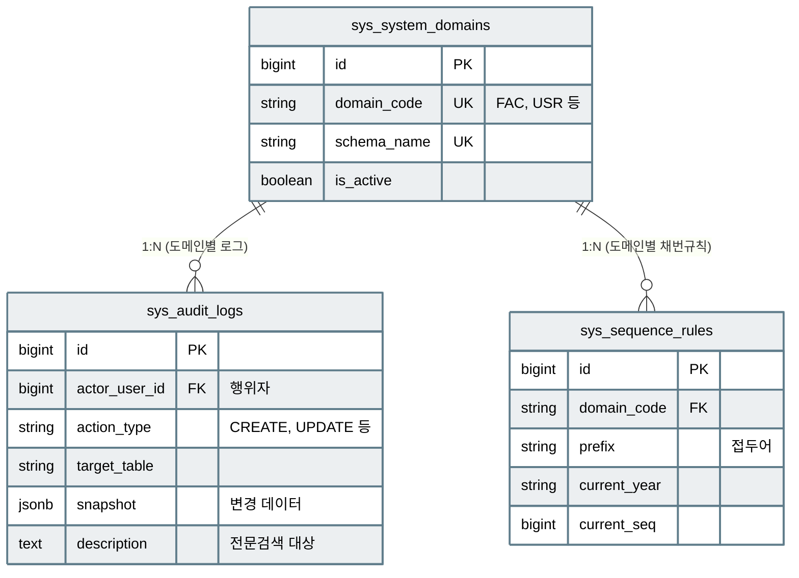

# 📘 SFMS Phase 1 DATABASE 설계서 - 시스템 관리 (SYS) (Revised v1.4)

* **문서 버전:** v1.4 (Actual Implementation Sync)
* **최종 수정일:** 2026-03-07
* **대상 스키마:** `sys`

---

## 1. 🗺️ 설계 개요

시스템 전반의 메타데이터, 보안 감사 로그, 문서 번호 채번 규칙을 관리하는 기반 도메인입니다.

### 1.1 주요 역할

* **도메인 관리**: 시스템 내 설치된 모듈(스키마) 정보 정의
* **감사 로그**: 데이터 변경 이력(Snapshot) 및 행위 추적 (PGroonga 전문 검색 적용)
* **자동 채번**: 문서 번호(INV-2024-001 등)의 규칙 정의 및 발급 로직 제공

---

## 2. 🗄️ 상세 스키마 정의 (Schema Definition)

### 2.1 Table Specification

| Table Name | Description | PK Type | Remarks |
| --- | --- | --- | --- |
| `system_domains` | 시스템 모듈(도메인) 등록 | `BigSerial` | FAC, USR, CMM 등 |
| `audit_logs` | 데이터 변경 및 시스템 행위 감사 로그 | `BigSerial` | JSONB Snapshot, PGroonga 인덱스 |
| `sequence_rules` | 문서 번호 자동 채번 규칙 정의 | `BigSerial` | 도메인별/접두어별 관리 |

### 2.2 주요 함수 (Functions)

* **`sys.trg_set_updated_at()`**: 모든 테이블의 `updated_at` 필드를 자동 갱신하는 전역 트리거 함수.
* **`sys.fn_get_next_sequence()`**: 동시성을 보장하며 규칙에 맞는 다음 문서 번호를 생성하는 함수.

---

## 3. 🗺️ ERD (Entity Relationship Diagram)

---

## 4. 🚀 특이사항

* **보안 강화**: `audit_logs`는 사용자의 IP와 User-Agent를 기록하여 추적성을 보장합니다.
* **검색 최적화**: 로그의 `description` 및 `snapshot` 필드에는 `pgroonga` 인덱스를 설정하여 대량의 로그에서도 고속 검색이 가능합니다.
