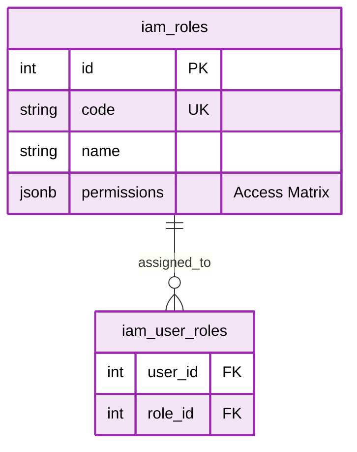

# 📘 SFMS Phase 1 DATABASE 설계서 - 인증 및 권리 (IAM) (Revised v1.3)

* **문서 버전:** v1.3 (Production Ready)
* **작성일:** 2026-02-17
* **기준 규격:** `SFMS Standard v1.2`

---

## 1. 🗺️ ERD (Entity Relationship Diagram)

역할(Role) 기반의 세밀한 권한 제어를 통해 메뉴 접근 및 데이터 조작 권한을 관리합니다.



---

## 2. 🗄️ 상세 스키마 명세서 (Schema Specifications)

| Table Name | PK | Description | 주요 컬럼 및 JSONB 구조 |
| --- | --- | --- | --- |
| **roles** | `id` | 역할 정의 (RBAC) | code('ADMIN', 'OP'), name('운영자'), is_system, <br/> permissions (JSONB): {""fac_mgmt"": [""read"", ""write""]} |
| **user_roles** | `(user_id, role_id)` | 사용자-역할 매핑 | user_id (FK: usr.users), role_id (FK: iam.roles) |

---

## 3. 🗄️ 상세 스키마 정의 (Schema Definition - Common & File & Log)

**목적:** 역할(Role) 기반 접근 제어(RBAC)를 통해 메뉴 접근 및 데이터 조작 권한을 세밀하게 관리.

### 3.1 Table Specification

| Table Name | Description | PK Type | Remarks |
| --- | --- | --- | --- |
| `roles` | 역할 정의 (RBAC) | `BigSerial` | 역할별 권한 매트릭스(`permissions`) JSONB 포함 |
| `user_roles` | 사용자-역할 매핑 | `Composite` | 사용자별 다중 역할 부여를 위한 교차 테이블 |

### 3.2 DDL Script (SQL)

```sql
CREATE SCHEMA IF NOT EXISTS iam;
COMMENT ON SCHEMA iam IS '인증 및 권한 관리 도메인';
-----------------------------------------------------------
-- 🟪 ism 도메인 (인증 및 권한 관리)
-----------------------------------------------------------
CREATE SCHEMA IF NOT EXISTS iam;
COMMENT ON SCHEMA iam IS '인증 및 권한 관리 도메인';

-- ========================================================
-- 1. 역할 정의 (Roles)
-- ========================================================
CREATE TABLE iam.roles (
    id                  BIGSERIAL PRIMARY KEY,
    name                VARCHAR(100) NOT NULL,          -- 역할의 표시 명칭 (UI 노출용)
    code                VARCHAR(50) NOT NULL UNIQUE,    -- 시스템 내부 식별용 코드 (고유값)
    
    -- [핵심] 메뉴 및 액션별 권한 매트릭스
    -- 구조 예시: {"menu_id": ["read", "write"], "user_mng": ["*"]}
    -- GIN 인덱스를 통해 JSON 내부 키/값 검색 성능 최적화
    permissions         JSONB NOT NULL DEFAULT '{}'::jsonb,
    
    description         TEXT,                           -- 역할에 대한 상세 설명
    is_system           BOOLEAN DEFAULT false,          -- true일 경우 삭제/수정 제한 (시스템 필수 역할)
    
    created_at          TIMESTAMPTZ DEFAULT CURRENT_TIMESTAMP,
    created_by          BIGINT REFERENCES usr.users(id),
    updated_at          TIMESTAMPTZ DEFAULT CURRENT_TIMESTAMP,
    updated_by          BIGINT REFERENCES usr.users(id),

    -- [무결성 제약] 역할 코드는 항상 대문자로 저장
    CONSTRAINT chk_roles_code_upper CHECK (code = UPPER(code)),
    -- [데이터 검증] permissions 컬럼은 반드시 JSON 객체 타입이어야 함 (배열 등 불가)
    CONSTRAINT chk_roles_permissions_obj CHECK (jsonb_typeof(permissions) = 'object')
);

-- [Trigger] 업데이트 시 updated_at 자동 갱신
CREATE TRIGGER trg_updated_at_roles 
BEFORE UPDATE ON iam.roles 
FOR EACH ROW EXECUTE FUNCTION cmm.trg_set_updated_at();

-- [Index] 권한 JSON 데이터의 고속 검색을 위한 GIN 인덱스
CREATE INDEX idx_iam_roles_permissions_gin ON iam.roles USING GIN (permissions);

-- [Comment] 테이블 및 컬럼 설명 등록 (DB 메타데이터)
COMMENT ON TABLE iam.roles IS '시스템 내 역할(Role) 및 권한(Permission) 정의 테이블';
COMMENT ON COLUMN iam.roles.id IS '역할 고유 ID (PK)';
COMMENT ON COLUMN iam.roles.name IS '역할 명칭 (예: 시스템 관리자, 일반 사용자)';
COMMENT ON COLUMN iam.roles.code IS '역할 식별 코드 (Unique, 대문자 필수, 예: ADMIN)';
COMMENT ON COLUMN iam.roles.permissions IS '권한 설정 JSONB (Key: 메뉴/리소스, Value: 행위 배열)';
COMMENT ON COLUMN iam.roles.description IS '역할에 대한 상세 설명';
COMMENT ON COLUMN iam.roles.is_system IS '시스템 기본 역할 여부 (True인 경우 삭제 불가)';
COMMENT ON COLUMN iam.roles.created_at IS '생성 일시';
COMMENT ON COLUMN iam.roles.created_by IS '생성자 ID';
COMMENT ON COLUMN iam.roles.updated_at IS '수정 일시';
COMMENT ON COLUMN iam.roles.updated_by IS '수정자 ID';


-- ========================================================
-- 2. 사용자-역할 매핑 (User-Roles)
-- ========================================================
CREATE TABLE iam.user_roles (
    user_id             BIGINT NOT NULL REFERENCES usr.users(id) ON DELETE CASCADE,
    role_id             BIGINT NOT NULL REFERENCES iam.roles(id) ON DELETE CASCADE,
    
    assigned_at         TIMESTAMPTZ DEFAULT CURRENT_TIMESTAMP,
    assigned_by         BIGINT REFERENCES usr.users(id) ON DELETE SET NULL,  -- 권한 부여 수행자

    -- 한 사용자가 동일 역할을 중복 보유할 수 없음
    PRIMARY KEY (user_id, role_id)
);

-- [Index] 특정 역할(Role)을 가진 사용자 목록 조회를 위한 인덱스
-- (PK가 user_id 선행이므로, role_id 선행 인덱스 별도 생성)
CREATE INDEX idx_iam_user_roles_role_id ON iam.user_roles (role_id);

-- [Comment] 테이블 및 컬럼 설명 등록 (DB 메타데이터)
COMMENT ON TABLE iam.user_roles IS '사용자와 역할 간의 N:M 매핑 테이블';
COMMENT ON COLUMN iam.user_roles.user_id IS '대상 사용자 ID (FK)';
COMMENT ON COLUMN iam.user_roles.role_id IS '부여된 역할 ID (FK)';
COMMENT ON COLUMN iam.user_roles.assigned_at IS '역할 부여 일시';
COMMENT ON COLUMN iam.user_roles.assigned_by IS '역할을 부여한 관리자 ID';


-- ========================================================
-- 3. 초기 필수 데이터 (Seed Data)
-- ========================================================
INSERT INTO iam.roles (name, code, permissions, is_system) VALUES 
('슈퍼 관리자', 'SUPER_ADMIN', '{"all": ["*"]}', true),
('일반 사용자', 'USER', '{"dashboard": ["read"]}', true);
```

---

## 4. 🚀 레거시 마이그레이션 전략 (Migration Strategy)

**Identity & Access Management:** 신규모듈이라 레거시 마이그레이션 전략 없음
