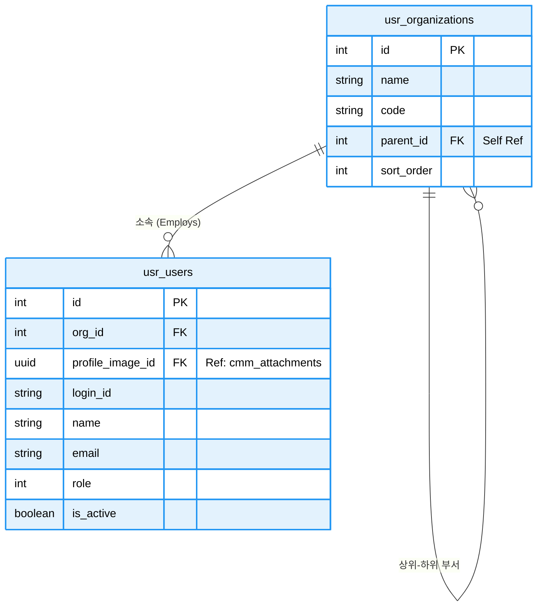

# 📘 SFMS Phase 1 DATABASE 설계서 - 사용자, 조직, 권한 (USR) (Revised v1.3)

* **문서 버전:** v1.3 (Production Ready)
* **작성일:** 2026-02-17
* **기준 규격:** `SFMS Standard v1.2`

---

## 1. 🗺️ ERD (Entity Relationship Diagram)

조직 구조와 사용자 계정을 관리합니다. `usr_organizations`의 자기 참조(Self-Reference) 관계가 핵심입니다.



---

## 2. 🗄️ 상세 스키마 명세서 (Schema Specifications)

| Table Name | PK | Description | 주요 컬럼 및 JSONB 구조 |
| --- | --- | --- | --- |
| **organizations** | `id` | **조직 (Department)** | `parent_id`(상위조직), `legacy_source`('GUMC'/'MES') |
| **users** | `id` | **사용자 (User)** | `login_id`, `role`(1/10/100), `profile_image_id`(UUID),_`metadata` (JSONB): 레거시 메모, UI 설정 등 |

---

## 3. 🗄️ 상세 스키마 정의 (Schema Definition - Common & File & Log)

#### 4.2.1 Table Specification

| Table Name | Description | PK Type | Remarks |
| --- | --- | --- | --- |
| `organizations` | 조직 (본부/팀/파트) | `Serial` | 계층형 구조 (Self-Ref) |
| `users` | 사용자 계정 | `Serial` | MinIO 프로필 이미지 참조 |

#### 4.2.2 DDL Script (SQL)

```sql
-----------------------------------------------------------
-- 🟦 usr 도메인 (사용자 및 조직)
-----------------------------------------------------------
CREATE SCHEMA IF NOT EXISTS usr;
COMMENT ON SCHEMA usr IS '사용자 및 조직 관리 도메인';

-- ========================================================
-- 1. [Table] 조직 (Organizations)
-- 설명: 부서, 팀 등 계층적 조직 구조를 관리하는 테이블
-- ========================================================
CREATE TABLE usr.organizations (
    id                  BIGSERIAL PRIMARY KEY,
    
    name                VARCHAR(100) NOT NULL,          -- 조직 명칭 (예: 개발팀, 인사팀)
    code                VARCHAR(50) NOT NULL UNIQUE,    -- 조직 식별 코드 (고유값)
    
    parent_id           BIGINT REFERENCES usr.organizations(id), -- [Self-Ref] 상위 조직 ID (NULL이면 최상위)
    
    sort_order          INT DEFAULT 0,                  -- 트리 구조 내 정렬 순서
    description         TEXT,                           -- 조직 상세 설명
    is_active           BOOLEAN DEFAULT true,           -- 사용 여부 (폐쇄된 부서는 False)
    
    -- [Migration] 레거시 시스템 데이터 이관용 필드
    legacy_id           INTEGER,                        -- 기존 시스템의 PK
    legacy_source       VARCHAR(20),                    -- 데이터 원천 (예: ERP, HR)
    
    -- [Audit] 감사 로그 (FK 제약조건은 데이터 적재 후 ALTER로 추가)
    created_at          TIMESTAMPTZ DEFAULT CURRENT_TIMESTAMP,
    created_by          BIGINT,                         -- 생성자 (users.id)
    updated_at          TIMESTAMPTZ DEFAULT CURRENT_TIMESTAMP,
    updated_by          BIGINT,                         -- 수정자 (users.id)

    -- [Constraint] 조직 코드는 대문자만 허용
    CONSTRAINT chk_organizations_code_upper CHECK (code = UPPER(code)),
    -- [Constraint] 자기 자신을 부모로 가질 수 없음 (무한 루프 방지)
    CONSTRAINT chk_organizations_parent_recursive CHECK (id <> parent_id)
);

-- [Index] 계층 구조 조회(Start with Connect by 유사 쿼리) 성능 최적화
CREATE INDEX idx_usr_org_parent ON usr.organizations (parent_id);

-- [Trigger] 수정 시 updated_at 자동 갱신
CREATE TRIGGER trg_updated_at_organizations 
BEFORE UPDATE ON usr.organizations 
FOR EACH ROW EXECUTE FUNCTION cmm.trg_set_updated_at();

-- [Comments] 테이블 및 전체 컬럼 주석
COMMENT ON TABLE usr.organizations IS '조직(부서) 계층 정보 관리 테이블';
COMMENT ON COLUMN usr.organizations.id IS '조직 고유 ID (PK)';
COMMENT ON COLUMN usr.organizations.name IS '조직 및 부서 명칭';
COMMENT ON COLUMN usr.organizations.code IS '조직 식별 코드 (Unique, 대문자 필수)';
COMMENT ON COLUMN usr.organizations.parent_id IS '상위 조직 ID (Self Reference, NULL: 최상위)';
COMMENT ON COLUMN usr.organizations.sort_order IS '동일 레벨 내 정렬 순서';
COMMENT ON COLUMN usr.organizations.description IS '조직의 역할 및 기능 설명';
COMMENT ON COLUMN usr.organizations.is_active IS '조직 활성화 여부 (False: 폐쇄/미사용)';
COMMENT ON COLUMN usr.organizations.legacy_id IS '[마이그레이션] 기존 시스템의 조직 ID';
COMMENT ON COLUMN usr.organizations.legacy_source IS '[마이그레이션] 데이터 원천 시스템명';
COMMENT ON COLUMN usr.organizations.created_at IS '데이터 생성 일시';
COMMENT ON COLUMN usr.organizations.created_by IS '데이터 생성자 ID (User FK)';
COMMENT ON COLUMN usr.organizations.updated_at IS '데이터 최종 수정 일시';
COMMENT ON COLUMN usr.organizations.updated_by IS '데이터 최종 수정자 ID (User FK)';


-- ========================================================
-- 2. [Table] 사용자 (Users)
-- 설명: 시스템 접속 계정 및 사원 정보 관리
-- ========================================================
CREATE TABLE usr.users (
    id                  BIGSERIAL PRIMARY KEY,
    
    org_id              BIGINT REFERENCES usr.organizations(id) ON UPDATE CASCADE ON DELETE SET NULL, -- 소속 부서
    profile_image_id    UUID REFERENCES cmm.attachments(id) ON UPDATE CASCADE ON DELETE SET NULL,     -- 프로필 사진
    
    login_id            VARCHAR(50) NOT NULL UNIQUE,    -- 시스템 로그인 ID
    password_hash       VARCHAR(255) NOT NULL,          -- 비밀번호 (BCrypt/Argon2 해시)
    
    emp_code            VARCHAR(16) NOT NULL UNIQUE,    -- 사원 번호 (인사 시스템 연동 키)
    name                VARCHAR(100) NOT NULL,          -- 사용자 실명
    email               VARCHAR(100) NOT NULL UNIQUE,   -- 이메일 (계정 찾기 및 알림용)
    phone               VARCHAR(50),                    -- 연락처
    
    is_active           BOOLEAN DEFAULT TRUE,           -- 계정 활성화 여부 (퇴사자 처리 등)
    last_login_at       TIMESTAMPTZ,                    -- 마지막 로그인 시간
    
    -- [Migration] 레거시 데이터 매핑
    legacy_id           INTEGER,
    legacy_source       VARCHAR(20),
    
    -- [Extension] 사용자별 설정, UI 테마 등 비정형 데이터
    metadata            JSONB NOT NULL DEFAULT '{}'::jsonb,

    -- [Audit] 감사 로그 (FK는 하단 ALTER문에서 추가)
    created_at          TIMESTAMPTZ DEFAULT CURRENT_TIMESTAMP,
    created_by          BIGINT,
    updated_at          TIMESTAMPTZ DEFAULT CURRENT_TIMESTAMP,
    updated_by          BIGINT,

    -- [Constraint] 로그인 ID는 소문자로 저장
    CONSTRAINT chk_users_login_id_lower CHECK (login_id = LOWER(login_id)),
    -- [Constraint] 이메일은 소문자로 저장
    CONSTRAINT chk_users_email_lower CHECK (email = LOWER(email)),
    -- [Constraint] 이메일 형식이 맞는지 정규식 검사
    CONSTRAINT chk_users_email_format CHECK (email ~* '^[A-Za-z0-9._%+-]+@[A-Za-z0-9.-]+\.[A-Za-z]{2,}$'),
    -- [Constraint] 사번은 빈 값일 수 없음
    CONSTRAINT chk_users_emp_code_not_empty CHECK (LENGTH(TRIM(emp_code)) > 0)
);

-- [Index] 부서별 사용자 조회 성능 최적화
CREATE INDEX idx_usr_users_org_id ON usr.users (org_id);
-- [Index] 사용자 이름 검색 (pgroonga 확장 기능을 사용한 전체 텍스트 검색)
CREATE INDEX idx_usr_name_pg ON usr.users USING pgroonga (name);
-- [Index] 로그인 시 ID 조회 속도 향상
CREATE INDEX idx_usr_login_id ON usr.users (login_id);
-- [Index] 메타데이터(JSONB) 내부 키 검색 최적화
CREATE INDEX idx_usr_users_metadata_gin ON usr.users USING GIN (metadata);

-- [Trigger] 수정 시 updated_at 자동 갱신
CREATE TRIGGER trg_updated_at_users 
BEFORE UPDATE ON usr.users 
FOR EACH ROW EXECUTE FUNCTION cmm.trg_set_updated_at();

-- [Comments] 테이블 및 전체 컬럼 주석
COMMENT ON TABLE usr.users IS '시스템 사용자(임직원) 계정 정보 테이블';
COMMENT ON COLUMN usr.users.id IS '사용자 고유 ID (PK)';
COMMENT ON COLUMN usr.users.org_id IS '소속 조직 ID (FK)';
COMMENT ON COLUMN usr.users.profile_image_id IS '프로필 이미지 파일 ID (UUID FK)';
COMMENT ON COLUMN usr.users.login_id IS '로그인 계정 ID (Unique, 소문자)';
COMMENT ON COLUMN usr.users.password_hash IS '단방향 암호화된 비밀번호';
COMMENT ON COLUMN usr.users.emp_code IS '사원 번호 (인사 시스템 매핑용)';
COMMENT ON COLUMN usr.users.name IS '사용자 성명';
COMMENT ON COLUMN usr.users.email IS '이메일 주소 (Unique, 소문자)';
COMMENT ON COLUMN usr.users.phone IS '전화번호 또는 휴대전화번호';
COMMENT ON COLUMN usr.users.is_active IS '계정 사용 가능 여부 (False: 잠김/퇴사)';
COMMENT ON COLUMN usr.users.last_login_at IS '최근 로그인 성공 일시';
COMMENT ON COLUMN usr.users.legacy_id IS '[마이그레이션] 기존 시스템 사용자 ID';
COMMENT ON COLUMN usr.users.legacy_source IS '[마이그레이션] 데이터 원천';
COMMENT ON COLUMN usr.users.metadata IS '사용자 설정 및 확장 속성 (JSONB)';
COMMENT ON COLUMN usr.users.created_at IS '계정 생성 일시';
COMMENT ON COLUMN usr.users.created_by IS '계정 생성자 ID (관리자)';
COMMENT ON COLUMN usr.users.updated_at IS '계정 정보 수정 일시';
COMMENT ON COLUMN usr.users.updated_by IS '계정 정보 수정자 ID';


-- ========================================================
-- 3. 시스템 초기 데이터 (Bootstrapping)
-- 설명: created_by, updated_by가 users 테이블을 참조해야 하는데,
--       최초 생성 시에는 user가 없으므로 ID=0인 가상 시스템 계정을 먼저 생성함.
-- ========================================================

-- (1) 시스템 최상위 조직 생성 (ID: 0)
-- 생성자(created_by)를 0으로 지정하여 임시 삽입
INSERT INTO usr.organizations (
    id, name, code, sort_order, description, is_active, 
    created_at, created_by, updated_at, updated_by
) VALUES (
    0, '시스템 관리', 'SYSTEM', -1, '시스템 자동 생성 및 관리를 위한 가상 최상위 조직', true,
    CURRENT_TIMESTAMP, 0, CURRENT_TIMESTAMP, 0
);

-- (2) 시스템 슈퍼 유저 생성 (ID: 0)
-- 조직(0)을 참조하며, 자기 자신(0)이 생성한 것으로 처리
INSERT INTO usr.users (
    id, org_id, login_id, password_hash, emp_code, name, 
    email, is_active, metadata, created_at, created_by, updated_at, updated_by
) VALUES (
    0, 0, 'system', '$6$SYSTEM_ACCOUNT_NO_LOGIN$', '0000', '시스템',
    'system@sfms.local', true, '{"role": "internal_system"}',
    CURRENT_TIMESTAMP, 0, CURRENT_TIMESTAMP, 0
);

-- (3) 시퀀스 값 조정
-- ID 0번을 수동으로 넣었으므로, 다음 INSERT는 1부터 시작하도록 시퀀스 초기화
SELECT setval('usr.organizations_id_seq', 1, false);
SELECT setval('usr.users_id_seq', 1, false);


-- ========================================================
-- 4. 외래키(FK) 제약조건 추가 (Circular Reference 해결)
-- 설명: users 테이블 데이터가 생성되었으므로 이제 감사 로그 필드에 FK를 걸 수 있음
-- ========================================================

-- 조직 테이블의 감사 필드 FK 연결
ALTER TABLE usr.organizations 
    ADD CONSTRAINT fk_org_created_by FOREIGN KEY (created_by) REFERENCES usr.users (id),
    ADD CONSTRAINT fk_org_updated_by FOREIGN KEY (updated_by) REFERENCES usr.users (id);

-- 사용자 테이블의 감사 필드 FK 연결
ALTER TABLE usr.users 
    ADD CONSTRAINT fk_usr_created_by FOREIGN KEY (created_by) REFERENCES usr.users (id),
    ADD CONSTRAINT fk_usr_updated_by FOREIGN KEY (updated_by) REFERENCES usr.users (id);
```

---

## 4. 🚀 레거시 마이그레이션 전략 (Migration Strategy)

조직 및 사용자 (usr)

* **Organization:** `users.tbldepartments`(GUMC) 테이블을 `usr.organizations`로 1차 이관 후, `mes.pklstDepartments` 데이터를 병합합니다. (`legacy_source`로 구분)
* **User:** `mes.tblUsers`를 메인으로 `usr.users`에 이관합니다. `image` 컬럼(BLOB)이 있는 경우 MinIO에 업로드 후 `cmm.attachments`에 메타데이터를 생성하고 `usr.users.profile_image_id`를 연결합니다.
