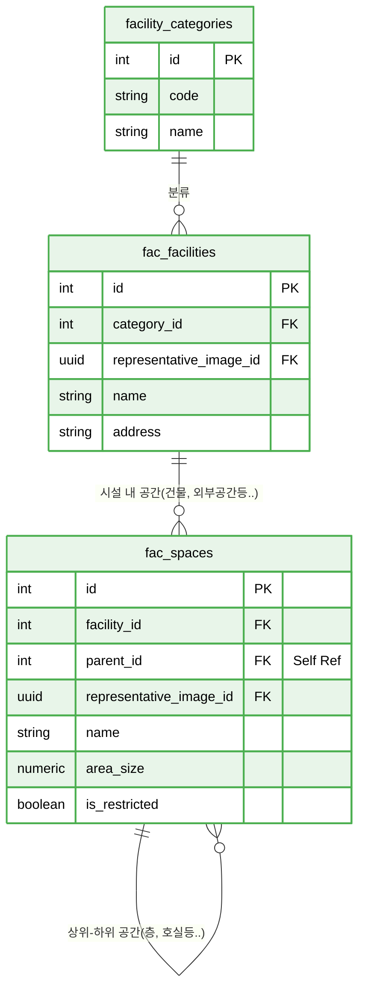

# 📘 SFMS Phase 1 DATABASE 설계서 - 인증 및 권리 (IAM) (Revised v1.3)

* **문서 버전:** v1.3 (Production Ready)
* **작성일:** 2026-02-17
* **기준 규격:** `SFMS Standard v1.2`

---

## 1. 🗺️ ERD (Entity Relationship Diagram)

공간과 시설물을 관리합니다. `fac_spaces` 역시 계층 구조(층-호실 등)를 가지므로 자기 참조 관계가 중요합니다.



---

## 2. 🗄️ 상세 스키마 명세서 (Schema Specifications)

| Table Name | PK | Description | 주요 컬럼 및 JSONB 구조 |
| --- | --- | --- | --- |
| **facility_categories** | `id` | 시설 대분류 | `code`('STP', 'PS'), `name`('하수처리장', '펌프장') |
| **facilities** | `id` | **최상위 시설 (Site)** | `category_id`, `code`(유니크),<br/> `metadata`: `{"manager": "김소장", "tel": "031-..."}` |
| **spaces** | `id` | **공간 트리 (Tree)** | `parent_id`(계층), `space_type_id`(공정/실/지점),<br/>`metadata` (JSONB): **설비 제원, 용량, 레거시 속성** |
| **space_types** | `id` | 공간 유형 코드 | `code`('PROC', 'ROOM', 'POINT') |

---

## 3. 🗄️ 상세 스키마 정의 (Schema Definition)

**목적:** 레거시의 파편화된 위치 정보(`site`, `lines`, `smp`, `location`)를 **시설(facility) - 공간(Space)** 트리 구조로 통합.

### 3.1 Table Specification

| Table Name | Description | PK Type | Remarks |
| --- | --- | --- | --- |
| `facility_categories` | 시설 카테고리 | `Serial` | 하수처리장, 펌프장 등 |
| `space_types` | 공간 유형 | `Serial` | 공정, 건물, 층, 구역 |
| `space_functions` | 공간 기능 | `Serial` | 전기실, 기계실 등 |
| `facilities` | **최상위 시설** | `Serial` | 사업소 단위 (Site) |
| `spaces` | **공간 트리** | `Serial` | 공정 > 층 > 실 > 지점 |

### 3.2 DDL Script (SQL)

```sql
-----------------------------------------------------------
-- 🟩 fac 도메인 (시설 및 공간 관리) - 최종 확정본
-----------------------------------------------------------
CREATE SCHEMA IF NOT EXISTS fac;
COMMENT ON SCHEMA fac IS '시설물 및 공간(Site/Location) 관리 도메인';

-- ========================================================
-- 1. 기초 코드 테이블 (Categories, Types, Functions)
-- ========================================================

-- (1) 시설 카테고리 (facility_categories)
CREATE TABLE fac.facility_categories (
    id                  BIGSERIAL PRIMARY KEY,
    code                VARCHAR(50) NOT NULL UNIQUE,    -- 코드 (예: WTP, PS)
    name                VARCHAR(100) NOT NULL,          -- 명칭 (예: 하수처리장, 펌프장)
    description         TEXT,                           -- 설명
    is_active           BOOLEAN DEFAULT true,           -- 사용 여부

    created_at          TIMESTAMPTZ DEFAULT CURRENT_TIMESTAMP,
    created_by          BIGINT REFERENCES usr.users(id),
    updated_at          TIMESTAMPTZ DEFAULT CURRENT_TIMESTAMP,
    updated_by          BIGINT REFERENCES usr.users(id),

    -- [Constraint] 코드는 대문자 필수
    CONSTRAINT chk_facility_categories_code_upper CHECK (code = UPPER(code))
);

-- [Trigger] 수정 일시 자동 갱신
CREATE TRIGGER trg_updated_at_facility_categories
BEFORE UPDATE ON fac.facility_categories
FOR EACH ROW EXECUTE FUNCTION cmm.trg_set_updated_at();

-- [Comments]
COMMENT ON TABLE fac.facility_categories IS '시설물 유형 분류 (예: 처리장, 펌프장, 관로 등)';
COMMENT ON COLUMN fac.facility_categories.id IS '카테고리 ID (PK)';
COMMENT ON COLUMN fac.facility_categories.code IS '카테고리 식별 코드 (Unique, 대문자)';
COMMENT ON COLUMN fac.facility_categories.name IS '카테고리 명칭';
COMMENT ON COLUMN fac.facility_categories.description IS '카테고리 상세 설명';
COMMENT ON COLUMN fac.facility_categories.is_active IS '사용 여부';
COMMENT ON COLUMN fac.facility_categories.created_at IS '생성 일시';
COMMENT ON COLUMN fac.facility_categories.created_by IS '생성자 ID';
COMMENT ON COLUMN fac.facility_categories.updated_at IS '수정 일시';
COMMENT ON COLUMN fac.facility_categories.updated_by IS '수정자 ID';


-- (2) 공간 유형 (space_types)
CREATE TABLE fac.space_types (
    id                  BIGSERIAL PRIMARY KEY,
    code                VARCHAR(50) NOT NULL UNIQUE,    -- 코드 (예: BLDG, FLOOR, ROOM)
    name                VARCHAR(100) NOT NULL,          -- 명칭 (예: 건물, 층, 호실)
    is_active           BOOLEAN DEFAULT true,

    created_at          TIMESTAMPTZ DEFAULT CURRENT_TIMESTAMP,
    created_by          BIGINT REFERENCES usr.users(id),
    updated_at          TIMESTAMPTZ DEFAULT CURRENT_TIMESTAMP,
    updated_by          BIGINT REFERENCES usr.users(id),

    CONSTRAINT chk_space_types_code_upper CHECK (code = UPPER(code))
);

-- [Trigger]
CREATE TRIGGER trg_updated_at_space_types
BEFORE UPDATE ON fac.space_types
FOR EACH ROW EXECUTE FUNCTION cmm.trg_set_updated_at();

-- [Comments]
COMMENT ON TABLE fac.space_types IS '공간의 물리적 유형 정의 (건물, 층, 구역 등)';
COMMENT ON COLUMN fac.space_types.id IS '공간 유형 ID (PK)';
COMMENT ON COLUMN fac.space_types.code IS '유형 식별 코드 (Unique, 대문자)';
COMMENT ON COLUMN fac.space_types.name IS '유형 명칭';
COMMENT ON COLUMN fac.space_types.is_active IS '사용 여부';
COMMENT ON COLUMN fac.space_types.created_at IS '생성 일시';
COMMENT ON COLUMN fac.space_types.created_by IS '생성자 ID';
COMMENT ON COLUMN fac.space_types.updated_at IS '수정 일시';
COMMENT ON COLUMN fac.space_types.updated_by IS '수정자 ID';


-- (3) 공간 기능/용도 (space_functions)
CREATE TABLE fac.space_functions (
    id                  BIGSERIAL PRIMARY KEY,
    code                VARCHAR(50) NOT NULL UNIQUE,    -- 코드 (예: ELEC_ROOM, OFFICE)
    name                VARCHAR(100) NOT NULL,          -- 명칭 (예: 전기실, 사무실)
    is_active           BOOLEAN DEFAULT true,

    created_at          TIMESTAMPTZ DEFAULT CURRENT_TIMESTAMP,
    created_by          BIGINT REFERENCES usr.users(id),
    updated_at          TIMESTAMPTZ DEFAULT CURRENT_TIMESTAMP,
    updated_by          BIGINT REFERENCES usr.users(id),

    CONSTRAINT chk_space_functions_code_upper CHECK (code = UPPER(code))
);

-- [Trigger]
CREATE TRIGGER trg_updated_at_space_functions
BEFORE UPDATE ON fac.space_functions
FOR EACH ROW EXECUTE FUNCTION cmm.trg_set_updated_at();

-- [Comments]
COMMENT ON TABLE fac.space_functions IS '공간의 기능적 용도 정의 (전기실, 제어실, 화장실 등)';
COMMENT ON COLUMN fac.space_functions.id IS '공간 기능 ID (PK)';
COMMENT ON COLUMN fac.space_functions.code IS '기능 식별 코드 (Unique, 대문자)';
COMMENT ON COLUMN fac.space_functions.name IS '기능 명칭';
COMMENT ON COLUMN fac.space_functions.is_active IS '사용 여부';
COMMENT ON COLUMN fac.space_functions.created_at IS '생성 일시';
COMMENT ON COLUMN fac.space_functions.created_by IS '생성자 ID';
COMMENT ON COLUMN fac.space_functions.updated_at IS '수정 일시';
COMMENT ON COLUMN fac.space_functions.updated_by IS '수정자 ID';


-- ========================================================
-- 2. 최상위 시설 (facilities)
-- 설명: 사업소, 처리장 등 최상위 물리적 단위
-- ========================================================
CREATE TABLE fac.facilities (
    id                  BIGSERIAL PRIMARY KEY,
    category_id         BIGINT REFERENCES fac.facility_categories(id), -- 시설 유형(FK)

    -- [대표 사진] Attachments 테이블 참조 (FK)
    representative_image_id UUID REFERENCES cmm.attachments(id) ON DELETE SET NULL,

    code                VARCHAR(50) NOT NULL UNIQUE,    -- 시설 코드 (Legacy: site_code)
    name                VARCHAR(100) NOT NULL,          -- 시설 명칭 (Legacy: site_name)
    address             VARCHAR(255),                   -- 주소
    is_active           BOOLEAN DEFAULT true,           -- 운영 여부
    sort_order          INT DEFAULT 0,                  -- 정렬 순서
    
    -- [Migration] 레거시 데이터 및 비정형 속성
    metadata            JSONB NOT NULL DEFAULT '{}'::jsonb, -- 전화번호, 팩스 등 추가 정보
    legacy_id           INTEGER,                        -- 구 시스템 ID (tblsite.site_id)
    
    created_at          TIMESTAMPTZ DEFAULT CURRENT_TIMESTAMP,
    created_by          BIGINT REFERENCES usr.users(id),
    updated_at          TIMESTAMPTZ DEFAULT CURRENT_TIMESTAMP,
    updated_by          BIGINT REFERENCES usr.users(id),

    CONSTRAINT chk_facility_code_upper CHECK (code = UPPER(code))
);

-- [Trigger]
CREATE TRIGGER trg_updated_at_facilities
BEFORE UPDATE ON fac.facilities
FOR EACH ROW EXECUTE FUNCTION cmm.trg_set_updated_at();

-- [Index]
CREATE INDEX idx_fac_name_pg ON fac.facilities USING pgroonga (name);       -- 이름 전문 검색
CREATE INDEX idx_fac_meta_gin ON fac.facilities USING GIN (metadata);       -- 메타데이터 검색

-- [Comments]
COMMENT ON TABLE fac.facilities IS '최상위 시설물(사업소/처리장) 정보 테이블';
COMMENT ON COLUMN fac.facilities.id IS '시설물 고유 ID (PK)';
COMMENT ON COLUMN fac.facilities.category_id IS '시설물 카테고리 ID (FK)';
COMMENT ON COLUMN fac.facilities.representative_image_id IS '시설물 대표 이미지 ID (FK)';
COMMENT ON COLUMN fac.facilities.code IS '시설물 관리 코드 (Unique, 대문자)';
COMMENT ON COLUMN fac.facilities.name IS '시설물 명칭';
COMMENT ON COLUMN fac.facilities.address IS '시설물 주소';
COMMENT ON COLUMN fac.facilities.is_active IS '운영(활성) 여부';
COMMENT ON COLUMN fac.facilities.sort_order IS '표시 정렬 순서';
COMMENT ON COLUMN fac.facilities.metadata IS '시설물 추가 속성 JSON (연락처, 좌표 등)';
COMMENT ON COLUMN fac.facilities.legacy_id IS '[마이그레이션] 기존 시스템 시설 ID';
COMMENT ON COLUMN fac.facilities.created_at IS '생성 일시';
COMMENT ON COLUMN fac.facilities.created_by IS '생성자 ID';
COMMENT ON COLUMN fac.facilities.updated_at IS '수정 일시';
COMMENT ON COLUMN fac.facilities.updated_by IS '수정자 ID';


-- ========================================================
-- 3. 공간 계층 (Spaces)
-- 설명: 시설물 내의 트리 구조 공간 (건물 -> 층 -> 구역/설비군)
-- ========================================================
CREATE TABLE fac.spaces (
    id                  BIGSERIAL PRIMARY KEY,
    
    facility_id         BIGINT NOT NULL REFERENCES fac.facilities(id) ON DELETE CASCADE, -- 소속 시설
    parent_id           BIGINT REFERENCES fac.spaces(id) ON DELETE CASCADE,              -- 상위 공간 (Self-Ref)
    
    -- [대표 사진]
    representative_image_id UUID REFERENCES cmm.attachments(id) ON DELETE SET NULL,

    space_type_id       BIGINT REFERENCES fac.space_types(id),          -- 물리적 유형 (건물, 층)
    space_function_id   BIGINT REFERENCES fac.space_functions(id),      -- 기능적 용도 (전기실, 사무실)
    
    code                VARCHAR(50) NOT NULL,           -- 공간 코드 (시설 내 유일)
    name                VARCHAR(100) NOT NULL,          -- 공간 명칭
    area_size           NUMERIC(10, 2),                 -- 면적 (m2)
    is_active           BOOLEAN DEFAULT true,           -- 사용 여부
    sort_order          INT DEFAULT 0,                  -- 정렬 순서
    is_restricted       BOOLEAN DEFAULT false,          -- 출입 제한 구역 여부

    -- [Migration] 레거시 통합의 핵심 필드
    metadata            JSONB NOT NULL DEFAULT '{}'::jsonb, -- 기타 속성
    legacy_id           INTEGER,                        -- 구 시스템 ID
    legacy_source_tbl   VARCHAR(50),                    -- 데이터 원천 테이블 (tbllines, tblsmp 등)

    created_at          TIMESTAMPTZ DEFAULT CURRENT_TIMESTAMP,
    created_by          BIGINT REFERENCES usr.users(id),
    updated_at          TIMESTAMPTZ DEFAULT CURRENT_TIMESTAMP,
    updated_by          BIGINT REFERENCES usr.users(id),

    -- [Constraint] 시설 내에서 코드는 유일해야 함 (복합 Unique)
    CONSTRAINT uq_fac_spaces_code UNIQUE (facility_id, code),
    -- [Constraint] 코드는 대문자
    CONSTRAINT chk_spaces_code_upper CHECK (code = UPPER(code)),
    -- [Constraint] 자기 자신을 부모로 가질 수 없음
    CONSTRAINT chk_spaces_parent_recursive CHECK (id <> parent_id)
);

-- [Trigger]
CREATE TRIGGER trg_updated_at_spaces
BEFORE UPDATE ON fac.spaces
FOR EACH ROW EXECUTE FUNCTION cmm.trg_set_updated_at();

-- [Index]
CREATE INDEX idx_fac_spaces_name_pg ON fac.spaces USING pgroonga (name);                -- 이름 전문 검색
CREATE INDEX idx_fac_spaces_meta_pg ON fac.spaces USING pgroonga (metadata);            -- 메타데이터 전문 검색
CREATE INDEX idx_fac_spaces_meta_gin ON fac.spaces USING GIN (metadata);                -- 메타데이터 JSON 검색
CREATE INDEX idx_fac_spaces_hierarchy ON fac.spaces (facility_id, parent_id);           -- 계층 조회 최적화

-- [Comments]
COMMENT ON TABLE fac.spaces IS '시설물 내부 공간 계층(Tree) 관리 테이블';
COMMENT ON COLUMN fac.spaces.id IS '공간 고유 ID (PK)';
COMMENT ON COLUMN fac.spaces.facility_id IS '소속 시설물 ID (FK)';
COMMENT ON COLUMN fac.spaces.parent_id IS '상위 공간 ID (Self Reference, NULL: 최상위 공간)';
COMMENT ON COLUMN fac.spaces.representative_image_id IS '공간 대표 이미지 ID (FK)';
COMMENT ON COLUMN fac.spaces.space_type_id IS '공간 물리적 유형 ID (건물, 층 등)';
COMMENT ON COLUMN fac.spaces.space_function_id IS '공간 기능적 용도 ID (전기실, 펌프실 등)';
COMMENT ON COLUMN fac.spaces.code IS '공간 식별 코드 (시설 내 Unique, 대문자)';
COMMENT ON COLUMN fac.spaces.name IS '공간 명칭';
COMMENT ON COLUMN fac.spaces.area_size IS '면적 (단위: m2)';
COMMENT ON COLUMN fac.spaces.is_active IS '사용 여부';
COMMENT ON COLUMN fac.spaces.sort_order IS '정렬 순서';
COMMENT ON COLUMN fac.spaces.is_restricted IS '출입 제한/보안 구역 여부';
COMMENT ON COLUMN fac.spaces.metadata IS '공간 추가 속성 JSON';
COMMENT ON COLUMN fac.spaces.legacy_id IS '[마이그레이션] 기존 시스템 ID';
COMMENT ON COLUMN fac.spaces.legacy_source_tbl IS '[마이그레이션] 데이터 원천 테이블명';
COMMENT ON COLUMN fac.spaces.created_at IS '생성 일시';
COMMENT ON COLUMN fac.spaces.created_by IS '생성자 ID';
COMMENT ON COLUMN fac.spaces.updated_at IS '수정 일시';
COMMENT ON COLUMN fac.spaces.updated_by IS '수정자 ID';

```

---

## 4. 🚀 레거시 마이그레이션 전략 (Migration Strategy)

조직 및 사용자 (usr)

파편화된 레거시 테이블을 `facility > Space` 트리로 재구성합니다.

| Legacy Table | Legacy Column | New Table | New Column | Space Type |
| --- | --- | --- | --- | --- |
| `lims.tblsite` | `site_name` | `fac.facilities` | `name` | (Root) |
| `wqm.tbllines` | `name` | `fac.spaces` | `name` | `PROC` (공정) |
| `mes.tblLocation` | `chrLocationName` | `fac.spaces` | `name` | `ROOM` (실/위치) |
| `lims.tblsmp` | `smp_loc_name` | `fac.spaces` | `name` | `POINT` (지점) |
