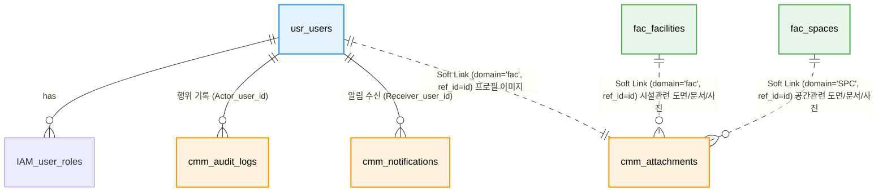

# 📘 SFMS Phase 1 DATABASE 설계서 - 도메인간 연결 (Revised v1.3)

* **문서 버전:** v1.3 (Production Ready)
* **작성일:** 2026-02-17
* **기준 규격:** `SFMS Standard v1.2`

---

## 1. 🗺️ ERD (Entity Relationship Diagram)

