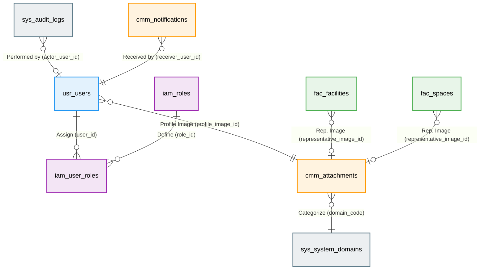

# 📘 SFMS Phase 1 DATABASE 설계서 - 도메인간 연결 (Revised v1.4)

* **문서 버전:** v1.4 (Actual Implementation Sync)
* **최종 수정일:** 2026-03-07
* **설명:** 각 도메인(스키마) 간의 물리적/논리적 연결 고리를 정의합니다.

---

## 1. 🗺️ 통합 관계도 (Cross-Domain ERD)

SFMS는 마이크로서비스 지향적 설계를 위해 도메인을 분리했으나, 데이터 무결성을 위해 핵심 연결 고리는 물리적 외래키(FK)를 유지합니다.

---

## 2. 🔗 주요 연결 방식 상세 (Connection Details)

### 2.1 물리적 제약조건 (Hard Foreign Keys)

데이터 무결성(Integrity)이 필수적인 구간은 `ALTER TABLE`을 통해 교차 도메인 FK를 설정합니다.

| Source Table | Source Column | Target Table | Type | Description |
| --- | --- | --- | --- | --- |
| `usr.users` | `profile_image_id` | `cmm.attachments` | `UUID` | 사용자의 프로필 사진 참조 |
| `iam.user_roles` | `user_id` | `usr.users` | `BigInt` | 역할 할당 대상 사용자 |
| `fac.facilities` | `representative_image_id` | `cmm.attachments` | `UUID` | 시설 대표 이미지 |
| `sys.audit_logs` | `actor_user_id` | `usr.users` | `BigInt` | 행위자 추적 (시스템 작업 시 NULL) |

### 2.2 논리적 연결 (Soft Links / Polymorphic)

첨부파일(`attachments`)과 같이 여러 도메인에서 공용으로 사용하는 테이블은 `domain_code`와 `ref_id`를 조합하여 논리적으로 연결합니다.

* **연결 원리**:
    1. `domain_code`: `sys.system_domains`에 등록된 코드 (예: 'FAC', 'USR')
    2. `resource_type`: 도메인 내 상세 리소스 구분 (예: 'facilities', 'spaces')
    3. `ref_id`: 해당 리소스 테이블의 `id` (PK)
* **장점**: 스키마 간의 물리적 의존성을 최소화하면서도 통합 파일 관리가 가능합니다.

---

## 3. 🚦 초기화 및 배포 순서 (Deployment Sequence)

도메인 간 참조 관계를 고려하여 다음 순서로 DDL이 실행됩니다.

1. **`sys` 스키마 & 전역 트리거**: 기반 환경 조성
2. **`usr` → `sys` → `cmm` → `iam` → `fac`**: 기본 테이블 생성
3. **`90_constraints.pgsql`**: 순환 참조 및 교차 도메인 외래키(FK) 일괄 설정
4. **`93_cmm_seed.pgsql`**: 기초 데이터 및 도메인 코드 적재
