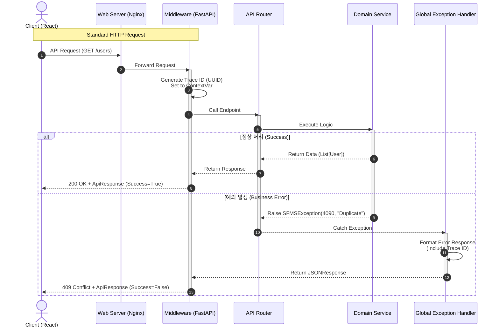
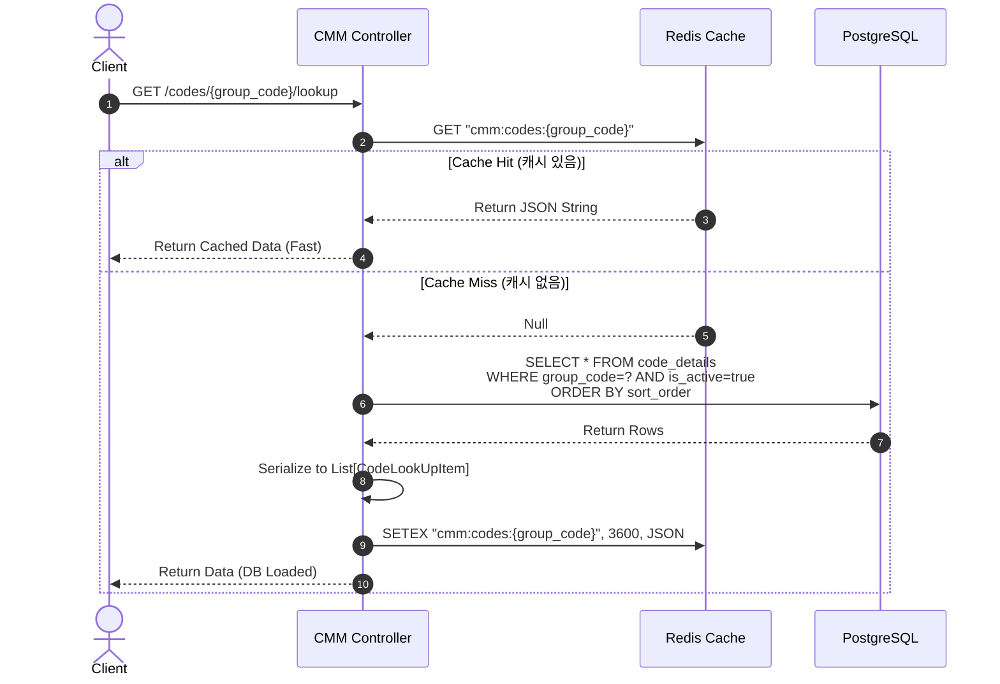
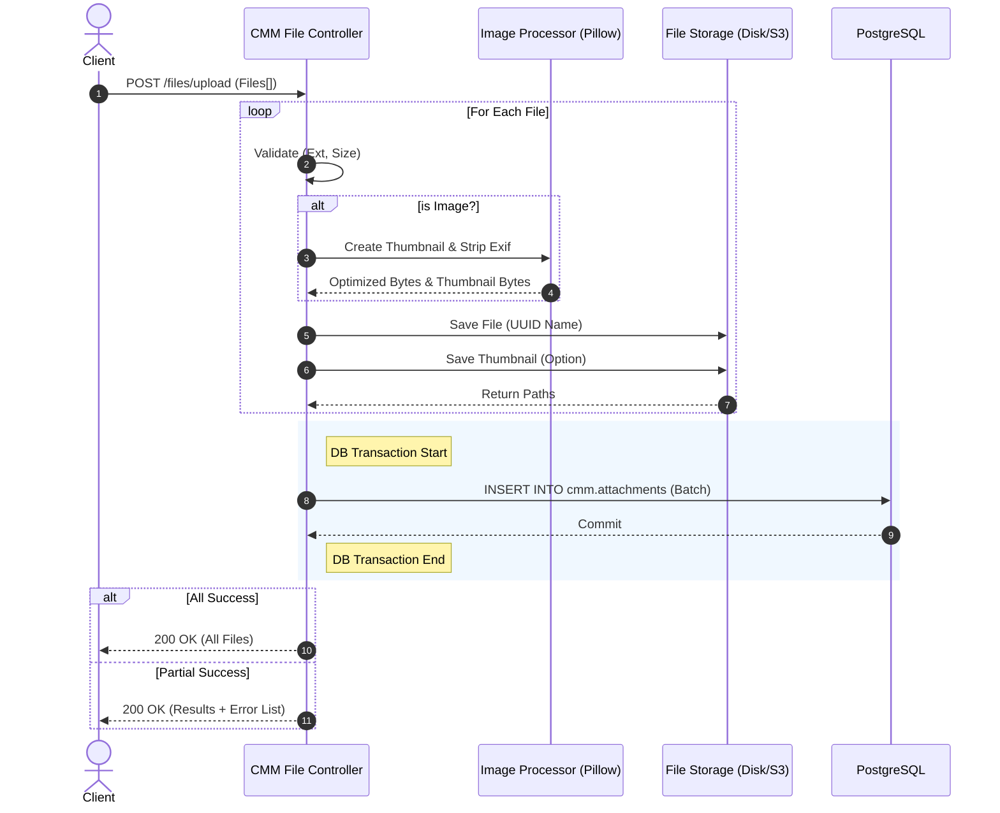
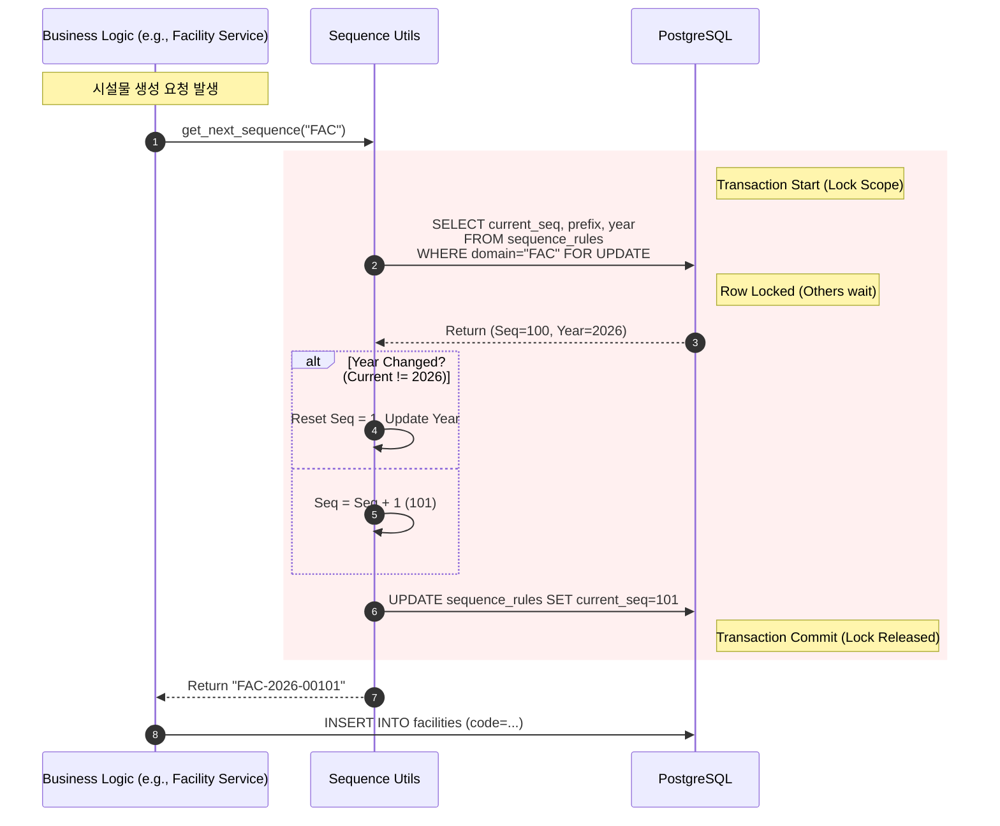
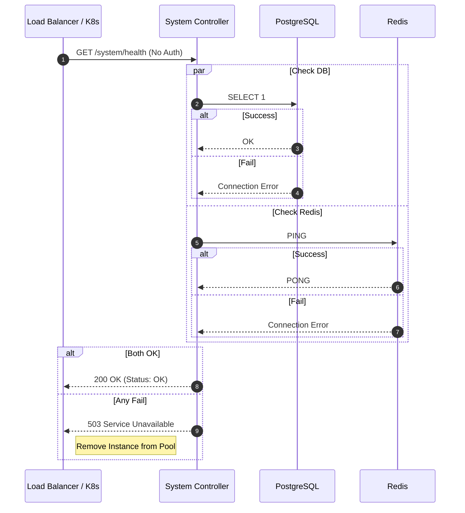

# 📐 SFMS Phase 1 - 핵심 로직 시퀀스 다이어그램 (01. 공통 표준 & CMM)

* **문서 버전:** v1.0
* **작성일:** 2026-02-17
* **관련 모듈:** `Core(Middleware)`, `CMM(Codes, Files, Sequence)`

---

## 1. 🌐 표준 요청/응답 및 예외 처리 흐름 (Global Request Flow)

모든 API 요청이 거쳐가는 **미들웨어(Middleware)**와 **전역 예외 처리(Global Exception Handler)**의 작동 원리를 정의합니다.

### 1.1 핵심 로직 설명

1. **Trace ID:** 요청 진입 시 `X-Request-ID`가 없으면 생성하여 `ContextVar`에 저장 (로그 추적용).
2. **Global Handler:** 비즈니스 로직에서 `SFMSException`이 발생하면, 이를 가로채어 표준 `ApiResponse` 포맷으로 변환합니다.
3. **Response Wrapper:** 정상 리턴된 데이터도 `ApiResponse` 객체로 감싸서 일관된 포맷을 보장합니다.

### 1.2 Sequence Diagram

---

## 2. 🗂️ 공통 코드 조회 및 캐싱 전략 (Code Lookup with Cache)

프론트엔드 성능 최적화를 위해 **Redis Cache-Aside 패턴**을 적용한 코드 조회 로직입니다.

### 2.1 핵심 로직 설명

1. **Cache First:** DB보다 Redis를 먼저 조회합니다.
2. **DB Fallback:** 캐시 미스(Miss) 시 DB에서 조회하고 Redis에 적재(TTL 설정)합니다.
3. **Structure:** 프론트엔드 컴포넌트(`Select`, `Radio`)가 바로 사용할 수 있는 `{value, label}` 형태로 반환합니다.

### 2.2 Sequence Diagram

---

## 3. 📂 다중 파일 업로드 및 이미지 처리 (Multi-Upload & Processing)

**트랜잭션 관리**와 **이미지 후처리(Thumbnail)**가 복합된 가장 복잡한 로직입니다.

### 3.1 핵심 로직 설명

1. **Validation:** 파일별 확장자 및 용량을 검사합니다.
2. **Processing:** 이미지(`Pillow`)는 메타데이터 제거 및 썸네일 생성을 수행합니다.
3. **IO Separation:** 스토리지 업로드(I/O)는 **DB 트랜잭션 외부**에서 수행하여 DB Lock 점유 시간을 최소화합니다.
4. **Transaction:** 모든 파일 처리가 끝난 후(또는 건별) 성공한 건에 대해서만 DB에 Insert 합니다.

### 3.2 Sequence Diagram

---

## 4. 🔢 동시성 제어 채번 로직 (Atomic Sequence Generation)

여러 사용자가 동시에 문서를 생성할 때 **중복 번호**가 발생하지 않도록 보장하는 로직입니다(시스템 성능을 위해 결번 허용).

### 4.1 핵심 로직 설명

1. **Row Lock:** `SELECT ... FOR UPDATE`를 사용하여 해당 도메인의 채번 규칙 Row를 잠급니다.
2. **Atomic Increment:** 현재 순번을 메모리가 아닌 DB 레벨에서 증가시킵니다.
3. **Formatting:** `PREFIX` + `YEAR` + `LPAD(SEQ)` 형태로 포맷팅합니다.

### 4.2 Sequence Diagram

---

## 5. 🏥 시스템 헬스 체크 흐름 (System Health Check)

L4/L7 스위치나 K8s가 서비스 가용성을 판단하는 흐름입니다.

### 5.1 핵심 로직 설명

1. **Auth Bypass:** 인증 토큰 없이 접근 가능해야 합니다.
2. **Deep Check:** 단순히 API 서버가 뜬 것뿐만 아니라, **DB와 Redis 연결 상태**까지 확인합니다.
3. **Timeout:** 연결 확인은 1~2초 내에 빠르게 타임아웃 처리되어야 합니다.

### 5.2 Sequence Diagram

