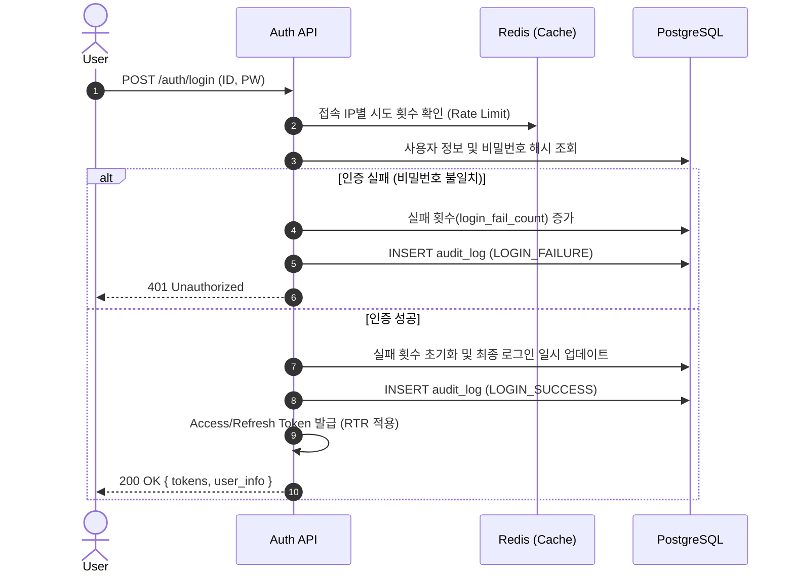
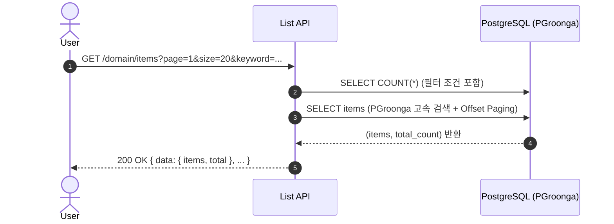

# 📉 SFMS Phase 1 - 핵심 비즈니스 로직 및 기능 명세서

* **버전:** v1.5 (Advanced Standard)
* **최종 수정일:** 2026-03-21
* **목표:** 엔터프라이즈급 안정성과 보안성을 갖춘 **시설 관리 기반 시스템** 구축.

---

## 1. 📐 핵심 로직 시퀀스 (Core Sequences)

### 1.1 보안 강화 로그인 (Secure Login)
Redis 기반의 실패 횟수 제한 및 보안 감사가 포함된 로그인 프로세스입니다.

### 1.2 고속 검색 및 페이징 (Search & Paging)
`PGroonga`와 통합 페이징 규격을 적용한 데이터 조회 로직입니다.

---

## 📋 2. 주요 기능 명세 (Functional Spec)

### 2.1 🔐 인증 및 보안 (IAM)

| 기능 ID | 기능명 | 핵심 로직 (Standard) |
| --- | --- | --- |
| **FN-IAM-01** | **로그인 및 RTR** | • Access(30분)/Refresh(30일) 토큰 발급. • 리프레시 토큰 사용 시마다 기존 토큰 무효화 및 재발급(Rotation). |
| **FN-IAM-02** | **강력한 로그아웃** | • 백엔드 호출 시 Access/Refresh 토큰 모두 Redis 블랙리스트 등록. |
| **FN-IAM-03** | **동적 권한 감지** | • 역할 코드 대신 권한 매트릭스 내 `{"ALL": ["*"]}` 여부로 슈퍼유저 자동 판별. |

### 2.2 👥 사용자 및 조직 (USR)

| 기능 ID | 기능명 | 핵심 로직 (Standard) |
| --- | --- | --- |
| **FN-USR-01** | **통합 조직도** | • 전 도메인 공통 루트("전체 조직도") 및 `ApartmentOutlined` 아이콘 적용. • 비활성 부서/사용자 시각적 구분(취소선). |
| **FN-USR-02** | **인사 정보 확장** | • 직위, 직책 등 가변 정보는 `JSONB(metadata)`를 활용하여 유연하게 관리. |

### 2.3 🏭 시설 및 공간 (FAC) - (진행 예정)

| 기능 ID | 기능명 | 핵심 로직 (Standard) |
| --- | --- | --- |
| **FN-FAC-01** | **Bento UI 조회** | • 조회 우선 패턴(View-first) 및 10-Row 스크롤 정책 적용. |
| **FN-FAC-02** | **계층형 공간 관리** | • 부서 조직도와 동일한 트리-상세 레이아웃 인터페이스 공유. |

### 2.4 ⚙️ 시스템 관리 및 감사 (SYS)

| 기능 ID | 기능명 | 핵심 로직 (Standard) |
| --- | --- | --- |
| **FN-SYS-01** | **보안 감사 로그** | • 로그인 실패, 계정 잠금, 데이터 변경 이력(Snapshot)을 상세 기록. • IP 및 User-Agent 정보를 포함한 위협 추적 기능. |
| **FN-SYS-02** | **자동 채번 관리** | • 비관적 락(`FOR UPDATE`)을 통한 다중 서버 환경의 번호 중복 방지. • 연도별 초기화 규칙 지원. |

---

## 🛡️ 3. 보안 및 운영 정책 (Security Policy)

1.  **Zero Hardcoded Strings**: 모든 UI 텍스트는 `messages.ts`에서 키 기반으로 관리.
2.  **Error Code System**: 한글 메시지 대신 영문 에러 코드를 전송하여 클라이언트 단에서 번역 처리.
3.  **Data Auditing**: 모든 C/U/D 행위는 반드시 감사 로그를 생성해야 하며, 실패한 접근 시도도 기록 대상에 포함.
4.  **Database Mobility**: `backup_db.sh`를 통한 컨테이너 환경의 이식성 보장.
