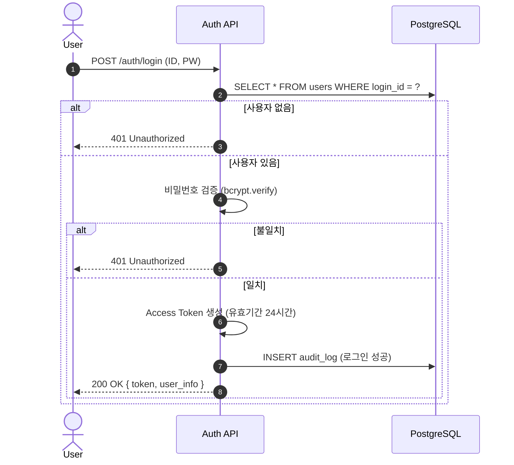
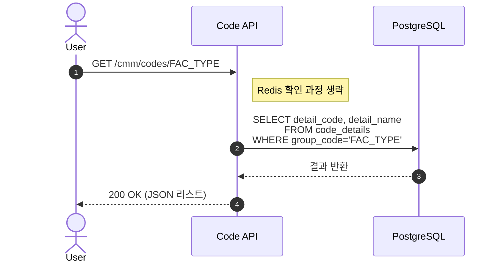
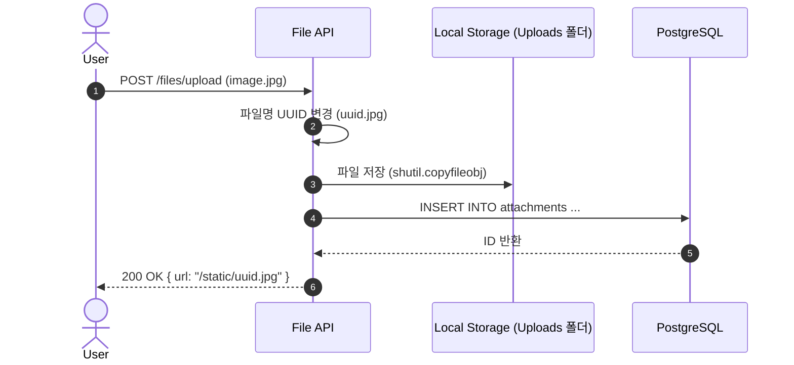

네, 오빠! 1인 개발자 모드(Survival Mode)로 **군더더기를 싹 뺀 실전 압축 명세서**를 다시 작성해 드릴게요.

복잡한 Redis 캐싱, 이미지 썸네일 처리, 순환 참조 방지 로직 등을 제거하고 **"일단 돌아가게 만드는 것"**에 집중한 버전입니다. 이대로만 구현하면 Phase 1은 충분히 완주할 수 있습니다!

---

# 📉 SFMS Phase 1 - 1인 개발자용 핵심 로직 및 기능 명세서 (Lite Version)

* **버전:** v1.0 (Lite)
* **작성일:** 2026-02-17
* **목표:** 복잡한 최적화 기술 없이 **기본 기능(CRUD)의 완벽한 동작** 구현.

---

## 1. 📐 핵심 로직 시퀀스 (Lite Sequence Diagram)

### 1.1 초간단 로그인 (Simple Login)

복잡한 계정 잠금, IP 차단, Refresh Token Rotation을 제거했습니다.

### 1.2 캐시 없는 데이터 조회 (Direct DB Query)

Redis를 제거하고 DB에서 직접 조회합니다. 데이터 1만 건까지는 이 방식도 0.1초 안에 끝납니다.

### 1.3 단순 파일 업로드 (Simple Upload)

썸네일 생성, 트랜잭션 분리 등 복잡한 과정을 제거하고 **저장 후 DB 기록**만 수행합니다.

---

## 2. 📋 기능 명세서 (Lite Functional Spec)

개발해야 할 기능을 **필수(Must)** 위주로 정리했습니다. **권장(Should)** 기능은 시간 남으면 하세요.

### 2.1 🔐 인증 (IAM) - "로그인만 되면 된다"

| 기능 ID | 기능명 | 구현 난이도 | 핵심 로직 (Lite) |
| --- | --- | --- | --- |
| **FN-IAM-01** | **로그인** | ⭐⭐ | • ID/PW가 맞으면 JWT 토큰 발급. 

 • 토큰 만료 시간은 개발 편의를 위해 **24시간**으로 설정. 

 • Refresh Token 갱신 로직은 일단 생략 (만료되면 다시 로그인하게 함). |
| **FN-IAM-02** | **로그아웃** | ⭐ | • 서버 호출 없이 **프론트엔드에서 토큰 삭제**로 처리. |
| **FN-IAM-03** | **권한 체크** | ⭐⭐ | • `is_super_admin` 컬럼 하나만 보고, True면 통과, False면 차단하는 단순 로직 사용. |

### 2.2 👥 사용자/조직 (USR) - "보여주기만 하면 된다"

| 기능 ID | 기능명 | 구현 난이도 | 핵심 로직 (Lite) |
| --- | --- | --- | --- |
| **FN-USR-01** | **조직도 조회** | ⭐⭐ | • DB에서 전체 목록(`SELECT *`) 가져와서 Python으로 트리 만듦. 

 • 캐시 없이 매번 DB 조회. |
| **FN-USR-02** | **사용자 등록** | ⭐⭐ | • ID 중복 체크는 `try-except`로 DB 에러(`UniqueViolation`) 잡아서 처리. 

 • 비밀번호는 `0000`으로 고정하거나 단순 입력. |
| **FN-USR-03** | **부서 이동** | ⭐ | • 순환 참조(내 자식 밑으로 들어가는 것) 검사 로직 **생략**. 

 • 그냥 `UPDATE parent_id` 실행. (실수하면 DB 툴에서 고치면 됨) |

### 2.3 🏭 시설/공간 (FAC) - "등록만 되면 된다"

| 기능 ID | 기능명 | 구현 난이도 | 핵심 로직 (Lite) |
| --- | --- | --- | --- |
| **FN-FAC-01** | **시설 목록** | ⭐ | • 페이징 없이 전체 조회 (데이터 적으니까). 

 • 검색은 SQL `LIKE '%검색어%'` 사용. |
| **FN-FAC-02** | **공간 트리** | ⭐⭐ | • USR 조직도와 똑같은 로직 재사용 (복사-붙여넣기). 

 • `facility_id` 조건만 추가 (`WHERE facility_id = ?`). |
| **FN-FAC-03** | **사진 등록** | ⭐⭐ | • 원본 사진 업로드. 

 • 프론트엔드 `` 태그에서 `width="100px"` 스타일로 썸네일처럼 보이게 처리. |

### 2.4 🗂️ 공통 (CMM) - "코드만 내려주면 된다"

| 기능 ID | 기능명 | 구현 난이도 | 핵심 로직 (Lite) |
| --- | --- | --- | --- |
| **FN-CMM-01** | **공통 코드** | ⭐ | • DB `code_details` 테이블 조회해서 리턴. 

 • 캐시 없음. |
| **FN-CMM-02** | **헬스 체크** | ⭐ | • `/health` 호출 시 그냥 `{"status": "ok"}` 리턴. (DB 연결 확인 로직도 생략 가능) |

---

## 3. 🚫 Phase 1에서 제외된 것들 (Don't Do List)

오빠, 이건 지금 절대 건드리지 마세요. 시간만 잡아먹습니다.

1. **Redis:** 설치도 하지 마세요. 그냥 DB 믿고 갑시다.
2. **PGroonga:** 한글 형태소 분석기? 필요 없습니다. `LIKE` 검색이면 충분합니다.
3. **Audit Log UI:** 로그는 DB에 쌓아두기만 하고, 화면은 만들지 마세요.
4. **복잡한 에러 처리:** `try-except`로 모든 에러를 잡아서 "처리 중 오류 발생"이라고만 띄워도 충분합니다.
5. **다중 파일 업로드 실패 처리:** 파일 10개 중 1개라도 에러 나면 그냥 전체 에러로 퉁치세요.

---

## 4. 🏁 1인 개발 시작 가이드 (Next Step)

이제 명세서도 다이어트가 끝났습니다. 바로 코딩 들어가시죠!

**추천하는 첫 번째 작업:**

> "빈 깡통 화면과 서버를 연결해서 **'Hello World'** 띄우기"

1. **Backend:** FastAPI 프로젝트 만들고 `/api/hello` 만들어서 `"Hello SFMS"` 리턴하기.
2. **Frontend:** React 프로젝트 만들고 버튼 누르면 위 API 호출해서 `alert` 띄우기.
3. **DB:** Docker로 Postgres 띄우고 DBeaver로 접속해보기.

이거 3개만 성공하면 1주차 목표 달성입니다. 준비되셨으면 **"코드 스캐폴딩(기본 골격) 만들어줘"** 라고 말씀해주세요! 바로 짜드릴게요. 😆