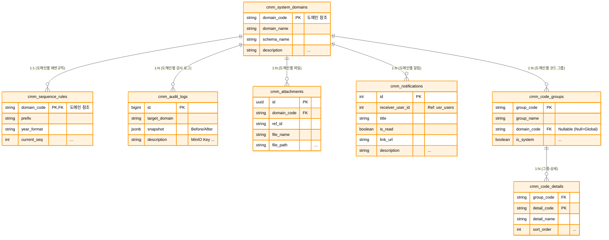
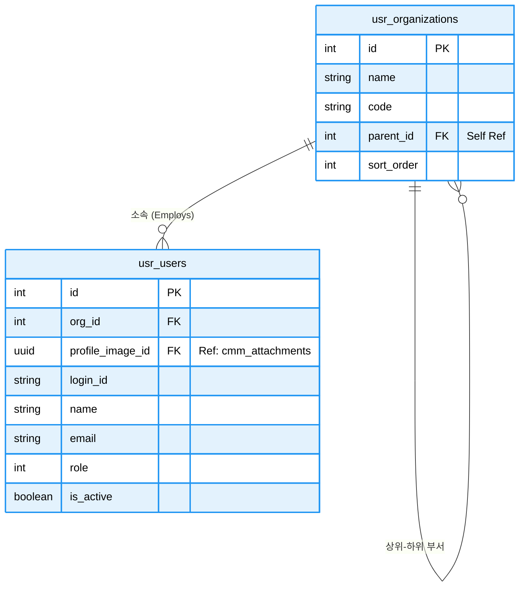
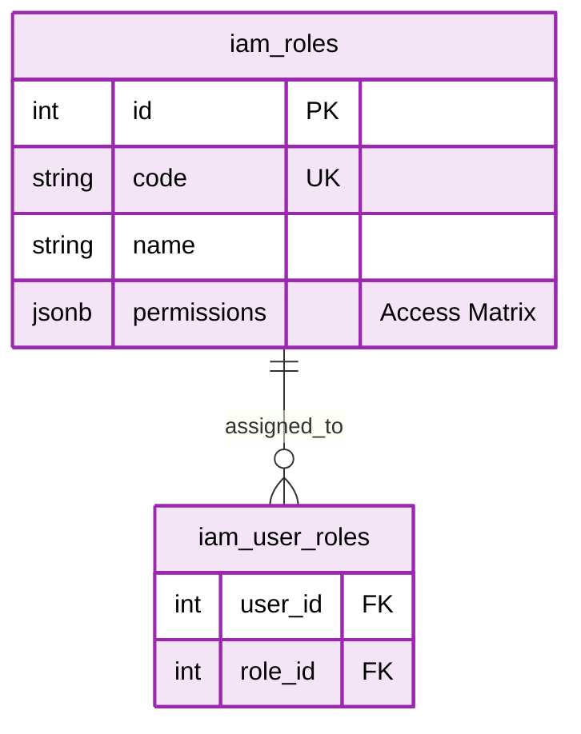
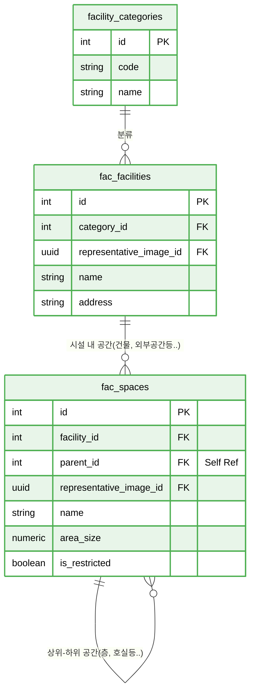
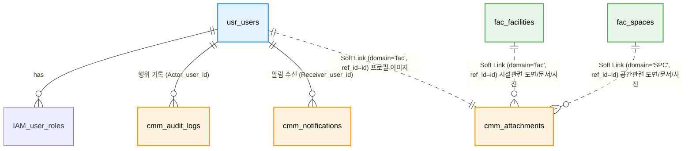

# 📘 SFMS Phase 1: 통합 데이터베이스 설계서 (Final Version)

* **프로젝트명:** SFMS (Sewage facility Management System)
* **작성일:** 2026-02-16
* **버전:** 2.0
* **단계:** Phase 1 (Foundation, Security, facility Base)
* **기술 스택:**
* **Database:** PostgreSQL 16+
* **Extensions:** `pgroonga` (한글/JSON 검색), `pgcrypto` (UUID)
* **File Storage:** MinIO (S3 Compatible) - DB는 메타데이터만 저장
* **변경이력**:

> 1. cmm, usr, fac 스키마 확정.
> 2. **JSONB 데이터 구조 표준 명세 추가.**

* **스키마 구조:**

> 1. **`cmm` (Common):** 공통 기준정보, 파일 레지스트리(MinIO), 감사 로그, 알림
> 2. **`ian` (Identity & Access Management):** 사용자 인증, 권한 관리
> 3. **`usr` (User):** 사용자, 조직(Organization), 권한(RBAC)
> 4. **`fac` (facility):** 시설 및 공간 계층 구조 (Tree)

---

## 1. 🏗️ 설계 원칙 및 규칙 (Conventions)

### 1.1 데이터 타입 및 식별자 전략

* **Primary Key (PK):**
  * 일반 업무 데이터: `BigSerial` (Auto-increment BigInteger) 사용. (성능 및 레거시 매핑 용이)
  * 파일/첨부 데이터: `UUID` (v4) 사용. (보안 및 분산 저장소 키 충돌 방지)

* **Timezone:**
  * 모든 일시(`DateTime`)는 `TIMESTAMPTZ` (Timezone 포함) 타입을 사용하며, DB에는 **UTC**로 저장하고 애플리케이션에서 로컬 시간(KST)으로 변환합니다.

* **JSONB 활용 (Semi-structured Data):**
  * Snake Case: JSON Key는 반드시 **스네이크 케이스(user_name)**를 사용합니다.
  * Flat Structure: 가능한 중첩(Nested) 구조를 피하고 1단계 Depth를 권장합니다.
  * Search: PGroonga 인덱스를 통해 JSON 내부의 모든 Key와 Value를 검색 가능하게 합니다.
  * 레거시 시스템의 비정형 데이터, 설비 제원, 변경 로그(`snapshot`)는 `JSONB` 컬럼에 저장하여 스키마 변경 없이 유연성을 확보합니다.

### 1.2 검색 및 인덱싱 전략

* **Full Text Search:** `PGroonga` 확장 기능을 사용하여 한글의 **중간 일치 검색**(`LIKE '%검색어%'`) 속도를 획기적으로 개선합니다.
* **JSON Search:** `Audit Log`의 변경 내역이나 `facility`의 메타데이터 검색 시 `GIN` 인덱스(PGroonga)를 사용하여 고속 검색을 지원합니다.

---

## 2. 🗺️ ERD (Entity Relationship Diagram)

네, 전체를 하나의 ERD에 담으면 관계선이 꼬이고 테이블이 작아져서 가독성이 크게 떨어집니다.

**도메인(스키마) 단위로 쪼개서 관리하는 것이 정석입니다.** 요청하신 대로 **cmm(공통), usr(사용자/조직), fac(시설)** 3가지 영역으로 나누어 시각화해 드립니다.

각 다이어그램은 해당 도메인 내부의 관계에 집중하고, 타 도메인과의 연결은 '참조(Reference)' 형태로 표현하여 깔끔하게 정리했습니다.

---

### 2.1. CMM (공통 모듈)

시스템 전반에서 사용하는 코드, 파일, 로그, 알림 등을 관리하는 영역입니다. 다른 모든 모듈의 기반이 됩니다.



---

### 2.2. USR (사용자 & 조직 모듈)

조직 구조와 사용자 계정을 관리합니다. `usr_organizations`의 자기 참조(Self-Reference) 관계가 핵심입니다.



---

### 2.3. IAM (사용자 인증, 권한 관리)

역할(Role) 기반의 세밀한 권한 제어를 통해 메뉴 접근 및 데이터 조작 권한을 관리합니다.



---

### 2.4. FAC (시설 모듈)

공간과 시설물을 관리합니다. `fac_spaces` 역시 계층 구조(층-호실 등)를 가지므로 자기 참조 관계가 중요합니다.



---

### 2.5. 도메인 간 인터페이스

개별 상세 ERD만으로는 **모듈 간의 연결**을 파악하기 어려울 때가 있습니다. 이럴 때는 테이블 내부 컬럼을 다 보여주는 대신, **테이블 이름만으로 구성된 '개념 모델(Conceptual Model)'**을 하나 그려두는 것이 좋습니다.



---

## 3. 🗄️ 상세 스키마 명세서 (Schema Specifications)

### 3.1 🟧 cmm: 공통 및 기준정보 (Common)

| Table Name | PK | Description | 주요 컬럼 및 JSONB 구조 |
| --- | --- | --- | --- |
| **system_domains** | `domain_code` | 시스템 모듈 정의 | `schema_name`(스키마), `is_active` |
| **code_groups** | `group_code` | 공통 코드 그룹 | `is_system`(삭제불가 여부) |
| **code_details** | `(group, detail)` | 공통 코드 상세 | `props` (JSONB): `{"color": "#F00", "unit": "kg"}` |
| **attachments** | `id` (UUID) | **MinIO 파일 메타데이터** | `file_path`(MinIO Key), `ref_id`(참조ID), `legacy_id` |
| **audit_logs** | `id` (BigInt) | **데이터 감사 로그** | `snapshot` (JSONB): `{"before": {...}, "after": {...}}` |
| **notifications** | `id` | 사용자 알림 | `receiver_user_id`, `is_read`, `link_url` |
| **sequence_rules** | `domain_code` | 문서 번호 채번 규칙 | `prefix`(접두어), `current_seq`(현재번호) |

### 3.2 🟦 usr: 사용자 및 조직 (User & Org)

| Table Name | PK | Description | 주요 컬럼 및 JSONB 구조 |
| --- | --- | --- | --- |
| **organizations** | `id` | **조직 (Department)** | `parent_id`(상위조직), `legacy_source`('GUMC'/'MES') |
| **users** | `id` | **사용자 (User)** | `login_id`, `role`(1/10/100), `profile_image_id`(UUID),_`metadata` (JSONB): 레거시 메모, UI 설정 등 |

### 3.3 🟪 IAM: 사용자 인증 및 권한 관리 (Identity & Access Management)

| Table Name | PK | Description | 주요 컬럼 및 JSONB 구조 |
| --- | --- | --- | --- |
| **roles** | `id` | 역할 정의 (RBAC) | code('ADMIN', 'OP'), name('운영자'), is_system, <br/> permissions (JSONB): {""fac_mgmt"": [""read"", ""write""]} |
| **user_roles** | `(user_id, role_id)` | 사용자-역할 매핑 | user_id (FK: usr.users), role_id (FK: iam.roles) |

### 3.4 🟩 fac: 시설 및 공간 (facility)

| Table Name | PK | Description | 주요 컬럼 및 JSONB 구조 |
| --- | --- | --- | --- |
| **facility_categories** | `id` | 시설 대분류 | `code`('STP', 'PS'), `name`('하수처리장', '펌프장') |
| **facilities** | `id` | **최상위 시설 (Site)** | `category_id`, `code`(유니크),<br/> `metadata`: `{"manager": "김소장", "tel": "031-..."}` |
| **spaces** | `id` | **공간 트리 (Tree)** | `parent_id`(계층), `space_type_id`(공정/실/지점),<br/>`metadata` (JSONB): **설비 제원, 용량, 레거시 속성** |
| **space_types** | `id` | 공간 유형 코드 | `code`('PROC', 'ROOM', 'POINT') |

---

## 4. 🗄️ 상세 스키마 정의 (Schema Definition)

### 4.1 cmm 도메인 (Common & File & Log)

**목적:** 시스템 전반의 공통 데이터, 파일 메타데이터(MinIO), 보안 감사 로그 관리.

#### 4.1.1 Table Specification

| Table Name | Description | PK Type | Remarks |
| --- | --- | --- | --- |
| `system_domains` | 시스템 모듈(도메인) 등록 | `Varchar` | fac, usr, cmm 등 |
| `code_groups` | 공통 코드 그룹 | `Varchar` | |
| `code_details` | 공통 코드 상세 | `Composite` | **JSONB Props** 적용 |
| `attachments` | **MinIO 파일 메타데이터** | `UUID` | 물리적 파일은 MinIO 저장 |
| `audit_logs` | 데이터 변경 감사 로그 | `BigInt` | **JSONB Snapshot** 필수 |
| `sequence_rules` | 문서 번호 자동 채번 규칙 | `Varchar` | |
| `notifications` | 사용자 알림 | `BigInt` | |

#### 4.1.2 DDL Script (SQL)

```sql
CREATE SCHEMA IF NOT EXISTS cmm;
COMMENT ON SCHEMA cmm IS '공통 관리 도메인 (기준정보, 파일, 로그)';

-- 확장 기능 활성화
CREATE EXTENSION IF NOT EXISTS pgroonga;
CREATE EXTENSION IF NOT EXISTS "uuid-ossp";

-----------------------------------------------------------
-- 0. 자동 시간 갱신을 위한 함수 (공통)
-----------------------------------------------------------
CREATE OR REPLACE FUNCTION cmm.trg_set_updated_at()
RETURNS TRIGGER AS $$
BEGIN
    NEW.updated_at = CURRENT_TIMESTAMP;
    RETURN NEW;
END;
$$ LANGUAGE plpgsql;

-----------------------------------------------------------
-- 1. 시스템 도메인 (system_domains)
-----------------------------------------------------------
CREATE TABLE cmm.system_domains (
    id             BIGSERIAL PRIMARY KEY,

    domain_code    VARCHAR(3) NOT NULL UNIQUE, -- PK는 비즈니스 코드로 유지 (FAC, USR 등)
    domain_name    VARCHAR(50) NOT NULL,
    schema_name    VARCHAR(50) NOT NULL UNIQUE, -- 스키마명은 중복 불가
    description    TEXT,
    sort_order     INT DEFAULT 0,

    is_active      BOOLEAN DEFAULT true,

    created_at     TIMESTAMPTZ DEFAULT CURRENT_TIMESTAMP,
    created_by     BIGINT REFERENCES usr.users(id),
    updated_at     TIMESTAMPTZ DEFAULT CURRENT_TIMESTAMP,
    updated_by     BIGINT REFERENCES usr.users(id),
    
    -- 제약조건: 코드는 반드시 대문자 3자
    CONSTRAINT chk_domain_code_format CHECK (domain_code ~ '^[A-Z]{3}$')
);
CREATE TRIGGER trg_updated_at_system_domains 
BEFORE UPDATE ON cmm.system_domains 
FOR EACH ROW EXECUTE FUNCTION cmm.trg_set_updated_at();

COMMENT ON COLUMN cmm.system_domains.created_by IS '생성자 ID';
COMMENT ON COLUMN cmm.system_domains.updated_by IS '최종 수정자 ID';

-----------------------------------------------------------
-- 2. 공통 코드 그룹 (code_groups)
-----------------------------------------------------------
CREATE TABLE cmm.code_groups (
    id             BIGSERIAL PRIMARY KEY,

    group_code     VARCHAR(30) NOT NULL UNIQUE,
    domain_code    VARCHAR(3) REFERENCES cmm.system_domains(domain_code) ON UPDATE CASCADE,
    group_name     VARCHAR(100) NOT NULL,
    description    TEXT,

    is_system      BOOLEAN DEFAULT false,
    is_active      BOOLEAN DEFAULT true,

    created_at     TIMESTAMPTZ DEFAULT CURRENT_TIMESTAMP,
    created_by     BIGINT REFERENCES usr.users(id),
    updated_at     TIMESTAMPTZ DEFAULT CURRENT_TIMESTAMP,
    updated_by     BIGINT REFERENCES usr.users(id),

    CONSTRAINT chk_group_code_format CHECK (group_code ~ '^[A-Z0-9_]+$')
);

CREATE INDEX idx_code_groups_domain ON cmm.code_groups (domain_code);

CREATE TRIGGER trg_updated_at_code_groups 
BEFORE UPDATE ON cmm.code_groups 
FOR EACH ROW EXECUTE FUNCTION cmm.trg_set_updated_at();

-----------------------------------------------------------
-- 3. 공통 코드 상세 (code_details)
-----------------------------------------------------------
CREATE TABLE cmm.code_details (
    id             BIGSERIAL PRIMARY KEY, -- 대리키 (필요시 내부 참조용)

    group_code     VARCHAR(30) NOT NULL REFERENCES cmm.code_groups(group_code) ON DELETE CASCADE,
    detail_code    VARCHAR(30) NOT NULL,
    detail_name    VARCHAR(100) NOT NULL,
    props          JSONB DEFAULT '{}'::jsonb NOT NULL,
    sort_order     INT DEFAULT 0,

    is_active      BOOLEAN DEFAULT true,

    created_at     TIMESTAMPTZ DEFAULT CURRENT_TIMESTAMP,
    created_by     BIGINT REFERENCES usr.users(id),
    updated_at     TIMESTAMPTZ DEFAULT CURRENT_TIMESTAMP,
    updated_by     BIGINT REFERENCES usr.users(id),

    CONSTRAINT uq_code_details_group_detail UNIQUE (group_code, detail_code),
    CONSTRAINT chk_detail_code_format CHECK (detail_code ~ '^[A-Z0-9_]+$')
);

CREATE INDEX idx_code_details_group ON cmm.code_details (group_code);

CREATE TRIGGER trg_updated_at_code_details 
BEFORE UPDATE ON cmm.code_details 
FOR EACH ROW EXECUTE FUNCTION cmm.trg_set_updated_at();

-----------------------------------------------------------
-- 4. 파일/첨부파일 (attachments)
-----------------------------------------------------------
CREATE TABLE cmm.attachments (
    id             UUID PRIMARY KEY DEFAULT gen_random_uuid(),

    domain_code    VARCHAR(3) NOT NULL REFERENCES cmm.system_domains(domain_code),
    ref_id         VARCHAR(50) NOT NULL, -- 참조 데이터 ID
    category_code  VARCHAR(20) NOT NULL, -- 룩업 코드 (ATTACH_CAT)

    file_name      VARCHAR(255) NOT NULL,
    file_path      VARCHAR(500) NOT NULL, -- MinIO Bucket Key
    file_size      BIGINT NOT NULL DEFAULT 0,
    content_type   VARCHAR(100),
    
    props          JSONB NOT NULL DEFAULT '{}'::jsonb,

    legacy_id      INTEGER,
    legacy_source  VARCHAR(50),
    is_deleted     BOOLEAN DEFAULT false,
    
    created_at     TIMESTAMPTZ DEFAULT CURRENT_TIMESTAMP,
    created_by     BIGINT REFERENCES usr.users(id),
    updated_at     TIMESTAMPTZ DEFAULT CURRENT_TIMESTAMP,
    updated_by     BIGINT REFERENCES usr.users(id),

    -- 제약조건: 파일 크기는 음수 불가
    CONSTRAINT chk_attachments_size CHECK (file_size >= 0)
);
CREATE INDEX idx_attachments_ref ON cmm.attachments (domain_code, ref_id);
CREATE UNIQUE INDEX uq_attachments_active_path ON cmm.attachments (file_path) WHERE (is_deleted IS FALSE);

CREATE TRIGGER trg_updated_at_attachments 
BEFORE UPDATE ON cmm.attachments 
FOR EACH ROW EXECUTE FUNCTION cmm.trg_set_updated_at();

-----------------------------------------------------------
-- 5. 시스템 감사 로그 (audit_logs)
-----------------------------------------------------------
CREATE TABLE cmm.audit_logs (
    id             BIGSERIAL PRIMARY KEY,
    
    actor_user_id  BIGINT REFERENCES usr.users(id), -- 논리적 참조: usr.users(id)
    
    action_type    VARCHAR(20) NOT NULL, -- CREATE, UPDATE, DELETE, LOGIN, UPLOAD, DOWNLOAD 등
    
    target_domain  VARCHAR(3) NOT NULL REFERENCES cmm.system_domains(domain_code),
    target_table   VARCHAR(50) NOT NULL, -- [추가] 실제 테이블명 (예: facilities, users)
    target_id      VARCHAR(50) NOT NULL, -- 대상 데이터의 PK

    snapshot       JSONB NOT NULL DEFAULT '{}'::jsonb,

    client_ip      VARCHAR(50),
    user_agent     TEXT,
    
    description    TEXT,

    created_at     TIMESTAMPTZ DEFAULT CURRENT_TIMESTAMP
);

CREATE INDEX idx_cmm_audit_target_lookup ON cmm.audit_logs (target_table, target_id);
CREATE INDEX idx_cmm_audit_actor ON cmm.audit_logs (actor_user_id);
CREATE INDEX idx_cmm_audit_desc_pg ON cmm.audit_logs USING pgroonga (description);
CREATE INDEX idx_cmm_audit_snap_pg ON cmm.audit_logs USING pgroonga (snapshot);

-----------------------------------------------------------
-- 6. 알림 (notifications)
-----------------------------------------------------------
CREATE TABLE cmm.notifications (
    id                  BIGSERIAL PRIMARY KEY,
    domain_code         VARCHAR(3) REFERENCES cmm.system_domains(domain_code),

    sender_user_id      BIGINT REFERENCES usr.users(id), -- id == 0 이면 시스템 발신
    receiver_user_id    BIGINT REFERENCES usr.users(id),

    category            VARCHAR(20) NOT NULL, -- ALERT, NOTICE, MSG 등
    priority            VARCHAR(10) DEFAULT 'NORMAL', -- URGENT, NORMAL, LOW

    title               VARCHAR(200) NOT NULL,
    content             TEXT,
    
    link_url            VARCHAR(500),

    props               JSONB NOT NULL DEFAULT '{}'::jsonb,

    is_read             BOOLEAN DEFAULT false,
    read_at             TIMESTAMPTZ,

    
    is_deleted          BOOLEAN DEFAULT false, -- 삭제 여부 (사용자가 알림함에서 지웠을 때)
    
    created_at          TIMESTAMPTZ DEFAULT CURRENT_TIMESTAMP,
    updated_at          TIMESTAMPTZ DEFAULT CURRENT_TIMESTAMP,
    
    -- 제약조건: 읽은 시간이 생성 시간보다 빠를 수 없음
    CONSTRAINT chk_notifications_read_time CHECK (read_at IS NULL OR read_at >= created_at)
);

CREATE INDEX idx_notifications_receiver_unread 
ON cmm.notifications (receiver_user_id, is_read, created_at DESC) 
WHERE (is_deleted IS FALSE);

CREATE TRIGGER trg_updated_at_notifications 
BEFORE UPDATE ON cmm.notifications 
FOR EACH ROW EXECUTE FUNCTION cmm.trg_set_updated_at();

-----------------------------------------------------------
-- 7. 채번 규칙 (sequence_rules)
-----------------------------------------------------------
CREATE TABLE cmm.sequence_rules (
    id             BIGSERIAL PRIMARY KEY,
    domain_code    VARCHAR(3) NOT NULL REFERENCES cmm.system_domains(domain_code),
  
    prefix         VARCHAR(10) NOT NULL,
    year_format    VARCHAR(4) DEFAULT 'YYYY',
    separator      CHAR(1) DEFAULT '-',
    padding_length INT DEFAULT 4,

    current_year   VARCHAR(4) NOT NULL,
    current_seq    BIGINT NOT NULL DEFAULT 0,
    reset_type     VARCHAR(10) DEFAULT 'YEARLY',

    is_active      BOOLEAN DEFAULT true,

    created_at     TIMESTAMPTZ DEFAULT CURRENT_TIMESTAMP,
    created_by     BIGINT REFERENCES usr.users(id),
    updated_at     TIMESTAMPTZ DEFAULT CURRENT_TIMESTAMP,
    updated_by     BIGINT REFERENCES usr.users(id),

    CONSTRAINT uq_sequence_rules_domain_prefix UNIQUE (domain_code, prefix),
    CONSTRAINT chk_sequence_current_seq CHECK (current_seq >= 0),
    CONSTRAINT chk_sequence_padding CHECK (padding_length BETWEEN 1 AND 10)
);

-- 트리거 설정
CREATE TRIGGER trg_updated_at_sequence_rules 
BEFORE UPDATE ON cmm.sequence_rules 
FOR EACH ROW EXECUTE FUNCTION cmm.trg_set_updated_at();

-----------------------------------------------------------
-- 자동 채번 함수 (fn_get_next_sequence) - 도메인+접두어 기반
-----------------------------------------------------------
CREATE OR REPLACE FUNCTION cmm.fn_get_next_sequence(
    p_domain_code VARCHAR, 
    p_prefix VARCHAR, 
    p_user_id BIGINT DEFAULT NULL
)
RETURNS VARCHAR AS $$
DECLARE
    v_rec RECORD;
    v_new_seq BIGINT;
    v_now_year VARCHAR(4);
    v_formatted_year VARCHAR(4);
    v_result VARCHAR(100);
BEGIN
    v_now_year := TO_CHAR(CURRENT_TIMESTAMP, 'YYYY');

    SELECT * INTO v_rec FROM cmm.sequence_rules 
    WHERE domain_code = p_domain_code AND prefix = p_prefix AND is_active = true FOR UPDATE;

    IF NOT FOUND THEN RAISE EXCEPTION 'No active sequence rule for %:%', p_domain_code, p_prefix; END IF;

    -- 연도 리셋 로직
    IF v_rec.reset_type = 'YEARLY' AND v_rec.current_year <> v_now_year THEN v_new_seq := 1;
    ELSE v_new_seq := v_rec.current_seq + 1; END IF;

    -- DB 업데이트
    UPDATE cmm.sequence_rules SET current_seq = v_new_seq, current_year = v_now_year, updated_by = p_user_id, updated_at = CURRENT_TIMESTAMP WHERE id = v_rec.id;

    -- 연도 포맷팅 처리
    v_formatted_year := CASE 
        WHEN v_rec.year_format = 'YYYY' THEN v_now_year 
        WHEN v_rec.year_format = 'YY' THEN RIGHT(v_now_year, 2)
        ELSE '' END;

    -- 최종 번호 조합
    v_result := v_rec.prefix || CASE WHEN v_formatted_year <> '' THEN v_rec.separator || v_formatted_year ELSE '' END 
                || v_rec.separator || LPAD(v_new_seq::text, v_rec.padding_length, '0');

    RETURN v_result;
END;
$$ LANGUAGE plpgsql;

-----------------------------------------------------------
-- 8. 코드 조회 뷰 (Frontend & API 편의성 강화)
-----------------------------------------------------------
CREATE OR REPLACE VIEW cmm.v_code_lookup AS
SELECT 
    g.domain_code,    -- 도메인별 필터링을 위해 필요
    g.group_code, 
    g.group_name, 
    d.id AS detail_id, -- PK가 필요할 경우를 대비
    d.detail_code AS value, 
    d.detail_name AS label, 
    d.props, 
    d.sort_order
FROM cmm.code_groups g 
JOIN cmm.code_details d ON g.group_code = d.group_code
WHERE g.is_active = true 
  AND d.is_active = true
ORDER BY g.group_code, d.sort_order; -- 기본 정렬 순서 보장

COMMENT ON VIEW cmm.v_code_lookup IS '프론트엔드 Select 컴포넌트용 통합 코드 조회 뷰';
-----------------------------------------------------------
```

---

### 4.2 usr 도메인 (User & Organization)

**목적:** 기존 `Department`를 `Organization`으로 격상하고, 사용자의 계층적 관리 및 인증 처리.

#### 4.2.1 Table Specification

| Table Name | Description | PK Type | Remarks |
| --- | --- | --- | --- |
| `organizations` | 조직 (본부/팀/파트) | `Serial` | 계층형 구조 (Self-Ref) |
| `users` | 사용자 계정 | `Serial` | MinIO 프로필 이미지 참조 |

#### 4.2.2 DDL Script (SQL)

```sql
CREATE SCHEMA IF NOT EXISTS usr;

-- 1. 조직 (Organizations 감사 필드 FK는 나중에)
CREATE TABLE usr.organizations (
    id             BIGSERIAL PRIMARY KEY,
    name           VARCHAR(100) NOT NULL,   -- 부서명
    code           VARCHAR(50) NOT NULL UNIQUE,      -- 부서코드
    parent_id      BIGINT REFERENCES usr.organizations(id), -- 상위 조직
    sort_order     INT DEFAULT 0,
    description    TEXT,
    is_active      BOOLEAN DEFAULT true, -- 조직 활성화 여부
    
    -- [Migration] 레거시 데이터 추적
    legacy_id      INTEGER,          -- Old: department_id
    legacy_source  VARCHAR(20),      -- 'GUMC' or 'MES'
    
    created_at     TIMESTAMPTZ DEFAULT CURRENT_TIMESTAMP,
    created_by     BIGINT, -- 나중에 FK 추가
    updated_at     TIMESTAMPTZ DEFAULT CURRENT_TIMESTAMP,
    updated_by     BIGINT, -- 나중에 FK 추가

    -- [보완] 조직 코드는 항상 대문자로 표준화
    CONSTRAINT chk_organizations_code_upper CHECK (code = UPPER(code)),
    -- [보완] 자기 참조 무한 루프 방지
    CONSTRAINT chk_organizations_parent_recursive CHECK (id <> parent_id)
);

CREATE TRIGGER trg_updated_at_organizations 
BEFORE UPDATE ON usr.organizations 
FOR EACH ROW EXECUTE FUNCTION cmm.trg_set_updated_at();

CREATE INDEX idx_usr_org_parent ON usr.organizations (parent_id);

-- 2. 사용자 (Users)
CREATE TABLE usr.users (
    id               BIGSERIAL PRIMARY KEY,
    org_id           BIGINT REFERENCES usr.organizations(id) ON UPDATE CASCADE ON DELETE SET NULL,
    profile_image_id UUID REFERENCES cmm.attachments(id) ON UPDATE CASCADE ON DELETE SET NULL,
    
    login_id         VARCHAR(50) NOT NULL UNIQUE, -- Legacy: chrUserName
    password_hash    VARCHAR(255) NOT NULL,
    emp_code         VARCHAR(16) NOT NULL UNIQUE, -- 사번
    name             VARCHAR(100) NOT NULL,
    email            VARCHAR(100) NOT NULL UNIQUE,
    phone            VARCHAR(50),

    is_active        BOOLEAN DEFAULT TRUE,
    last_login_at    TIMESTAMPTZ,
    
    -- [Migration]
    legacy_id        INTEGER, -- Old: user_id
    legacy_source    VARCHAR(20), -- 'GUMC' or 'MES'
    metadata         JSONB NOT NULL DEFAULT '{}'::jsonb, -- 기타 레거시 컬럼

    created_at     TIMESTAMPTZ DEFAULT CURRENT_TIMESTAMP,
    created_by     BIGINT,
    updated_at     TIMESTAMPTZ DEFAULT CURRENT_TIMESTAMP,
    updated_by     BIGINT,

    CONSTRAINT chk_users_login_id_lower CHECK (login_id = LOWER(login_id)),
    CONSTRAINT chk_users_email_lower CHECK (email = LOWER(email)),
    CONSTRAINT chk_users_email_format CHECK (email ~* '^[A-Za-z0-9._%+-]+@[A-Za-z0-9.-]+\.[A-Za-z]{2,}$'),
    CONSTRAINT chk_users_emp_code_not_empty CHECK (LENGTH(TRIM(emp_code)) > 0) -- 추가: 공통 사번 체크
);

CREATE TRIGGER trg_updated_at_users 
BEFORE UPDATE ON usr.users 
FOR EACH ROW EXECUTE FUNCTION cmm.trg_set_updated_at();

CREATE INDEX idx_usr_users_org_id ON usr.users (org_id);
CREATE INDEX idx_usr_name_pg ON usr.users USING pgroonga (name);
CREATE INDEX idx_usr_login_id ON usr.users (login_id);
CREATE INDEX idx_usr_users_metadata_gin ON usr.users USING GIN (metadata);

-----------------------------------------------------------
-- 0번 시스템 계정 생성 (트랜잭션 권장)
-----------------------------------------------------------
-- ID 0번을 직접 명시하여 인서트
INSERT INTO usr.organizations (
    id, name, code, sort_order, description, is_active, 
    created_at, created_by, updated_at, updated_by
) VALUES (
    0, '시스템 관리', 'SYSTEM', -1, '시스템 자동 생성 및 관리를 위한 최상위 조직', true,
    CURRENT_TIMESTAMP, 0, CURRENT_TIMESTAMP, 0
);

INSERT INTO usr.users (
    id, org_id, login_id, password_hash, emp_code, name, 
    email, is_active, metadata, created_at, created_by, updated_at, updated_by
) VALUES (
    0, 0, 'system', '$6$SYSTEM_ACCOUNT_NO_LOGIN$', '0000', '시스템',
    'system@sfms.local', true, '{"role": "internal_system"}',
    CURRENT_TIMESTAMP, 0, CURRENT_TIMESTAMP, 0
);

-- 시퀀스를 1로 리셋 (다음 자동 생성될 ID는 1이 됨)
SELECT setval('usr.organizations_id_seq', 1, false);
SELECT setval('usr.users_id_seq', 1, false);

-----------------------------------------------------------
-- 감사 필드 외래키 한꺼번에 추가 (순환 참조 깔끔 해결)
-----------------------------------------------------------
ALTER TABLE usr.organizations ADD CONSTRAINT fk_org_created_by FOREIGN KEY (created_by) REFERENCES usr.users (id);
ALTER TABLE usr.organizations ADD CONSTRAINT fk_org_updated_by FOREIGN KEY (updated_by) REFERENCES usr.users (id);
ALTER TABLE usr.users ADD CONSTRAINT fk_usr_created_by FOREIGN KEY (created_by) REFERENCES usr.users (id);
ALTER TABLE usr.users ADD CONSTRAINT fk_usr_updated_by FOREIGN KEY (updated_by) REFERENCES usr.users (id);
```

---

### 4.3 IAM 도메인 (Identity & Access)

**목적:** 역할(Role) 기반 접근 제어(RBAC)를 통해 메뉴 접근 및 데이터 조작 권한을 세밀하게 관리.

#### 4.3.1 Table Specification

| Table Name | Description | PK Type | Remarks |
| --- | --- | --- | --- |
| `roles` | 역할 정의 (RBAC) | `BigSerial` | 역할별 권한 매트릭스(`permissions`) JSONB 포함 |
| `user_roles` | 사용자-역할 매핑 | `Composite` | 사용자별 다중 역할 부여를 위한 교차 테이블 |

#### 4.3.2 DDL Script (SQL)

```sql
CREATE SCHEMA IF NOT EXISTS iam;
COMMENT ON SCHEMA iam IS '인증 및 권한 관리 도메인';

-- 1. 역할 정의 (Roles)
CREATE TABLE iam.roles (
    id             BIGSERIAL PRIMARY KEY,
    name           VARCHAR(100) NOT NULL,   -- 역할 명칭 (예: 시스템 관리자)
    code           VARCHAR(50) NOT NULL UNIQUE, -- 역할 코드 (예: ADMIN, OPERATOR)
    
    -- [핵심] 메뉴 및 액션별 권한 매트릭스
    -- 구조: {"menu_id": ["read", "write", "delete"]}
    permissions    JSONB NOT NULL DEFAULT '{}'::jsonb,
    
    description    TEXT,                    -- 역할 설명
    is_system      BOOLEAN DEFAULT false,   -- 시스템 보호 역할 여부
    
    created_at     TIMESTAMPTZ DEFAULT CURRENT_TIMESTAMP,
    created_by     BIGINT REFERENCES usr.users(id),
    updated_at     TIMESTAMPTZ DEFAULT CURRENT_TIMESTAMP,
    updated_by     BIGINT REFERENCES usr.users(id),

    CONSTRAINT chk_roles_code_upper CHECK (code = UPPER(code)),
    -- [보완] permissions가 반드시 JSON 객체 형태여야 함을 보장
    CONSTRAINT chk_roles_permissions_obj CHECK (jsonb_typeof(permissions) = 'object')
);

CREATE TRIGGER trg_updated_at_roles 
BEFORE UPDATE ON iam.roles 
FOR EACH ROW EXECUTE FUNCTION cmm.trg_set_updated_at();

CREATE INDEX idx_iam_roles_permissions_gin ON iam.roles USING GIN (permissions);

-- 2. 사용자-역할 매핑 (User-Roles)
CREATE TABLE iam.user_roles (
    user_id        BIGINT NOT NULL REFERENCES usr.users(id) ON DELETE CASCADE,
    role_id        BIGINT NOT NULL REFERENCES iam.roles(id) ON DELETE CASCADE,
    
    assigned_at    TIMESTAMPTZ DEFAULT CURRENT_TIMESTAMP,
    assigned_by    BIGINT REFERENCES usr.users(id) ON DELETE SET NULL,  -- 부여한 관리자 ID

    PRIMARY KEY (user_id, role_id)
);

CREATE INDEX idx_iam_user_roles_role_id ON iam.user_roles (role_id);

-- 초기 필수 역할 데이터 예시
INSERT INTO iam.roles (name, code, permissions, is_system) VALUES 
('슈퍼 관리자', 'SUPER_ADMIN', '{"all": ["*"]}', true),
('일반 사용자', 'USER', '{"dashboard": ["read"]}', true);

```

---

### 4.4 fac 도메인 (facility & Space)

**목적:** 레거시의 파편화된 위치 정보(`site`, `lines`, `smp`, `location`)를 **시설(facility) - 공간(Space)** 트리 구조로 통합.

#### 4.4.1 Table Specification

| Table Name | Description | PK Type | Remarks |
| --- | --- | --- | --- |
| `facility_categories` | 시설 카테고리 | `Serial` | 하수처리장, 펌프장 등 |
| `space_types` | 공간 유형 | `Serial` | 공정, 건물, 층, 구역 |
| `space_functions` | 공간 기능 | `Serial` | 전기실, 기계실 등 |
| `facilities` | **최상위 시설** | `Serial` | 사업소 단위 (Site) |
| `spaces` | **공간 트리** | `Serial` | 공정 > 층 > 실 > 지점 |

#### 4.4.2 DDL Script (SQL)

```sql
CREATE SCHEMA IF NOT EXISTS fac;

-- 1. 기초 코드 테이블
CREATE TABLE fac.facility_categories (
    id          BIGSERIAL PRIMARY KEY,
    code        VARCHAR(50) NOT NULL UNIQUE, 
    name        VARCHAR(100) NOT NULL,
    description TEXT,
    is_active   BOOLEAN DEFAULT true,

    created_at     TIMESTAMPTZ DEFAULT CURRENT_TIMESTAMP,
    created_by     BIGINT REFERENCES usr.users(id),
    updated_at     TIMESTAMPTZ DEFAULT CURRENT_TIMESTAMP,
    updated_by     BIGINT REFERENCES usr.users(id),

    CONSTRAINT chk_facility_categories_code_upper CHECK (code = UPPER(code))
);

CREATE TRIGGER trg_updated_at_facility_categories
BEFORE UPDATE ON fac.facility_categories
FOR EACH ROW EXECUTE FUNCTION cmm.trg_set_updated_at();

CREATE TABLE fac.space_types (
    id          BIGSERIAL PRIMARY KEY,
    code        VARCHAR(50) NOT NULL UNIQUE, 
    name        VARCHAR(100) NOT NULL,
    is_active   BOOLEAN DEFAULT true,

    created_at     TIMESTAMPTZ DEFAULT CURRENT_TIMESTAMP,
    created_by     BIGINT REFERENCES usr.users(id),
    updated_at     TIMESTAMPTZ DEFAULT CURRENT_TIMESTAMP,
    updated_by     BIGINT REFERENCES usr.users(id),

    CONSTRAINT chk_space_types_code_upper CHECK (code = UPPER(code))
);

CREATE TRIGGER trg_updated_at_space_types
BEFORE UPDATE ON fac.space_types
FOR EACH ROW EXECUTE FUNCTION cmm.trg_set_updated_at();

CREATE TABLE fac.space_functions (
    id          BIGSERIAL PRIMARY KEY,
    code        VARCHAR(50) NOT NULL UNIQUE, 
    name        VARCHAR(100) NOT NULL,
    is_active   BOOLEAN DEFAULT true,

    created_at     TIMESTAMPTZ DEFAULT CURRENT_TIMESTAMP,
    created_by     BIGINT REFERENCES usr.users(id),
    updated_at     TIMESTAMPTZ DEFAULT CURRENT_TIMESTAMP,
    updated_by     BIGINT REFERENCES usr.users(id),

    CONSTRAINT chk_space_functions_code_upper CHECK (code = UPPER(code))
);

CREATE TRIGGER trg_updated_at_space_functions
BEFORE UPDATE ON fac.space_functions
FOR EACH ROW EXECUTE FUNCTION cmm.trg_set_updated_at();

-- 2. 최상위 시설 (facilities)
CREATE TABLE fac.facilities (
    id             BIGSERIAL PRIMARY KEY,
    category_id    BIGINT REFERENCES fac.facility_categories(id),

    -- [대표 사진] Attachments 테이블 참조 (FK)
    representative_image_id UUID REFERENCES cmm.attachments(id) ON DELETE SET NULL,

    code           VARCHAR(50) NOT NULL UNIQUE, -- Legacy: site_code
    name           VARCHAR(100) NOT NULL,       -- Legacy: site_name
    address        VARCHAR(255),
    is_active      BOOLEAN DEFAULT true,
    sort_order     INT DEFAULT 0,
    
    -- [Migration]
    metadata       JSONB NOT NULL DEFAULT '{}'::jsonb,      -- Legacy 속성 (tel, fax 등)
    legacy_id      INTEGER,    -- Old: tblsite.site_id
    
    created_at     TIMESTAMPTZ DEFAULT CURRENT_TIMESTAMP,
    created_by     BIGINT REFERENCES usr.users(id),
    updated_at     TIMESTAMPTZ DEFAULT CURRENT_TIMESTAMP,
    updated_by     BIGINT REFERENCES usr.users(id),

    CONSTRAINT chk_facility_code_upper CHECK (code = UPPER(code))
);

CREATE TRIGGER trg_updated_at_facilities
BEFORE UPDATE ON fac.facilities
FOR EACH ROW EXECUTE FUNCTION cmm.trg_set_updated_at();

CREATE INDEX idx_fac_name_pg ON fac.facilities USING pgroonga (name);
CREATE INDEX idx_fac_meta_gin ON fac.facilities USING GIN (metadata);

-- 3. 공간 계층 (Spaces)
CREATE TABLE fac.spaces (
    id                BIGSERIAL PRIMARY KEY,
    facility_id       BIGINT NOT NULL REFERENCES fac.facilities(id) ON DELETE CASCADE,
    parent_id         BIGINT REFERENCES fac.spaces(id) ON DELETE CASCADE, -- 계층형
    
    -- [대표 사진] Attachments 테이블 참조 (FK)
    representative_image_id UUID REFERENCES cmm.attachments(id) ON DELETE SET NULL,

    space_type_id     BIGINT REFERENCES fac.space_types(id),
    space_function_id BIGINT REFERENCES fac.space_functions(id),
    
    code              VARCHAR(50) NOT NULL,
    name              VARCHAR(100) NOT NULL,
    area_size         NUMERIC(10, 2),
    is_active         BOOLEAN DEFAULT true,
    sort_order        INT DEFAULT 0,
    is_restricted     BOOLEAN DEFAULT false,

    -- [Migration] 레거시 통합의 핵심
    metadata          JSONB NOT NULL DEFAULT '{}'::jsonb, 
    legacy_id         INTEGER,          
    legacy_source_tbl VARCHAR(50), -- 'tbllines', 'tblsmp', 'tblLocation'

    created_at     TIMESTAMPTZ DEFAULT CURRENT_TIMESTAMP,
    created_by     BIGINT REFERENCES usr.users(id),
    updated_at     TIMESTAMPTZ DEFAULT CURRENT_TIMESTAMP,
    updated_by     BIGINT REFERENCES usr.users(id),

    CONSTRAINT uq_fac_spaces_code UNIQUE (facility_id, code),
    CONSTRAINT chk_spaces_code_upper CHECK (code = UPPER(code)),
    CONSTRAINT chk_spaces_parent_recursive CHECK (id <> parent_id)
);

CREATE TRIGGER trg_updated_at_spaces
BEFORE UPDATE ON fac.spaces
FOR EACH ROW EXECUTE FUNCTION cmm.trg_set_updated_at();

-- PGroonga 검색 최적화

CREATE INDEX idx_fac_spaces_name_pg ON fac.spaces USING pgroonga (name);
CREATE INDEX idx_fac_spaces_meta_pg ON fac.spaces USING pgroonga (metadata);
CREATE INDEX idx_fac_spaces_meta_gin ON fac.spaces USING GIN (metadata);
CREATE INDEX idx_fac_spaces_hierarchy ON fac.spaces (facility_id, parent_id);

```

---

## 5. ⚠️ DB 생성 전략 (Database Create Strategy)

1. usr 스키마와 users 테이블이 먼저 생성되어야 합니다.

2. 그다음에 cmm.audit_logs 테이블을 생성해야 REFERENCES usr.users(id) 구문에서 "테이블을 찾을 수 없다"는 에러가 나지 않습니다.

---

## 6. 🚀 레거시 마이그레이션 전략 (Migration Strategy)

기존 시스템(`GUMC`, `MES`, `LIMS`)의 데이터를 신규 스키마로 이관하기 위한 매핑 가이드입니다.

### 6.1 조직 및 사용자 (usr)

* **Organization:** `users.tbldepartments`(GUMC) 테이블을 `usr.organizations`로 1차 이관 후, `mes.pklstDepartments` 데이터를 병합합니다. (`legacy_source`로 구분)
* **User:** `mes.tblUsers`를 메인으로 `usr.users`에 이관합니다. `image` 컬럼(BLOB)이 있는 경우 MinIO에 업로드 후 `cmm.attachments`에 메타데이터를 생성하고 `usr.users.profile_image_id`를 연결합니다.

### 6.2 시설 및 공간 (fac) - 통합 계층화

파편화된 레거시 테이블을 `facility > Space` 트리로 재구성합니다.

| Legacy Table | Legacy Column | New Table | New Column | Space Type |
| --- | --- | --- | --- | --- |
| `lims.tblsite` | `site_name` | `fac.facilities` | `name` | (Root) |
| `wqm.tbllines` | `name` | `fac.spaces` | `name` | `PROC` (공정) |
| `mes.tblLocation` | `chrLocationName` | `fac.spaces` | `name` | `ROOM` (실/위치) |
| `lims.tblsmp` | `smp_loc_name` | `fac.spaces` | `name` | `POINT` (지점) |

### 6.3 파일 및 이미지 (cmm)

* DB에 저장된 `bytea`(BLOB) 데이터는 추출하여 MinIO의 `/legacy/{table_name}/{id}/` 경로에 저장합니다.
* 저장 후 `cmm.attachments` 테이블에 파일 경로와 `legacy_id`를 기록하여 데이터 무결성을 유지합니다.

### 6.4 마이그레이션 매핑 요약 (Migration Map)

| 구분 | 레거시 테이블 (Old) | 신규 테이블 (New) | 비고 |
| --- | --- | --- | --- |
| **조직** | `tbldepartments` (GUMC) | `usr.organizations` | `legacy_source`='GUMC' |
| **사용자** | `tblUsers` (MES) | `usr.users` | `legacy_source`='MES' |
| **시설** | `tblsite` (LIMS) | `fac.facilities` | `metadata`에 관리정보 저장 |
| **공정** | `tbllines` (WQM) | `fac.spaces` | `space_type`='PROC'🚩[^1] |
| **위치** | `tblLocation` (MES) | `fac.spaces` | `space_type`='ROOM' |
| **이미지** | `tblimages` (Blob) | `MinIO` + `cmm.attachments` | DB에서 파일 추출 후 업로드 |

[^1]:  상태: 🚩 검토, ⏳ 진행, ✅ 완료
순위: 🔴 고, 🟡 중, 🟢 저
