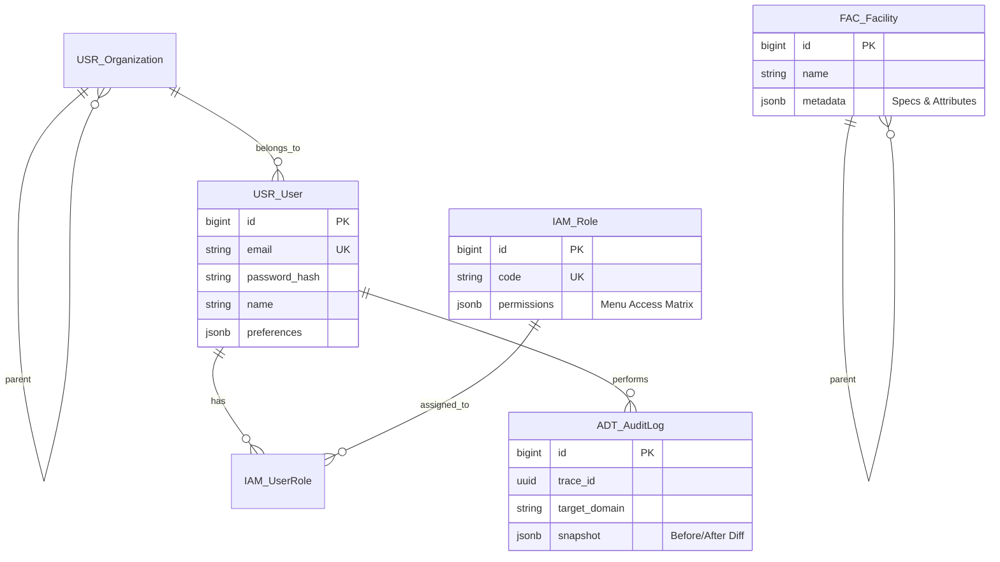
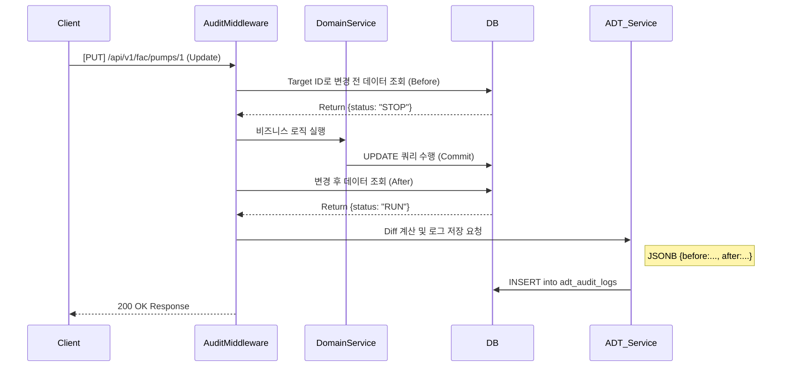
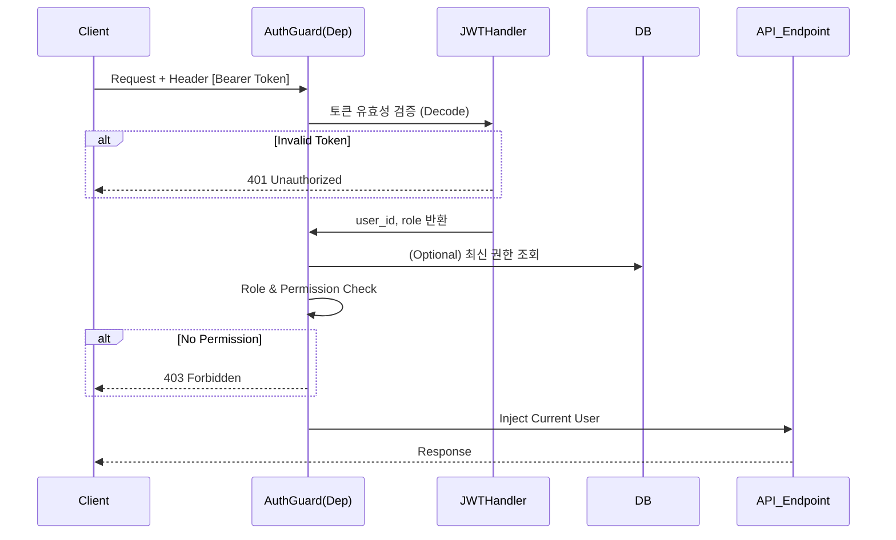

# 📘 SFMS Phase 1: 통합 설계서 (Foundation & Security)

* **프로젝트명:** SFMS (Sewage Facility Management System)
* **작성일:** 2026-02-16
* **작성자:** Chief Architect (Min-su)
* **단계:** Phase 1 (기반 구축 및 보안)
* **기술 스택:**
* **Backend:** Python 3.12+, FastAPI, SQLAlchemy (Async), Pydantic v2
* **Database:** PostgreSQL 16 + **PGroonga** (한글/JSONB 검색 최적화)
* **Frontend:** React, TypeScript, Ant Design Pro
* **Infra:** Docker Compose

---

## 1. 🏗️ 프로젝트 구조 (Project Structure)

**Domain-Driven Design (DDD)**의 경량화 버전을 채택하여 모듈 간 응집도를 높입니다.

```text
sfms-backend/
├── app/
│   ├── core/               # 전역 설정, 보안, DB, 로깅, 미들웨어
│   │   ├── config.py       # 환경변수 관리
│   │   ├── database.py     # SQLAlchemy 세션 및 Base
│   │   ├── security.py     # JWT 핸들러, 암호화
│   │   ├── exceptions.py   # 커스텀 예외 처리
│   │   └── middleware/     # ADT 로깅 미들웨어 등
│   ├── modules/            # 도메인별 모듈 (Modular Monolith)
│   │   ├── adt/            # [감사] Audit Log
│   │   ├── iam/            # [보안] Auth, Role, Permission
│   │   ├── usr/            # [조직] User, Organization
│   │   └── fac/            # [시설] Facility Management
│   └── main.py             # FastAPI 진입점
├── docs/                   # 설계 문서
├── tests/                  # Pytest
├── docker-compose.yml      # PGroonga, Redis 실행
└── requirements.txt

```

---

## 2. 🗄️ 데이터베이스 스키마 (ERD & Schema)

### 2.1 Entity Relationship Diagram (Mermaid)



### 2.2 상세 스키마 정의 (PostgreSQL + PGroonga)

#### A. ADT_AuditLog (감사 로그)

시스템의 모든 변경 사항을 추적하는 블랙박스입니다.

* **Index Strategy:** `snapshot` 컬럼에 PGroonga 인덱스를 적용하여 JSON 내부 검색 가속.

| Field | Type | Nullable | Description |
| --- | --- | --- | --- |
| `id` | `BigInteger` | NO | PK (Auto Increment) |
| `trace_id` | `UUID` | NO | 요청 추적 ID (Middleware 생성) |
| `actor_id` | `BigInteger` | YES | 수행자 ID (User ID) |
| `action` | `Varchar(20)` | NO | `CREATE`, `UPDATE`, `DELETE`, `LOGIN` |
| `target_domain` | `Varchar(50)` | NO | 예: `FAC`, `USR` |
| `target_id` | `Varchar(100)` | NO | 대상 레코드 PK |
| `snapshot` | `JSONB` | YES | **핵심:** 변경 이력 스냅샷 |
| `created_at` | `DateTime` | NO | 생성 일시 (Default: Now) |

**`snapshot` JSON 구조 예시:**

```json
{
  "before": { "status": "STOP", "temp": 45 },
  "after": { "status": "RUN", "temp": 60 },
  "changes": ["status", "temp"],
  "reason": "정기 가동"
}

```

#### B. IAM_Role (역할 및 권한)

* **Key Concept:** 메뉴별 권한을 JSONB로 관리하여 스키마 변경 없이 권한 체계를 수정 가능하게 함.

| Field | Type | Nullable | Description |
| --- | --- | --- | --- |
| `id` | `BigInteger` | NO | PK |
| `name` | `Varchar(50)` | NO | 역할명 (시스템 관리자 등) |
| `permissions` | `JSONB` | NO | 권한 매트릭스 |

**`permissions` JSON 구조 예시:**

```json
{
  "fac_mgmt": ["read", "create", "update", "delete"],
  "user_mgmt": ["read"],
  "report": ["read", "export"]
}

```

---

## 3. 📡 API 명세서 (Interface Specification)

### 3.1 공통 응답 포맷 (Envelope Pattern)

모든 API 응답은 아래 포맷을 준수합니다.

```json
{
  "success": true,           // 성공 여부
  "code": 200,               // HTTP Status or Custom Code
  "message": "Ok",           // 사람이 읽을 수 있는 메시지
  "data": { ... },           // 실제 페이로드 (List or Object)
  "meta": {                  // (Optional) 페이지네이션 등 메타 정보
    "total": 120,
    "page": 1,
    "size": 20
  }
}

```

### 3.2 에러 응답 포맷

```json
{
  "success": false,
  "code": 4001,              // Custom Error Code
  "message": "이미 존재하는 사용자 이메일입니다.",
  "data": null
}

```

### 3.3 Endpoint 규칙

* **Prefix:** `/api/v1`
* **URL:** `kebab-case` (소문자 및 하이픈)
* **Resource:** 복수형 명사 사용

| Method | URL | Description |
| --- | --- | --- |
| `POST` | `/api/v1/auth/login` | 로그인 (JWT 발급) |
| `GET` | `/api/v1/users` | 사용자 목록 조회 |
| `POST` | `/api/v1/users` | 사용자 생성 |
| `GET` | `/api/v1/users/{id}` | 사용자 상세 조회 |
| `PATCH` | `/api/v1/users/{id}` | 사용자 정보 일부 수정 |
| `GET` | `/api/v1/fac/facilities` | 시설 트리 조회 |

---

## 4. 🔄 핵심 로직 시퀀스 (Sequence Diagram)

### 4.1 ADT 자동 감사 로깅 (Audit Logging)

`@audit_logging` 데코레이터 또는 미들웨어에서 처리되는 로직입니다.



### 4.2 IAM 인증 및 인가 (Authentication & Authorization)



---

## 5. 🔐 권한 매트릭스 (Permission Matrix)

각 역할(Role)별로 수행 가능한 행위를 정의합니다.

| 도메인 | 기능(Menu) | Admin | Operator | Viewer | 비고 |
| --- | --- | --- | --- | --- | --- |
| **USR** | 사용자 관리 | ✅ All | ❌ | ❌ | |
| **IAM** | 권한 설정 | ✅ All | ❌ | ❌ | |
| **FAC** | 시설 트리 조회 | ✅ Read | ✅ Read | ✅ Read | |
| **FAC** | 시설 속성 편집 | ✅ All | ✅ Update | ❌ | |
| **ADT** | 감사 로그 조회 | ✅ Read | ❌ | ❌ | 보안 민감 |
| **RPT** | 보고서 출력 | ✅ Export | ✅ Export | ✅ Read | |

---

## 6. ✅ Phase 1 구현 체크리스트 (Backlog)

### 1주차: 환경 설정 및 공통 모듈

* [ ] Docker Compose 구성 (PostgreSQL + PGroonga, Redis)
* [ ] FastAPI 프로젝트 스캐폴딩 (폴더 구조)
* [ ] SQLAlchemy Base 및 DB 연결 설정 (`app/core/database.py`)
* [ ] 공통 Response/Exception 핸들러 구현

### 2주차: ADT & IAM (최우선 순위)

* [ ] `adt_audit_logs` 모델링 및 마이그레이션
* [ ] `usr_users`, `iam_roles` 모델링
* [ ] JWT 발급 및 검증 로직 구현 (`login` API)
* [ ] **Audit Logging 미들웨어/데코레이터 구현** (핵심)

### 3주차: USR & FAC 기초

* [ ] 사용자 CRUD API 구현
* [ ] 시설(Facility) 계층형(Self-referencing) 모델 구현
* [ ] PGroonga 기반 시설명 검색 API 구현 (`LIKE` vs `&@~`)
* [ ] React Admin(AntD Pro) 초기 세팅 및 로그인 연동

---
