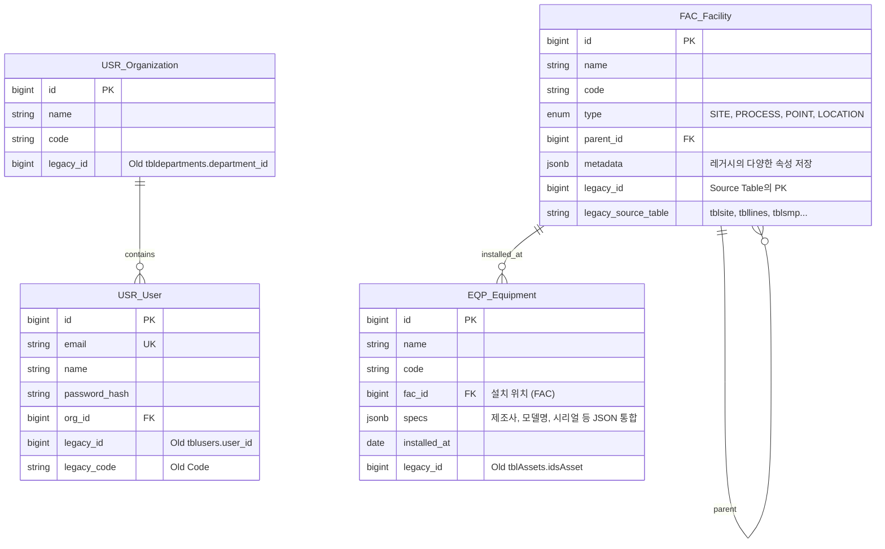

# 🛠️ 마이그레이션 핵심 전략: "Legacy Column 패턴"

데이터 마이그레이션을 100% 보장하기 위해, 새로운 테이블 설계 시 **Legacy ID를 보존하는 컬럼**을 필수적으로 추가합니다.

* **원칙:** 새로운 시스템은 `BigInt` PK를 사용하지만, 마이그레이션 편의성을 위해 레거시 시스템의 PK(`integer` or `code`)를 별도 컬럼에 저장합니다.
* **통합:** `gumc.users`와 `mes.public`에 흩어진 사용자/조직 정보를 하나로 합칩니다.
* **계층화:** `tblsite` -> `tbllines` -> `tblsmp` 등으로 흩어진 테이블을 `FAC_Facilities` 하나의 트리 구조로 통합합니다.

---

## 1. 🏗️ 통합 ERD 설계 (Phase 1 + Legacy Migration)

기존 레거시 데이터를 수용할 수 있도록 Phase 1 설계를 확장했습니다.



---

## 2. 📋 상세 스키마 정의 (Migration Friendly)

기존 컬럼의 데이터를 잃지 않기 위해 `JSONB`를 적극 활용하여, 새 테이블 스키마에 딱 맞지 않는 레거시 데이터들도 모두 `metadata`나 `attributes` 필드에 때려 넣을 수 있도록 설계했습니다.

### 2.1 USR_Organization (조직)

* **Source:** `users.tbldepartments` (gumc), `pklstDepartments` (mes)
* **통합 전략:** 두 소스 중 `gumc`를 마스터로 하고 중복 제거.

```sql
CREATE TABLE usr_organizations (
    id BIGSERIAL PRIMARY KEY,
    name VARCHAR(100) NOT NULL,
    code VARCHAR(50),
    parent_id BIGINT REFERENCES usr_organizations(id),
    
    -- [Migration Columns]
    legacy_id INTEGER, -- tbldepartments.department_id
    legacy_source VARCHAR(20) -- 'GUMC' or 'MES'
);

```

### 2.2 USR_User (사용자)

* **Source:** `users.tblusers` (gumc), `tblUsers` (mes)
* **이슈:** 레거시에 이메일 필드가 명확치 않음(`chrUserName`이 ID 역할).
* **전략:** `email`은 `username@gumc.co.kr` 등의 가상 이메일로 마이그레이션 후 추후 업데이트 유도.

```sql
CREATE TABLE usr_users (
    id BIGSERIAL PRIMARY KEY,
    username VARCHAR(100) NOT NULL, -- Old chrUserName
    email VARCHAR(255) UNIQUE,      -- 가상 생성 or contact_email
    password_hash VARCHAR(255),     -- 레거시 비번은 보통 plain/md5 이므로 마이그레이션 후 암호 재설정 유도 권장
    name VARCHAR(50),
    org_id BIGINT REFERENCES usr_organizations(id),
    
    -- [Migration Columns]
    legacy_id INTEGER, -- tblusers.user_id
    legacy_role_val INTEGER -- intRol (100, etc) -> 추후 IAM_Role로 매핑
);

```

### 2.3 FAC_Facility (시설 계층 통합 - 핵심)

레거시의 여러 테이블로 흩어진 계층 정보를 하나의 트리로 모읍니다.

* **Level 1 (SITE):** `lims.tblsite` (사업소)
* **Level 2 (PROCESS):** `wqm.tbllines` (계열/공정)
* **Level 3 (POINT):** `lims.tblsmp` (채수 지점) 및 `mes.tblLocation` (설비 위치)

```sql
CREATE TABLE fac_facilities (
    id BIGSERIAL PRIMARY KEY,
    name VARCHAR(100) NOT NULL,
    code VARCHAR(50),
    type VARCHAR(20) NOT NULL, -- SITE, PROCESS, AREA, POINT
    parent_id BIGINT REFERENCES fac_facilities(id),
    
    -- 레거시의 잡다한 컬럼들 (memo, sort_order, capacity 등)은 모두 여기에 담습니다.
    metadata JSONB DEFAULT '{}',
    
    -- [Migration Columns]
    legacy_id INTEGER,          -- 기존 테이블의 PK (site_id, id, smp_id 등)
    legacy_table VARCHAR(50)    -- 'tblsite', 'tbllines', 'tblsmp', 'tblLocation'
);

-- 검색 최적화 (PGroonga)
CREATE INDEX idx_fac_name_pgroonga ON fac_facilities USING pgroonga (name);
CREATE INDEX idx_fac_metadata_pgroonga ON fac_facilities USING pgroonga (metadata);

```

### 2.4 EQP_Equipment (자산/설비)

* **Source:** `mes.tblAssets` (주), `inv.tblinstruments` (부)
* **전략:** `tblAssets`의 방대한 컬럼(`chrSerialNo`, `chrModel`, `idsMaker` 등)을 모두 살리되, 주요 컬럼 외에는 `specs` JSONB 컬럼으로 이동시킵니다.

```sql
CREATE TABLE eqp_equipments (
    id BIGSERIAL PRIMARY KEY,
    name VARCHAR(255) NOT NULL,   -- chrAssetDescription
    code VARCHAR(50),             -- chrAssetCode
    fac_id BIGINT REFERENCES fac_facilities(id), -- idsLocation -> FAC ID 매핑
    
    -- 주요 속성
    maker VARCHAR(100),           -- idsMaker (Join해서 텍스트로 저장 or 별도 관리)
    model VARCHAR(100),           -- chrModel (inv.tblinstruments)
    serial_no VARCHAR(100),       -- chrSerialNo
    installed_at DATE,            -- dtmInstalled
    status VARCHAR(50),           -- idsStatus (Lookup -> Text 변환)
    
    -- 나머지 수십 개의 속성은 JSON으로 보존
    specs JSONB,                  -- purchase_price, depreciation, etc.
    
    -- [Migration Columns]
    legacy_id INTEGER,            -- idsAsset
    legacy_source VARCHAR(20)     -- 'MES_ASSET' or 'GUMC_INSTR'
);

-- 자산 스펙 검색용 인덱스
CREATE INDEX idx_eqp_specs_pgroonga ON eqp_equipments USING pgroonga (specs);

```

---

## 3. 🚀 마이그레이션 SQL 예시 (Migration Strategy)

PostgreSQL의 `fdw` (Foreign Data Wrapper)나 `dblink`를 써서 레거시 DB(Postgres)에서 새 DB로 데이터를 당겨오는 방식을 추천합니다. (같은 서버라면 `INSERT INTO ... SELECT` 가능)

### Step 1. 시설(Facility) 계층 구조 마이그레이션

* **1-1. 최상위 사업소 (SITE) 이동**

```sql
INSERT INTO fac_facilities (name, code, type, metadata, legacy_id, legacy_table)
SELECT 
    site_name, 
    site_code, 
    'SITE', 
    jsonb_build_object('manager', site_manager, 'tel', site_tel, 'address', site_address),
    site_id, 
    'tblsite'
FROM old_db.lims.tblsite;

```

* **1-2. 공정/계열 (PROCESS) 이동 (부모 연결)**

```sql
INSERT INTO fac_facilities (name, code, type, parent_id, metadata, legacy_id, legacy_table)
SELECT 
    l.name, 
    l.code, 
    'PROCESS',
    f.id, -- 위에서 생성된 SITE의 ID를 찾아서 연결
    jsonb_build_object('capacity', l.capacity, 'memo', l.memo),
    l.id,
    'tbllines'
FROM old_db.wqm.tbllines l
JOIN fac_facilities f ON f.legacy_code = l.plant_code AND f.type = 'SITE'; -- 코드 매핑 가정

```

* **1-3. 채수 지점/위치 (POINT) 이동**

```sql
INSERT INTO fac_facilities (name, code, type, parent_id, legacy_id, legacy_table)
SELECT 
    s.smp_loc_name, 
    s.smp_code, 
    'POINT',
    f.id, -- 부모 SITE ID
    s.smp_id,
    'tblsmp'
FROM old_db.lims.tblsmp s
JOIN fac_facilities f ON f.legacy_id = s.site_id AND f.legacy_table = 'tblsite';

```

### Step 2. 자산(Asset) 마이그레이션 (JSONB 활용)

`tblAssets`의 수많은 `chrProperty...` 컬럼들을 `specs` JSONB 필드로 묶어 넣습니다.

```sql
INSERT INTO eqp_equipments (
    name, code, fac_id, serial_no, installed_at, specs, legacy_id, legacy_source
)
SELECT 
    a."chrAssetDescription",
    a."chrAssetCode",
    f.id, -- fac_facilities와 매핑된 ID
    a."chrSerialNo",
    a."dtmInstalled"::date,
    -- 나머지 자잘한 컬럼들은 모두 JSON으로 패킹
    jsonb_build_object(
        'buyer', a."chrBuyers",
        'price', a."curPurchasePrice",
        'spec_prop1', a."chrProperty01",
        'note', a."memAssetNote"
    ),
    a."idsAsset",
    'MES_ASSET'
FROM old_db.public."tblAssets" a
LEFT JOIN fac_facilities f 
    ON f.legacy_id = a."idsLocation" AND f.legacy_table = 'tblLocation'; -- Location 매핑 필요

```

---

## 4.💡 결론 및 제안

1. **JSONB의 위력:** 레거시(`mes.sql`)에 있는 `tblAssets` 테이블의 수많은 컬럼(`chrProperty01`~`16` 등)을 1:1로 새 테이블에 만들지 마십시오. **`specs` JSONB 컬럼 하나**에 넣고 `PGroonga` 인덱스를 걸면, 스키마는 깔끔해지고 검색은 완벽하게 지원됩니다.
2. **Legacy ID 유지:** 위 설계처럼 `legacy_id`, `legacy_table` 컬럼을 유지하면, 마이그레이션 후 데이터 검증이 매우 쉽고, 필요시 롤백하거나 데이터를 다시 매핑하기도 수월합니다.
3. **코드 매핑:** `tblsite.site_code`와 `tbllines.plant_code` 처럼 문자열 코드로 연결된 관계는 마이그레이션 시 `JOIN` 조건으로 활용하여 새로운 `parent_id`(Integer ID) 관계로 변환해야 합니다.
