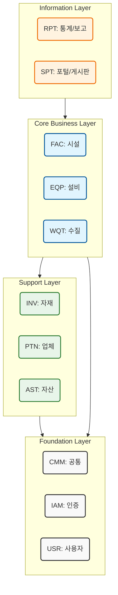

# 🏗️ 하수처리시설 종합관리 시스템 도메인 정의서 (Domain Definitions)

<!-- markdownlint-disable MD033 -->

본 문서는 **하수처리시설 종합관리 시스템(Smart WWTP FMS)**을 구성하는 업무 도메인(Domain)의 약칭(3-Letter Code)과 역할(R&R)을 정의합니다.
모든 데이터베이스 스키마(Schema), API 경로, 클래스 패키지(Package) 명은 이 표준을 준수합니다.

---

## 1. 🏛️ 기반 및 공통 (Foundation Layer)

> 시스템의 뼈대가 되는 하부 구조로, 다른 모든 도메인이 공통적으로 참조합니다.

| 도메인 코드 | 영문 명칭 (Full Name)             | 한글 명칭     | 핵심 역할 및 책임 (R&R)                                                                                                              |
| :---------: | :-------------------------------- | :------------ | :----------------------------------------------------------------------------------------------------------------------------------- |
|   **CMM**   | **C**o**MM**on                    | **공통 관리** | • **시스템 뼈대:** 공통코드, 자동채번(ID생성), 파일 입출력 • **유틸리티:** 알림 발송(SMS/Push), 결재 처리, PDF 엔진, 시스템 로그 |
|   **IAM**   | **I**dentity & **A**ccess **M**gt | **인증/보안** | • **접근 제어:** 로그인, SSO, API 키 관리, 세션 관리 • **권한 관리:** 역할(Role) 정의, 메뉴/화면별 접근 권한 제어 (`USR`와 분리) |
|   **USR**   | **US**e**R**                      | **사용자**    | • **인사 정보:** 직원 프로필, 조직도(부서), 직급 체계 • **근무 관리:** 근무조 편성, 마이페이지, 개인 설정                        |

 

## 2. 🏭 핵심 업무 (Core Business Layer)

> 하수처리시설의 본질적인 유지보수 및 운영 업무를 수행합니다.

| 도메인 코드 | 영문 명칭 (Full Name)          | 한글 명칭     | 핵심 역할 및 책임 (R&R)                                                                                                                 |
| :---------: | :----------------------------- | :------------ | :-------------------------------------------------------------------------------------------------------------------------------------- |
|   **FAC**   | **FAC**ility                   | **시설/공간** | • **공간 관리:** 건축물, 토목 구조물, 지하구, 층, 호실(Space) 관리 • **관계:** `PTN`(시공사)이 건설하며, `EQP`가 설치되는 장소 제공 |
|   **EQP**   | **EQP**uipment                 | **설비/장치** | • **설비 이력:** 펌프, 모터, 전기설비, 계측기(TMS) 통합 관리 • **관계:** `INV`(부품)를 사용하여 수리하며, `PTN`이 유지보수 수행     |
|   **WQT**   | **W**ater **Q**uality **T**est | **수질/LIMS** | • **수질 분석:** 채수 계획, 분석 의뢰, 시험 성적서, 실험실 장비 관리 • **관계:** `INV`(시약)를 사용하며, `PTN`에게 외부 분석 의뢰   |

 

## 3. 📦 지원 및 자원 (Support & Resource Layer)

> 핵심 업무를 수행하기 위해 필요한 자원(물자)과 협력사를 관리합니다.

| 도메인 코드 | 영문 명칭 (Full Name) | 한글 명칭     | 핵심 역할 및 책임 (R&R)                                                                                                            |
| :---------: | :-------------------- | :------------ | :--------------------------------------------------------------------------------------------------------------------------------- |
|   **INV**   | **INV**entory         | **재고/자재** | • **수불 관리:** 예비 부품(Spare Parts), 약품, 실험 시약 입출고 • **재고 관리:** 현재고 실사, 적정 재고 알림, 자재 마스터 관리 |
|   **PTN**   | **P**ar**T**ner       | **업체 관리** | • **협력사 정보:** 시공사, 납품사, 용역사, 수질 검사 대행 기관 • **계약 관리:** 업체별 계약 현황, 연락처, 수행 능력 평가       |
|   **AST**   | **AS**se**T**         | **자산/비품** | • **일반 자산:** PC, 가구, 차량, 공구 등 (감가상각 대상) • **관계:** `PTN`으로부터 구매/조달하여 `USR`에게 지급                |

 

## 4. 📊 정보 및 소통 (Information & Communication Layer)

> 축적된 데이터를 가공하여 시각화하거나, 사용자 간의 소통을 지원합니다.

| 도메인 코드 | 영문 명칭 (Full Name)        | 한글 명칭       | 핵심 역할 및 책임 (R&R)                                                                                            |
| :---------: | :--------------------------- | :-------------- | :----------------------------------------------------------------------------------------------------------------- |
|   **SPT**   | **S**u**P**por**T** / Portal | **포털/게시판** | • **커뮤니티:** 공지사항, 자료실, Q&A, 사내 게시판, 업무 매뉴얼 • **정보 공유:** 사용자 소통 창구 및 지식 관리 |
|   **RPT**   | **R**e**P**or**T**           | **통계/보고**   | • **리포팅:** 정기 보고서(운영일보/월보), 법정 서식 출력 • **시각화:** 운영 통계 분석, 경영 정보 시각화 (BI)   |

---

### 📌 시스템 아키텍처 다이어그램 (Mermaid)

