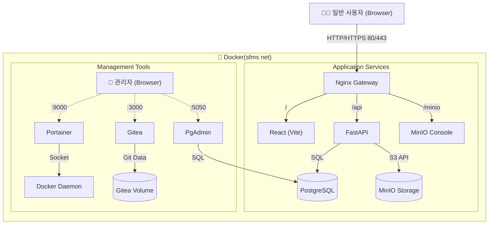

# SFMS (Smart Facility Management System)

## 1. 프로젝트 개요 (Project Overview)

- **프로젝트명**: SFMS
- **목표**: 하수처리시설 종합관리 시스템 구축 (추후 범용 CMMS 확장 고려)
- **핵심 가치**:
  - **Data Density High**: 엔터프라이즈급 데이터 밀집형 UI (Ant Design Pro `size="small"`)
  - **Domain Driven**: 3-Letter Code 기반의 명확한 도메인 분리
  - **Stability**: 레가시 데이터의 안정적인 마이그레이션 및 이력 관리

---

## 2. 기술 스택 (Tech Stack)

### Infrastructure (DevOps)

- **Container**: Docker, Docker Compose (v3.8+)
- **Gateway**: Nginx (Reverse Proxy)
- **Database**: PostgreSQL 16+
- **Storage**: MinIO (S3 Compatible) - 도면, PDF, 문서 저장소
- **Management**: Portainer, pgadmin4, Gitea (Optional)

### Backend (Logic & Data)

- **Language**: Python 3.13+
- **Framework**: FastAPI (Async)
- **Database**: PostgreSQL 16+
- **ORM**: SQLAlchemy (Async Engine)
- **Schema Validation**: Pydantic v2
- **VersionManger**: mise
- **PackageManager**: uv
- **Linting & Formatting**: Ruff

### Frontend (UI/UX)

- **Framework**: React 18 + Vite (SPA)
- **Language**: TypeScript
- **UI Library**: Ant Design v5 + ProComponents (ProTable, ProForm)
- **State Management**: TanStack Query (React Query)
- **Style**: Tailwind CS 4 + AntD Token System
- **VersionManger**: mise
- **PackageManager**: pnpm
- **Linting & Formatting**: Biome

---

## 3. 시스템 아키텍처 (Architecture)



---

## 4. 도메인 정의 (Domain 3-Letter Code)

모든 디렉토리, 테이블, API 경로는 아래 코드를 기준으로 네이밍합니다.

| 코드 |     명칭     |             설명              |      비고       |
| :--: | :----------: | :---------------------------: | :-------------: |
| CMM  |    Common    |  공통코드, 파일, 알림, 로그   |   시스템 기반   |
| IAM  |   Identity   | 인증, 권한(Role), 메뉴, API키 | 보안 (USR 분리) |
| USR  |     User     |       직원 정보, 조직도       |    인사 정보    |
| FAC  |   Facility   |    시설/공간 (건축, 토목)     |    위치/장소    |
| EQP  |  Equipment   | 설비/장치 (기계, 전기, 계측)  |   핵심 도메인   |
| WQT  | WaterQuality |        수질 분석, LIMS        |  하수처리 특화  |
| INV  |  Inventory   |       자재, 재고, 약품        |                 |
| PTN  |   Partner    |           업체 관리           |                 |
| AST  |    Asset     |     일반 자산 (PC, 차량)      |                 |
| SPT  |   Support    |         게시판, 포털          |                 |
| RPT  |    Report    |         통계, 보고서          |                 |

---

## 5. 디렉토리 구조 (Directory Structure)

### 5.1 Database (/database)

Postgresql sql script 파일 도메인별 기능별로 분리관리

```text
database/
├── 01_com/                # CMM (공통)
│   ├── tables.sql         # 테이블 정의
│   ├── functions.sql      # 채번 함수 등
│   └── seed.sql           # 기초 코드 데이터
├── 02_iam/                # IAM (인증/권한)
│   ├── tables.sql
│   └── seed.sql
├── 03_usr/                # USR (사용자/조직)
│   ├── tables.sql
│   └── seed.sql
├── 04_fac/                # FAC (시설)
│   └── tables.sql
├── 05_eqp/                # EQP (설비)
│   └── tables.sql
└── deploy.sql             # [중요] 모든 SQL을 순서대로 호출하는 마스터 파일
```

### 5.2 Backend (/backend)

파이썬의 "명시적 해결책" 철학을 준수하며, 기능별로 파일을 분리

```text
backend/
├── app/
│   ├── core/                  #  전역 설정 및 인프라 계층
│   │   ├── config.py          #  환경설정 (.env 로드)
│   │   └── database.py        #  DB 세션 관리 (app.core.database)
│   │
│   ├── domains/               #  DDD의 핵심: 비즈니스 도메인별 응집
│   │   ├── cmm/               #  [Common] 공통 코드, 파일, 채번
│   │   │   ├── models.py      #  SQLAlchemy 모델
│   │   │   ├── schemas.py     #  Pydantic 스키마
│   │   │   ├── service.py     #  비즈니스 로직
│   │   │   └── router.py      #  도메인 전용 라우터
│   │   ├── fac/               #  [Facility] 시설/공간 도메인
│   │   │   ├── models.py
│   │   │   ├── schemas.py
│   │   │   ├── service.py
│   │   │   └── router.py
│   │   └── eqp/               #  [Equipment] 설비 도메인
│   │       ├── models.py
│   │       ├── schemas.py
│   │       ├── service.py
│   │       └── router.py
│   │
│   ├── api/                   #  외부 노출 계층 (도메인 라우터 통합)
│   │   └── v1/
│   │       └── api_router.py  #  각 도메인의 router를 하나로 병합
│   │
│   └── main.py                #  애플리케이션 진입점
│
├── tests/                     #  도메인별 테스트 코드
├── Dockerfile
└── requirements.txt
```

### 5.3 Frontend (/frontend)

Vite 기반 React 프로젝트 구조입니다.

```text
frontend/src/
├── shared/                  # 모든 도메인이 공통으로 사용하는 요소
│   ├── components/          # 공통 UI (CustomButton, Layout 등)
│   ├── hooks/               # 공통 Hook (useAuth, useLocalStorage 등)
│   ├── utils/               # 공통 유틸 함수 (dateFormatter 등)
│   └── api/                 # Axios 인스턴스 설정 (interceptors 등)
│
├── domains/                 # DDD 핵심: 도메인별 응집
│   ├── cmm/                 # [Common] 공통 코드, 파일 관리
│   │   ├── api.ts           # 도메인 전용 API 호출
│   │   ├── types.ts         # TypeScript 인터페이스
│   │   ├── hooks.ts         # React Query 전용 Hook
│   │   ├── components/      # 도메인 내부용 컴포넌트 (CodeSelect 등)
│   │   └── pages/           # 도메인 메인 화면
│   │
│   ├── fac/                 # [Facility] 시설 관리
│   │   ├── api.ts
│   │   ├── types.ts
│   │   ├── hooks.ts
│   │   ├── components/      # (예: FacilityCard.tsx)
│   │   └── pages/           # (예: FacilityListPage.tsx)
│   │
│   └── eqp/                 # [Equipment] 설비 관리
│       ├── api.ts
│       ├── types.ts
│       ├── hooks.ts
│       ├── components/
│       └── pages/
│
├── App.tsx                  # 전역 설정 (AntD ConfigProvider 등)
└── main.tsx                 # Entry Point
├── Dockerfile
├── package.json
└── vite.config.ts
```

### 5.4 Infrastructure (/infra)

Vite 기반 React 프로젝트 구조입니다.

```text
infra/
├── docker-compose.yml         # 전체 컨테이너 오케스트레이션
├── nginx/
│   └── default.conf           # 라우팅 설정
├── pgsql/
│    └── init.sql              # DB 초기화 스크립트
├── pgadmin/
├── gitea/
└── data/               # [데이터] DB, 파일, 로그 저장소 (Git 관리 X !!!)
    ├── pgsql/          # PostgreSQL 데이터 파일들이 저장될 곳
    ├── minio/          # MinIO에 업로드된 PDF, 도면 파일들
    ├── logs/           # 백엔드/프론트엔드 로그 파일
    ├── gitea/          # Offline 버전관리 프로그램
    └── pgadm/          # Database 관리프로그램
```

---

## 6. 개발 규칙 (Convention)

### 6.1 공통사항

1. 언어: 모든 답변은 한국어로 진행

### 6.2 Database (PostgreSQL)

1. Naming: Snake Case (eqp_master, created_at).

2. Comment: 모든 테이블과 컬럼에 COMMENT ON 필수 작성.

3. Migration: Alembic 사용, 버전 파일은 Git 관리.

### 6.3 Python (Backend)

1. Style: Ruff 준수, 독케스팅 추가

2. Indent: Space 4 (Tabs 금지).

3. Inline Comment: 코드와 주석 사이에 Space 2개 삽입 # 뒤에는 한칸삽입 (code # comment).

4. DB Connection: DB 연결 객체 명칭은 app.core.database로 통일.

### 6.4 TypeScript (Frontend)

1. Style: Biome 준수, 독케스팅 추가

2. Indent: Space 2 (Tabs 금지).

3. UI:
   - Ant Design: v5 다크 모드(theme.darkAlgorithm)를 적용 , Table의 rowSelectedBg 등을 theme.ts에서 직접 제어, 기본적인  theme 제공
   - Ant Design ProTable 적극 활용 (size="small").

4. Popup: 상세 화면은 Modal보다 Drawer(우측 패널) 우선 사용.

5. Structure: View(Component)와 Logic(Service)의 철저한 분리.

6. any와 unknow의 사용의 최대한 억제

---

## 7. 주요 구현 로드맵 (Roadmap)

1. Phase 1 (환경 구축): Docker Compose (DB, MinIO, FastAPI, React) 실행 확인.

2. Phase 2 (기반 마련): IAM(로그인), CMM(공통코드) 구현.

3. Phase 3 (핵심 마이그레이션): 레가시 DB 분석 -> FAC(시설), EQP(설비) 신규 설계 및 이관.
